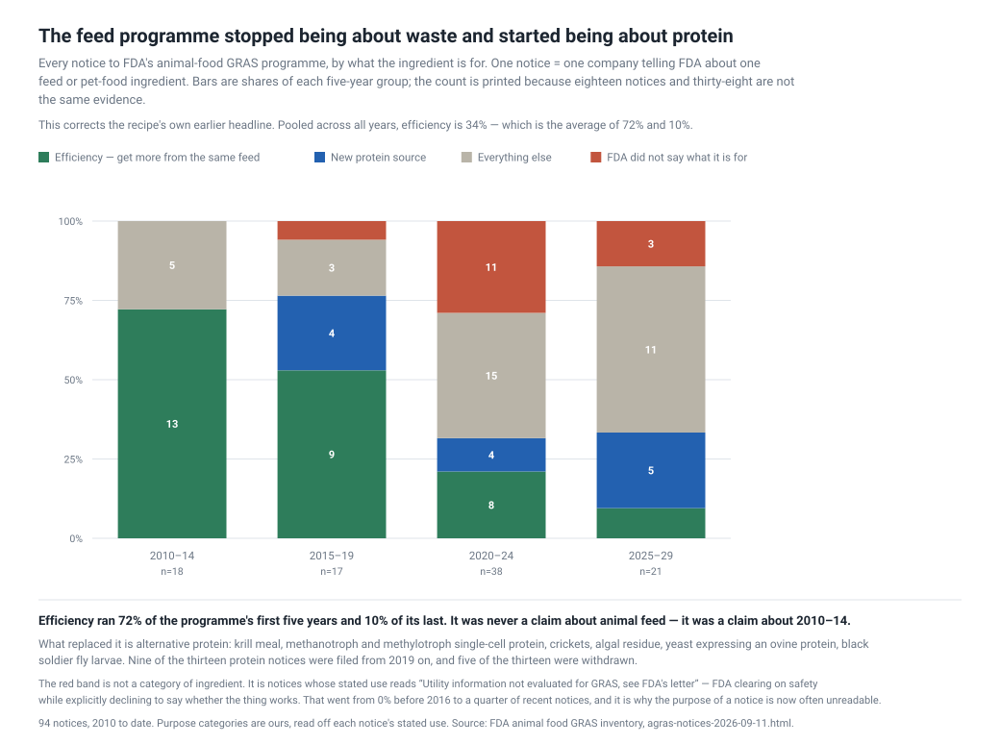
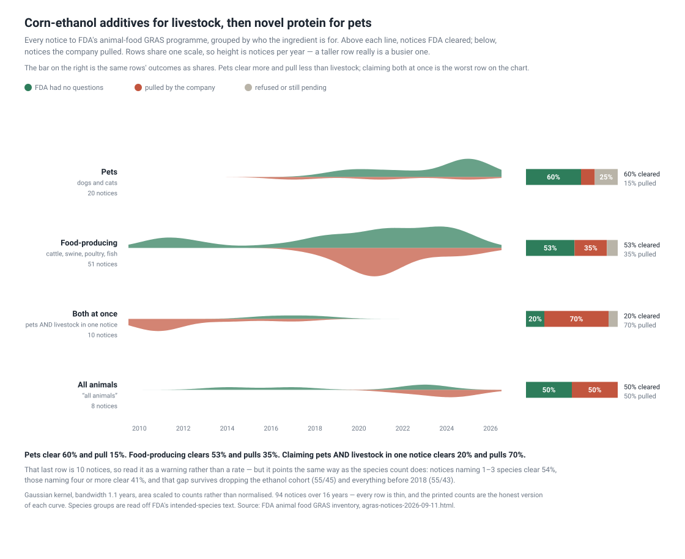
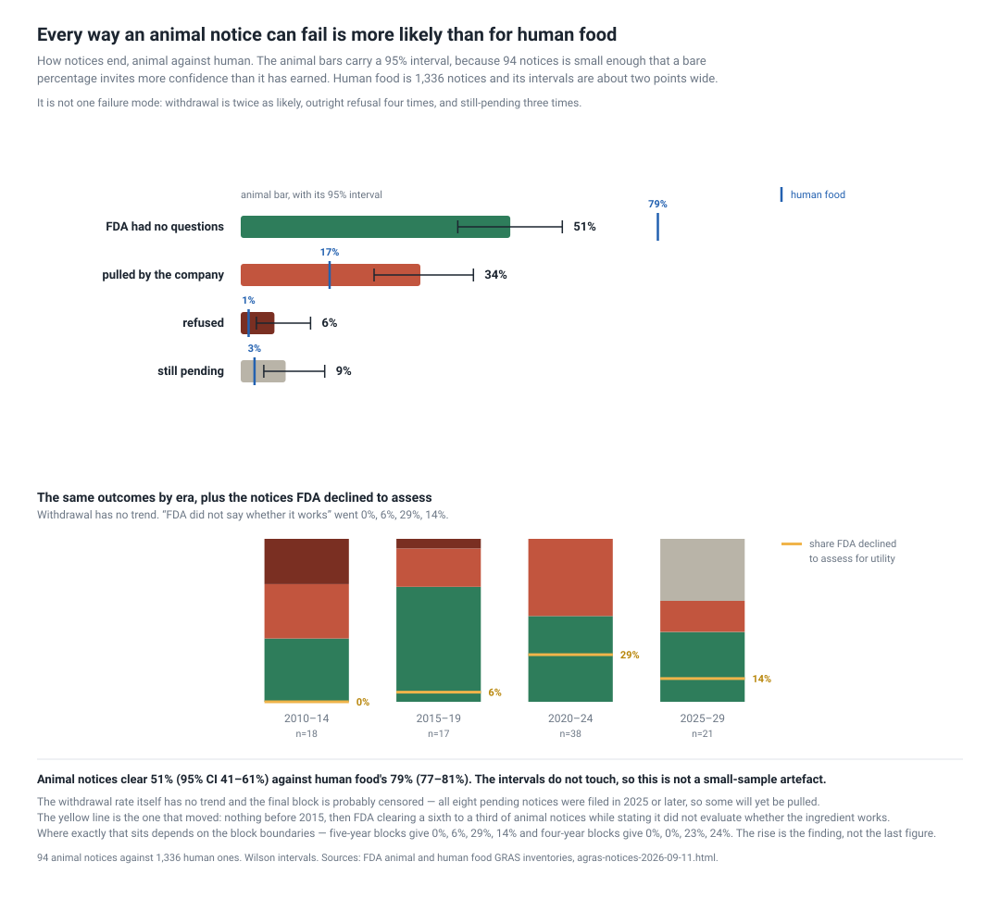
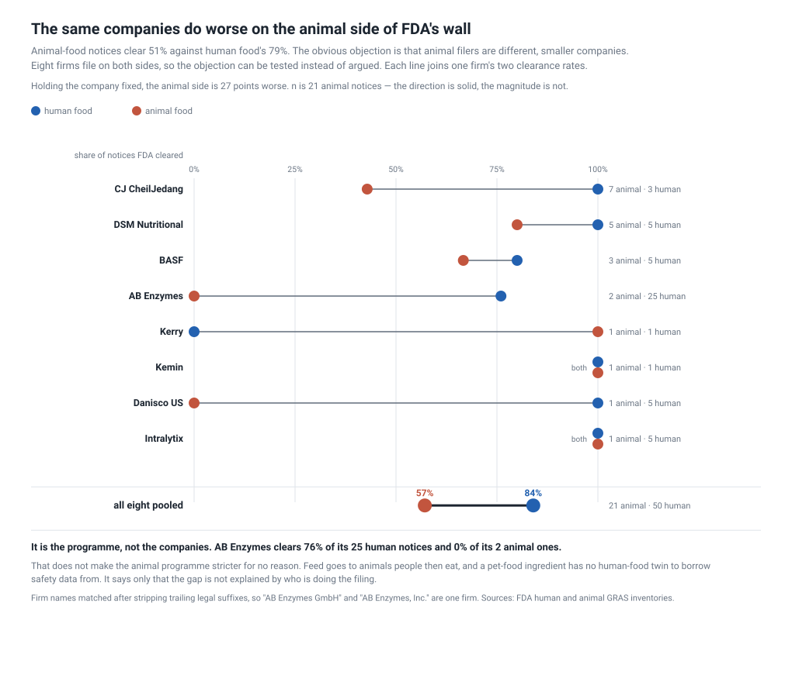
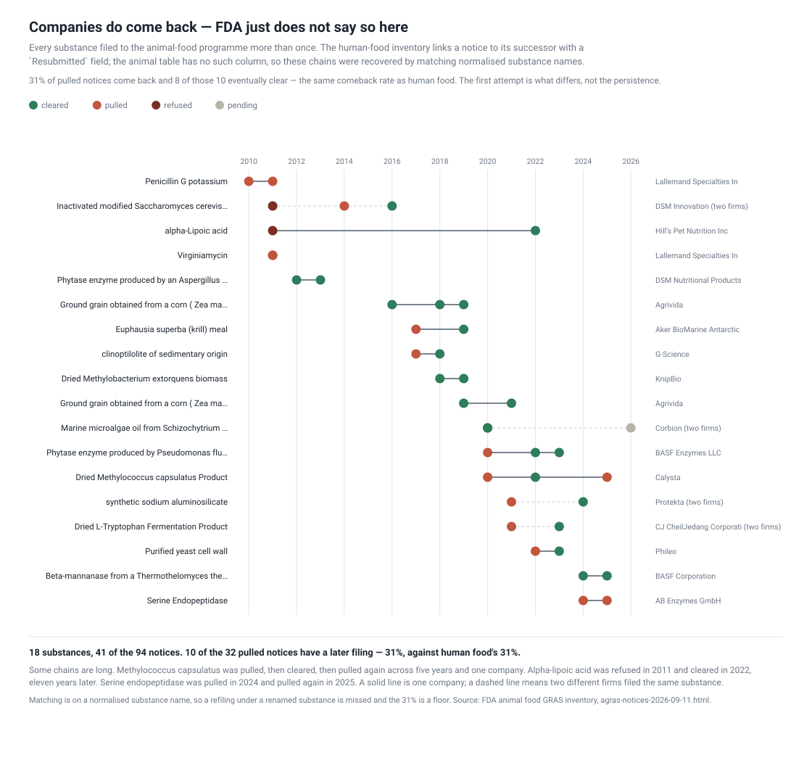
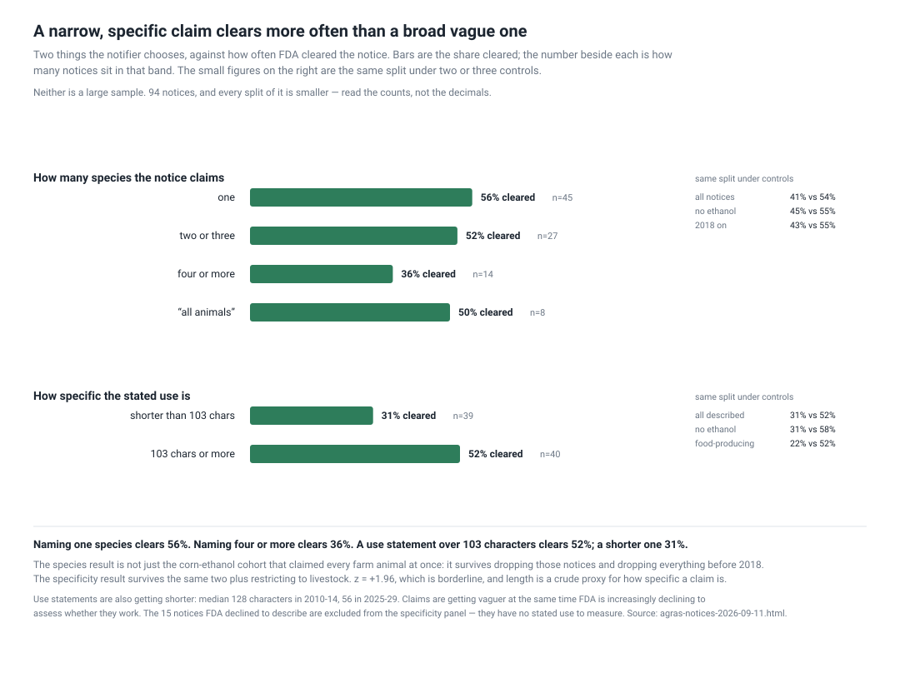
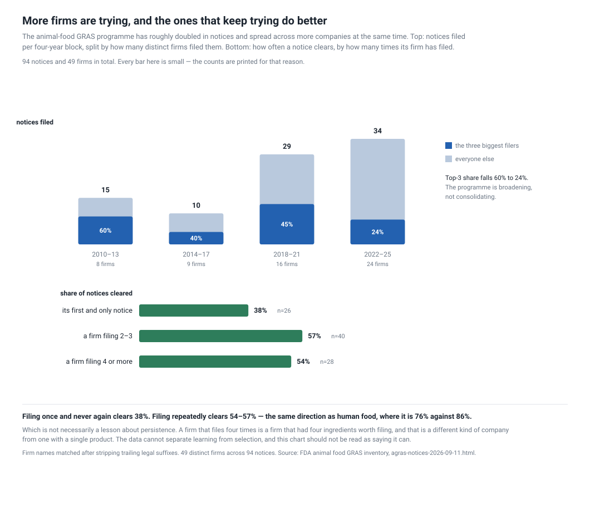

# Corn-ethanol additives for livestock, then novel protein for pets

**Published 2026-09-11** · seven figures, nine scripts · source: two FDA
inventories, no key and no account · everything re-derives from one capture with
no network access afterwards.

## What this is

FDA runs a **separate GRAS programme for animal food** — livestock feed and pet
food. A company decides for itself that its ingredient is safe, tells FDA, and
FDA replies. The best reply available is not "approved"; it is *"we have no
questions"*. Telling FDA is optional, here as on the human side.

94 notices since 2010, published as a rendered HTML table with no bulk export.
Its human-food sibling has 1,336 and a downloadable CSV, which makes the pair a
natural control: same agency, same mechanism, two programmes.

*Who has a stake:* feed formulators and integrators choosing ingredients ·
investors in feed-tech and alternative-protein companies · anyone modelling
livestock nitrogen and phosphorus runoff · regulators comparing the two
programmes.

## The short version

- **The programme changed subject and audience.** It opened as a corn-ethanol
  processing-aid channel for livestock and is now an alternative-protein channel
  for pets.
- **Animal notices clear 51% against human food's 79%** — and every failure mode
  is elevated, not just one.
- **It is the programme, not the companies.** Eight firms file on both sides and
  clear 84% human, 57% animal.
- **Companies do come back** at exactly the human rate, 31%. FDA just doesn't
  publish the link on this side.
- **Narrow, specific claims clear more often** than broad vague ones.
- **FDA increasingly clears on safety while saying nothing about whether the
  ingredient works.**

## What the programme is for, and how that changed



This recipe used to be headlined *"animal feed innovation is mostly about wasting
less"* — phytase releasing bound phosphorus, synthetic amino acids hitting the
target on less crude protein, ethanol co-products. Pooled across all years that
is 34% of notices.

**It was a claim about 2010–14.** By era, efficiency runs **72% → 53% → 21% →
10%.** The same failure as any pooled rate: an average of two regimes.

What replaced it is **alternative protein** — krill meal, methanotroph and
methylotroph single-cell protein, crickets, algal residue, yeast expressing an
ovine protein, black soldier fly larvae. Nine of the thirteen protein notices
were filed from 2019 on.

## Who it is for



**2025 is the first year pet food outnumbers livestock**, 11 notices to 8, up
from 1 of 18 in 2010–14. And **four of the six protein notices filed since 2024
are for dogs and cats**, not livestock.

Pet food is also the easier door: **60% cleared and 15% pulled, against 53% and
35% for food-producing animals.** Which is a plausible reason it is being used as
one — a pet-food ingredient never enters the human food chain.

## Every way a notice can fail is more likely here



| outcome | animal | human |
| --- | --- | --- |
| FDA had no questions | **51%** (95% CI 41–61) | **79%** (77–81) |
| pulled by the company | 34% | 16.8% |
| refused outright | 6.4% | 1.5% |
| still pending | 8.5% | 2.6% |

The intervals do not touch, so the headline gap is not a small-sample artefact.
And it is not one failure mode — withdrawal is twice as likely, refusal four
times, still-pending three times.

The yellow line is the one that moved: **FDA now clears a substantial share of
animal notices while stating it did not evaluate whether the ingredient works.**
Nothing before 2015; a sixth to a third since 2020, depending where you cut the
blocks.

## It is the programme, not the companies



The obvious objection to the 51%-against-79% gap is that animal filers are
different, smaller companies. **Eight firms file on both sides**, so it can be
tested rather than argued:

**84% clear on human food. 57% on animal.** AB Enzymes clears 76% of its 25
human notices and 0% of its 2 animal ones.

n is 21 animal notices, so the magnitude is soft and the direction is not. That
does not make the animal programme stricter for no reason — feed goes to animals
people then eat, and a pet-food ingredient has no human-food twin to borrow
safety data from. It says only that the gap is not explained by who is filing.

## Companies come back — FDA just does not say so



The human inventory links a notice to its successor with a `Resubmitted` field.
**The animal table has no such column.** Normalising substance names recovers the
links anyway: **18 substances filed more than once, 41 of the 94 notices.**

The rate that falls out is **31% of pulled notices come back, and 8 of those 10
eventually clear** — the same comeback rate as human food's 31%. So the animal
programme's *first attempt* fails far more often while the *retry* behaviour is
identical. What differs is the first pass, not the persistence.

Some chains are long. Alpha-lipoic acid was refused in 2011 and cleared in
**2022**. *Methylococcus capsulatus* was pulled, cleared, then pulled again
across five years and one company.

## What a notifier actually controls



- **Naming one species clears 56%. Naming four or more clears 36%.** The gap
  survives dropping the corn-ethanol cohort (55/45) and dropping everything
  before 2018 (55/43).
- **A use statement over 103 characters clears 52%; a shorter one 31%.** Survives
  the same two controls plus restricting to livestock (22/52). z = +1.96, which
  is borderline, and length is a crude proxy for specificity.

Both point the same way. And use statements are getting *shorter*: median 128
characters in 2010–14, 56 in 2025–29 — claims getting vaguer at the same time FDA
is increasingly declining to assess them.

## Who files



The programme **roughly doubled** (15 → 10 → 29 → 34 notices per four-year block)
and **deconcentrated** at the same time: the top three firms fell from 60% of
filings to 24%, while distinct firms per block went 8 → 9 → 16 → 24.

Firms that file repeatedly clear more — 38% for a first-and-only notice against
54–57%. But a firm that files four times is a firm that had four ingredients
worth filing, and **this data cannot separate learning from selection.**

## What to do with it

**Do not price an animal-food notice off human-food base rates.** The same
company faces roughly half the clearance odds on this side of FDA's wall.

**Do not read the programme's history as its present.** The sector it serves
changed underneath the description: efficiency for livestock became protein for
pets, and a recipe written about the first says nothing useful about the second.

**If you are filing:** name fewer species and say what the thing does. Both are
under your control and both correlate with clearing, on small samples that point
the same way under every control we could run.

**If you are reading a clearance:** check whether FDA assessed utility. On a
growing share of recent notices it explicitly did not.

## What not to trust

- **94 notices, and every split of it is smaller.** Read the counts, not the
  decimals. The paired control is 21 animal notices; the breadth result's widest
  band is 14.
- **No closure date.** The table records when a notice was filed and not when FDA
  answered, so lead time is not computable here — unlike the human side, where it
  runs 177–181 days. Getting it would mean fetching and parsing 94 letter PDFs.
- **Refiling chains are matched on normalised substance names**, so a refiling
  under a renamed substance is missed and the 31% is a floor.
- **Purpose and species categories are ours**, read off each notice's stated use
  and intended species. A quarter of recent notices have no stated use at all
  because FDA declined to evaluate it, which makes them unclassifiable.
- **No bulk export.** The source is a rendered HTML table, so the parse is
  structural and will break when FDA restyles the page.

*Every question this recipe asks — 28 of them, with statuses and which answers
describe, predict or prescribe — is the working document at
[`artifacts/research-questions/questions.md`](artifacts/research-questions/questions.md).*

## Why hasn't anyone

The animal programme is small and gets read as a footnote to the human one. What
that misses is that it is the **control**: same agency, same mechanism, a
different population, and eight companies filing into both. Most questions about
whether a regulatory gap is the regulator or the applicant cannot be tested at
all. Here it can.

## Run it

```sh
export GRAS_WORK=./work
python artifacts/scripts/capture.py           # both inventories
python artifacts/scripts/chart_shift.py
python artifacts/scripts/chart_audience.py
python artifacts/scripts/chart_outcomes.py
python artifacts/scripts/chart_wall.py
python artifacts/scripts/chart_chains.py
python artifacts/scripts/chart_breadth.py
python artifacts/scripts/chart_filers.py
```

The animal inventory has **no bulk export**, so `capture.py` stores the rendered
page and the parse reads the table out of it. The human CSV it is compared
against is **cp1252**, has its real header on row 3, and wraps the GRN column in
an Excel formula.
