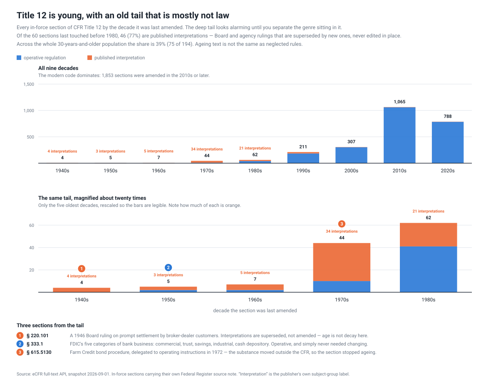
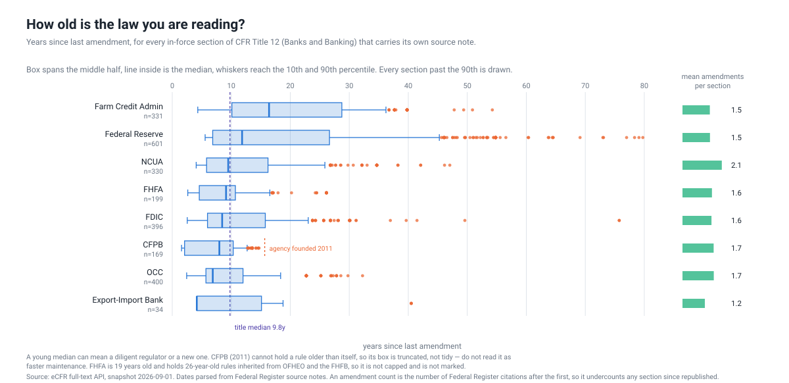
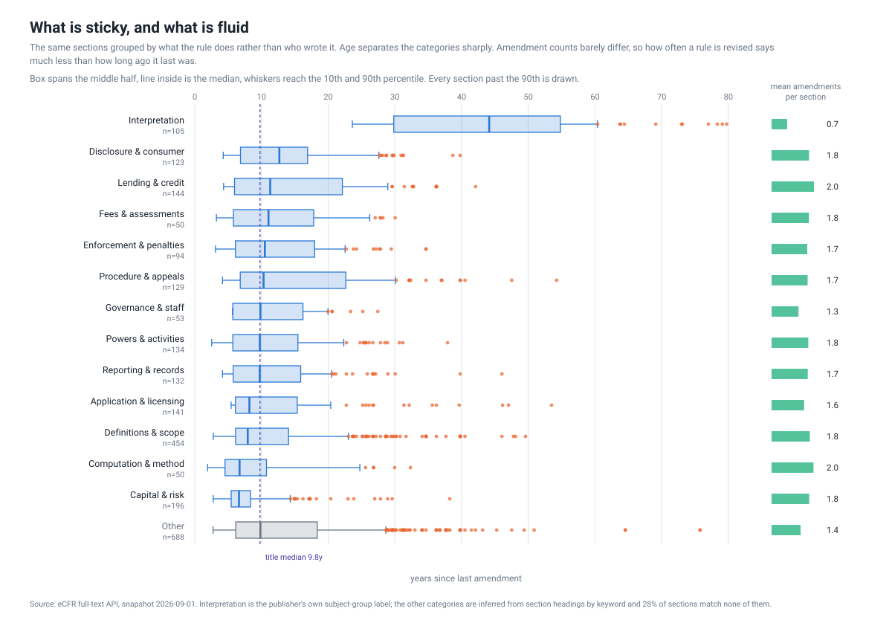
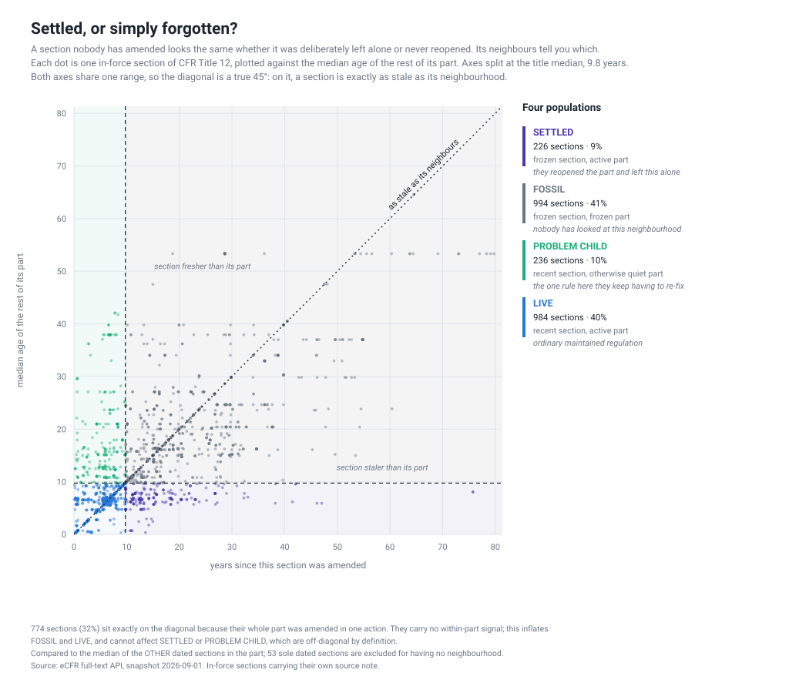
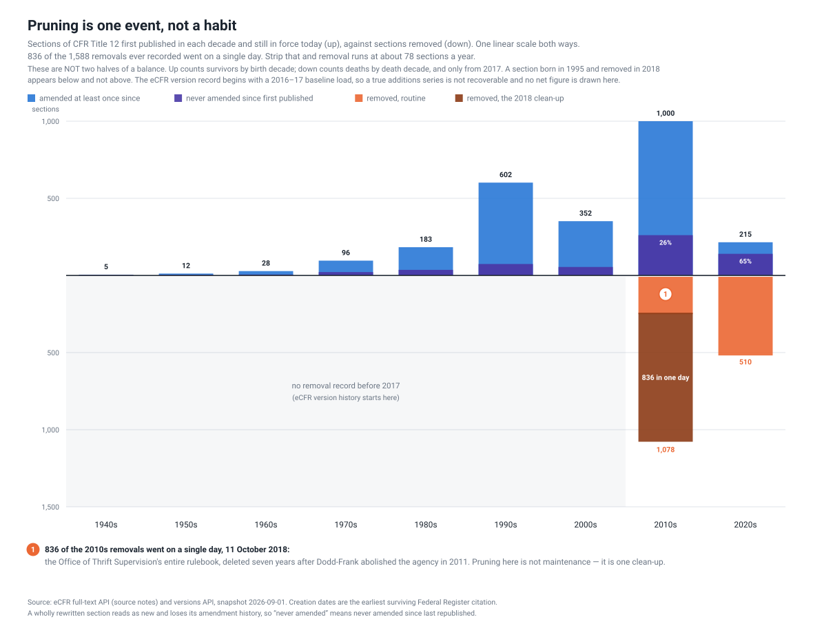
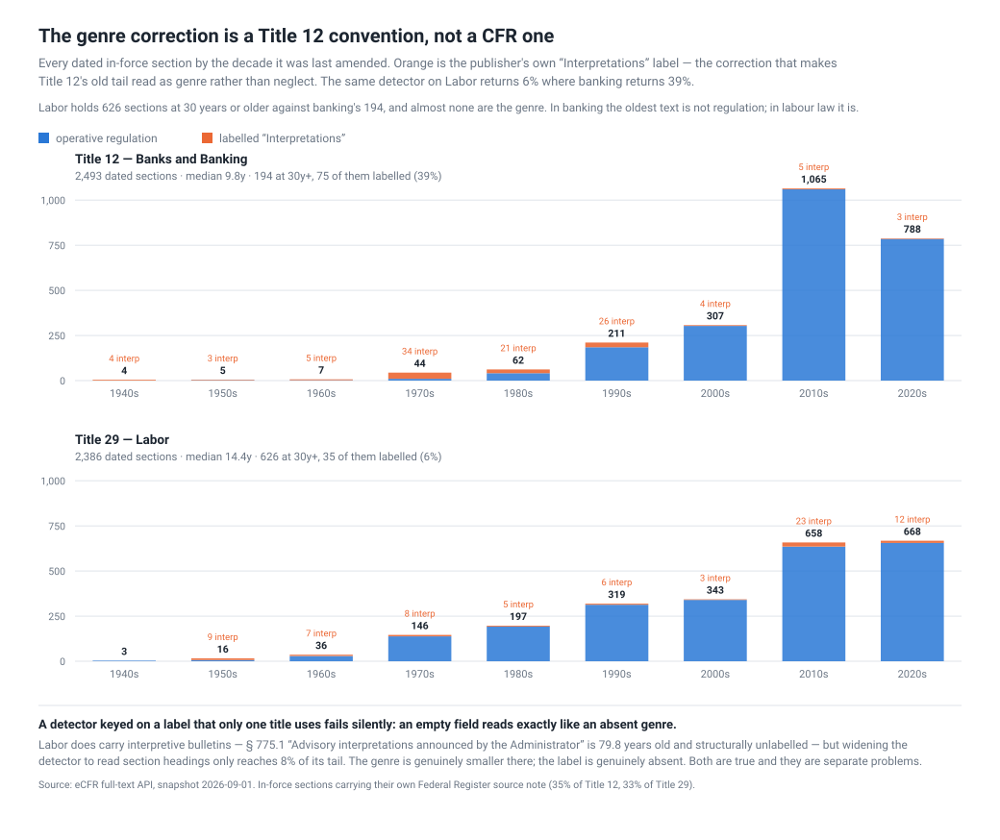
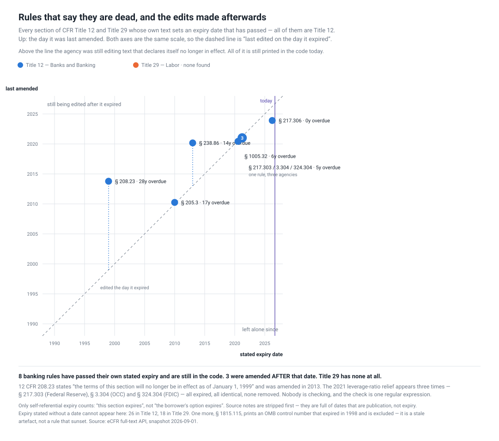
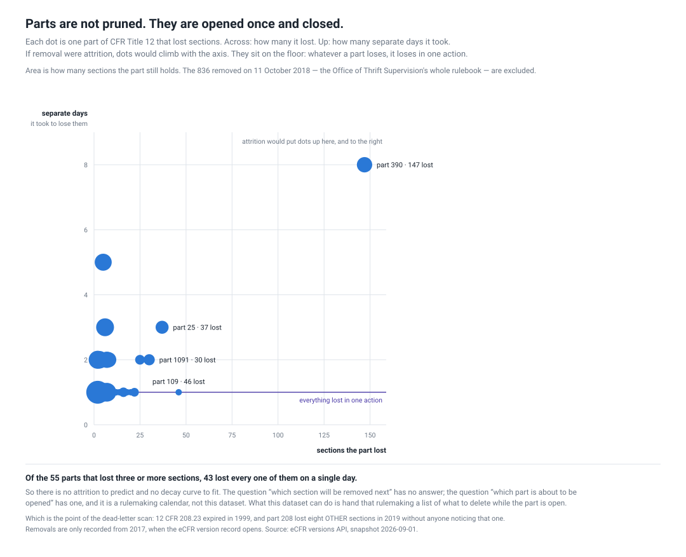
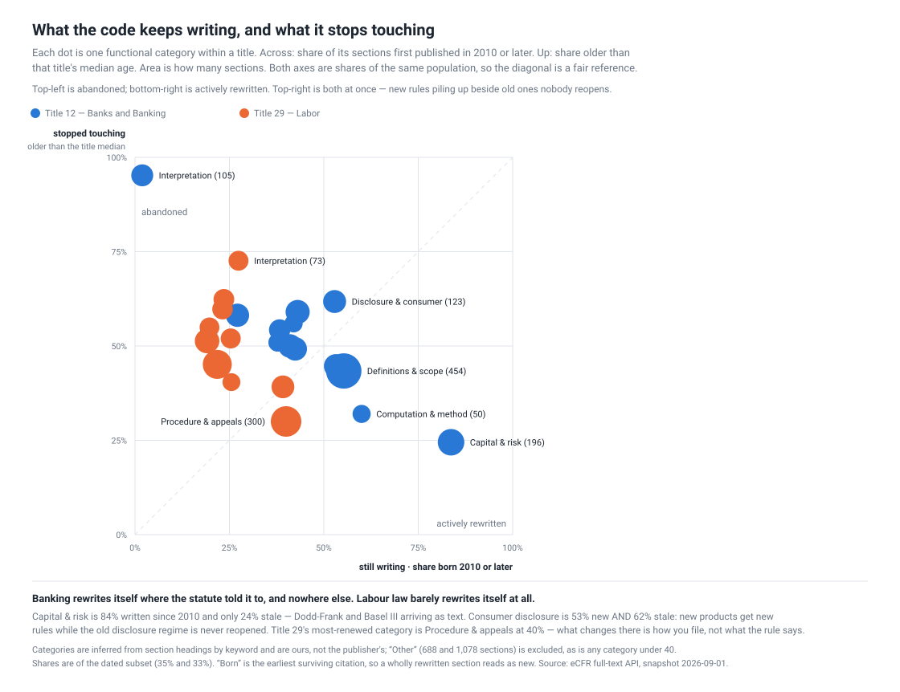

# When US regulation was last touched, and which of it already expired

**Published 2026-09-10** · nine figures, fifteen scripts, all re-derivable from a
local capture with no network access · source: the free
[eCFR API](https://www.ecfr.gov/developers), no key, no account.

*Two titles of the US Code of Federal Regulations — 12 (Banks and Banking) and 29
(Labor) — asking three questions nobody publishes the answer to: when was each
rule last actually changed, which rules have already passed their own expiry
date, and what does the code add versus abandon?*

## What it says

You can ask, for any US regulation, when it was last changed. Nobody publishes
the answer, but the eCFR ships the ingredients: each section carries a bracketed
source note listing its original Federal Register citation and every amendment
since.

Title 12 (Banks and Banking) is 449 parts and 7,180 sections. The obvious
prediction — banking is constantly re-regulated, so it should look young — is
right about the bulk and wrong about the shape.



**Median section age is 9.8 years. 1,853 sections were amended in the 2010s or
later.** But 194 sections have not been touched in 30 years, and the oldest —
§ 220.101, on prompt settlement by broker-dealer customers — was published on
**7 December 1946** and opens "The Board has recently considered…".

## The decision it changes

**If you are picking regulations to review, repeal or re-read, do not screen on
age.** It fails in both directions at once. It surfaces the 1946 interpretations
that are inert by design — 39% of everything 30 years or older — and it misses
the 226 *settled* sections, where an agency reopened the surrounding part and
deliberately left one section standing. Age finds text nobody has typed on. The
decision needs text nobody has **chosen**, and those are different sets.

*Who acts on this:* an agency running a retrospective review under EO 12866; a
policy shop assembling a deregulation target list; a compliance function deciding
which rules get re-read this year; a researcher choosing where to dig.

**And do not carry the genre correction across titles.** It is a Title 12
convention — see *The control* — and applied elsewhere it returns near-zero
without erroring, which reads as "no genre here" rather than "no label here".

**Start with the eight rules that already said they expired.** Every other
candidate for removal needs someone to argue a rule is unnecessary. These need
someone to read the rule's own sentence. There is no constituency for text that
has already expired and no notice-and-comment case the drafters did not already
make. It is the only part of a deregulation list with no policy argument
attached — and finding it is one regular expression.

The screen the data supports is the quadrant, not the calendar. **Settled** is
where a live agency made an active choice that is now decades old — the highest
yield per section read. **Problem child** is the opposite failure: a section
being re-fixed inside a part nobody else touches, which is usually a definition
doing structural work. **Fossil** is the pile age alone would have handed you,
and it is 41% of the title.

### The old tail is mostly a genre, not neglect

That 1946 section is not a rule. It sits in a subject group the publisher
itself labels **`Interpretations`** — Board and agency rulings that are
*superseded* by later rulings rather than edited in place. Never being amended
is what they are for.

| | sections | share that are interpretations |
| --- | --- | --- |
| last amended before 1980 | 60 | **77%** |
| 30 years or older | 194 | **39%** |
| last amended in the 1940s | 4 | **100%** |

The label is a field in the XML, so the correction is mechanical rather than a
judgement call. **Any staleness measure that skips it overstates the tail by
roughly a third**, and this one did until the split was made.

### The tail belongs to two agencies



| agency | sections | median | oldest |
| --- | --- | --- | --- |
| Farm Credit Administration | 331 | 16.4 y | 54.2 y |
| Federal Reserve | 601 | 11.8 y | **79.7 y** |
| NCUA | 330 | 9.5 y | 47.0 y |
| FDIC | 396 | 8.5 y | 75.8 y |
| OCC | 400 | 6.9 y | 32.2 y |
| CFPB | 169 | 8.0 y | 14.7 y |

The Federal Reserve holds the deep tail because it is the agency that publishes
interpretations at volume. Farm Credit has the oldest *median* — a small
regulator with a large rulebook and little reason to reopen it.

The CFPB row is a reminder to read these against agency age, not just rule age:
nothing it wrote can exceed 14.7 years, because the bureau did not exist before
2011. A young median can mean a diligent regulator or a new one.

### Age separates categories seven-fold; churn barely moves



Grouping by what a rule *does* rather than who wrote it:

| category | median age | mean amendments |
| --- | --- | --- |
| Interpretation | **44.1 y** | 0.7 |
| Disclosure & consumer | 12.7 y | 1.8 |
| Lending & credit | 11.3 y | 2.0 |
| Application & licensing | 8.2 y | 1.6 |
| **Capital & risk** | **6.6 y** | 1.8 |

Capital rules are the most-rewritten thing in banking and consumer disclosure
is the stickiest — a 2× spread, and 7× once interpretations are included.
**Amendment counts stay between 1.3 and 2.0 across every category except
Interpretation, which sits at 0.7** — and that exception is the genre defining
itself, since an interpretation superseded rather than edited never gets a second
citation. Among rules proper, how often one is revised says much less than how
long ago it last was. The table above is five of the fourteen categories the
chart draws; `Other` is the second largest at 688 sections (28%), and it is
greyed there rather than ranked.

### Churn concentrates in definitions, which is coupling, not dysfunction

The tempting inversion — *rules that keep needing amendment are the broken
ones* — does not survive the top of the churn list. **Seven of the twenty
most-amended sections in Title 12 are literally titled "Definitions"**
(§ 3.2 and § 620.5 lead at 15 amendments each). Across the title, sections
titled "Definitions" average **2.5 amendments against 1.6 overall**.

A definitions section is the header file of a regulation: it gets touched
whenever any substantive rule elsewhere changes a term. High churn there is
mechanical coupling. Treating it as evidence a rule does not work is the
mirror-image error to treating a 1946 interpretation as neglect.

### Frozen and forgotten are separable



A section nobody has amended looks identical whether it was deliberately left
alone or never reopened. Its neighbours resolve it — compare a section's age to
the median age of the rest of its part:

| | | share |
| --- | --- | --- |
| **Fossil** | frozen section, frozen part | 994 · 41% |
| **Live** | recent section, active part | 984 · 40% |
| **Problem child** | recent section, otherwise quiet part | 236 · 10% |
| **Settled** | frozen section, *active* part | 226 · 9% |

Those 226 settled sections are the interesting ones: someone reopened the part
and chose to leave this alone. § 333.1 — the FDIC's five categories of bank
business — has stood since 1950 while the rest of Part 333 was reworked around
it.

**These counts are a correction.** The chart previously reported 178 settled and
1,069 fossils. It described each section as compared to "the median age of the
rest of its part" and then included the section itself in that median, which
drags every point toward the diagonal and shrinks exactly the two off-diagonal
populations the chart exists to find. Settled was understated by 27%. The 53
sections that are the only dated section in their part are now excluded outright
rather than plotted against themselves.

**A third of the points carry no within-part signal.** 774 sections (32%) sit
exactly on the diagonal because their whole part was amended in one Federal
Register action, so "as stale as its neighbourhood" is true by construction, not
by choice. That inflates Fossil and Live. It cannot touch Settled or Problem
child, which are off-diagonal by definition — which is a second reason those two
are the load-bearing populations here.

### Deletion is an event, not a habit



1,588 sections have been removed from Title 12 since the version record begins in
2017. **836 of them went on a single day, 11 October 2018** — the Office of
Thrift Supervision's entire rulebook, cleared seven years after Dodd-Frank
abolished the agency in 2011. Strip that one clean-up and removal runs at about
**78 sections a year**.

**The two directions of that chart are not a balance, and the chart now says so.**
Up counts survivors by birth decade; down counts deaths by death decade, and only
from 2017. A section born in 1995 and removed in 2018 appears below and not above.
The chart previously read *"The code accretes; it is almost never pruned"* while
its own bars showed 1,588 removed against 1,215 surviving creations in the
measured window — a net claim its geometry contradicted. A true additions series
is not recoverable here at all: the eCFR version feed opens with a 2016–17
baseline load, so 5,083 sections have their "first" event inside the window and
almost none of those are creations. No net figure is drawn.

## The control: does any of this travel?

The finding above rests on one title, so the same pipeline was run on **Title 29
(Labor)** — 328 parts, 7,271 sections, one `capture.py` and one `derive.py`.



| | Title 12 Banking | Title 29 Labor |
| --- | --- | --- |
| dated in-force sections | 2,493 | 2,386 |
| median age | 9.8 y | **14.4 y** |
| sections 30 years or older | 194 | **626** |
| of those, labelled `Interpretations` | **39%** | **6%** |

**The correction does not travel, and it fails silently.** `Interpretations` as a
subject group appears 12 times in Title 12 and once in Title 29. Run the shipped
detector on Labor and it returns 6% — not because the genre is absent but because
the field is. An empty column and a missing phenomenon are indistinguishable in
the output, which is the same failure as any unchecked zero.

**The genre is also genuinely smaller there.** Labor does carry interpretive
bulletins: § 775.1, *"Advisory interpretations announced by the Administrator"*,
is **79.8 years old** and carries no structural label at all — its part is headed
simply `PART 775—GENERAL`. But widening the detector to read section headings
still only reaches 8% of Labor's tail. Both things are true and they are separate
problems: the label is absent, *and* the genre is smaller.

**A later pass found the better detector, and it does not rescue the claim.**
Labor marks the genre in prose instead of metadata: six parts — 778, 779, 780,
783, 784 and 794 — each carry a section headed *"Interpretations made, continued,
and superseded by this part"*, which is the FLSA interpretive-bulletin series
declaring itself. Treating membership of those parts as the genre marker takes
Labor's share of the 30-year tail from **6% to 12%**. Still nowhere near banking's
39%, so the direction holds and only the magnitude tightens. The lesson is
narrower and sharper than "the correction does not travel": **the genre exists in
both titles and each publisher marks it somewhere different**, so any cross-title
measure needs a per-title detector and a check that it fired.

So Labor's 626 old sections are, in the main, real un-updated regulation — OSHA
construction and maritime standards, Wage and Hour overtime rules, EEOC
recordkeeping. **In banking the oldest text is not regulation. In labour law it
is.** That contrast is what makes Title 12 worth the title of this recipe, and it
is also the reason the recipe cannot be sold as a CFR-wide method yet.

## Eight rules say they expired. All eight are still in the code.

Some regulations set their own end date — *this section expires on X*, *ceases to
be effective after X*. That is a promise the code makes to itself, and it is
checkable: parse the date, compare it to today, see whether the text is still
printed.



Both axes are dates on one scale, so the diagonal is "last edited on the day it
expired". **Three sections sit above it — amended *after* their own death date.**

| section | says it expires | last amended | |
| --- | --- | --- | --- |
| **12 CFR 208.23** Agricultural loan loss amortization | 1 Jan 1999 | **11 Oct 2013** | edited 14 years after it died |
| **12 CFR 238.86** Exemptions | 31 Dec 2012 | **2 Mar 2020** | edited 7 years after |
| **12 CFR 205.3** Coverage | 31 Dec 2009 | 1 Apr 2010 | edited 3 months after |
| **12 CFR 217.303 / 3.304 / 324.304** Temporary leverage exclusions | 31 Mar 2021 | 6 Jan 2021 | one rule, three agencies |
| **12 CFR 1005.32** Estimates | 21 Jul 2020 | 5 Jun 2020 | |
| **12 CFR 217.306** Building Block Approach | 31 Mar 2026 | 27 Nov 2023 | expired this year |

§ 208.23's own paragraph (f) reads *"The terms of this section will no longer be
in effect as of January 1, 1999"*, and the Federal Reserve amended it in 2013.
The 2021 entry is one rule issued in parallel by three agencies — Fed, OCC and
FDIC — all expired, none removed, which makes the omission structural rather than
one office being slow. **Title 29 has none at all.**

**A sunset clause in the CFR is not a mechanism; it is a sentence.** Across 14,451
sections, **53 set their own expiry** — under half a percent — and **44 of those
give no date**, so nothing can be computed about them.

## Why nobody catches them



The obvious guess is that expired text survives in parts nobody visits. It is
wrong, and the truth is worse. **§ 208.23 expired in 1999 — and in 2019 the
Federal Reserve deleted eight OTHER sections from part 208 and left it standing.**
§ 238.86 expired in 2012; part 238 lost seven sections in 2024; it survived.

Removal is a part-level event. 752 routine removals fall in just 96 of 449 parts,
the top ten parts account for 51% of them, and **of the 55 parts that lost three
or more sections, 43 lost every one on a single day.** A rulemaking opens a part,
deletes what it came for, and closes it. Nothing decays on its own.

So expired text does not survive through neglect of the part. It survives because
*"does any section here say it expired"* is not on the checklist when the part is
open — and that check is one regular expression.

## What the code adds, and what it abandons



Across: the share of a category written since 2010. Up: the share older than its
title's median. Area is section count.

* **Capital & risk is the outlier on both axes** — 84% written since 2010, only
  24% stale. That is Dodd-Frank and Basel III arriving as text. Nothing else in
  banking looks like it.
* **Consumer disclosure is the mirror**: 53% new *and* 62% stale. New products get
  new rules while the old disclosure regime is never reopened — the category grows
  at one end and rots at the other, which is where accumulated text is least
  coherent.
* **Interpretation is the abandoned corner** — 2% new, 95% stale. Expected: the
  genre is superseded, not edited. It is the shape a category makes when nobody
  maintains it, and it calibrates reading the others.
* **Labour law barely rewrites itself.** Its most-renewed category is *Procedure &
  appeals* at 40%, against banking's 84%. What changes in Title 29 is how you
  file, not what the rule says.

**The prediction that follows:** new regulation appears where a statute just
landed, not where the problem is worst. To know what the CFR adds next, read the
last major act of Congress in that domain.

## The chain: which figure cannot be read alone

* **`cfr-staleness-title12` requires `cfr-control-title29`.** The genre split is
  what makes the tail read as harmless, and that split is a Title 12 convention.
  Shown alone, the first chart licenses a claim about the CFR that the second
  refuses.
* **`cfr-age-by-agency` requires the founding-date marks.** A young median can
  mean a diligent regulator or a new one. CFPB's box ends at 14.7 years because
  the bureau does; the mark is on the chart. FHFA is *not* marked — it is 19
  years old and holds 26-year-old rules inherited from OFHEO and the FHFB, so its
  limit is not binding.
* **`cfr-age-by-category` requires its own footnote.** Only `Interpretation` is
  the publisher's label; the other thirteen categories are our keyword rules over
  headings, and 28% of sections match none of them.
* **`cfr-settled-vs-fossil` requires the co-amendment caveat.** 774 sections
  (32%) sit on the diagonal because their whole part moved in one action, which
  inflates Fossil and Live. Settled and Problem child are off-diagonal by
  definition and cannot be touched by it — which is why those two carry the
  conclusion and the other two do not.
* **`cfr-growth-vs-removal` may not be read as a net.** Different populations,
  different windows, and no recoverable additions series.
* **`cfr-dead-letter` requires the false-positive note below.** Eight hits out of
  fourteen thousand sections: at that scale a detector with a 3% error rate
  produces more noise than signal. The count is only trustworthy because the list
  is short enough to read by hand, and it was read.
* **`cfr-removal-shape` is what makes `cfr-dead-letter` actionable rather than
  merely embarrassing.** Because removal is a one-shot part-level act, expired
  text will not disappear on its own; it disappears only if it is on the list
  when someone opens the part.
* **`cfr-lifecycle` shares `cfr-age-by-category`'s caveat** — the categories are
  our keyword rules, not the publisher's, and `Other` (688 and 1,078 sections) is
  excluded from the plot rather than ranked.

**What follows, and what does not.** *Follows:* age is the wrong screen for
picking rules to review, and the quadrant is a better one. *Does not follow:*
that the CFR as a whole is younger than it looks — that was true of Title 12 for
a reason specific to Title 12. *Does not follow:* that a regulator with a young
median is diligent, or that a frequently amended section is a broken one; seven
of the twenty most-amended sections are titled "Definitions".

## What would change the answer, and what would not

Every open question sorted by one test: if it were answered against us, would
*The decision it changes* change? Anything that would is a blocker. Anything that
would not is recorded and does not stop you using this.

**BLOCKING — and resolved.** *Does uneven date coverage break the quadrant?*
Only 35% of Title 12 sections carry their own source note, and if the covered
ones were a biased sample of their parts, the neighbourhood comparison the whole
quadrant rests on would be noise. Tested three ways:

| restriction | n | Settled | Fossil |
| --- | --- | --- | --- |
| all parts | 2,440 | 9.1% | 40.7% |
| parts ≥10 dated sections | 1,719 | **9.7%** | 40.5% |
| parts ≥50% dated | 1,632 | 8.1% | 42.8% |
| parts ≥80% dated | 812 | **3.8%** | **59.7%** |

Demanding more *peers* — the thing that actually makes a neighbourhood median
mean anything — leaves the populations flat. Demanding more *coverage* moves them
hard, because coverage tracks part size: parts at 80%+ have a median of 7 sections
against 14 for parts under 50%, and they are older (12.8y vs 9.3y). Small old
parts freeze together and pile into Fossil. That is a composition shift, not a
failure of the method.

**So the list survives and the rate does not.** Every share quoted here is a share
*of the covered set*, not of Title 12, and is not portable to the title. Settled
is a **candidate list** — sections frozen while their *known* neighbours moved.
What the undated siblings did is unknowable by construction, so an entry can be
wrong. That is acceptable because the decision is where to look, not what you will
find; a noisy quadrant still beats age, which is wrong systematically rather than
noisily.

**NOT BLOCKING — recorded.**

* *The expiry detector was wrong three times before it was right, and every bug
  inflated it.* A first pass reported 33 past-expiry sections: it was reading
  dates out of the bracketed source note (`[53 FR 19433, May 27, 1988]` is a
  publication date) and treating *"shall be effective on…"* as a sunset. A second
  reported 211 undated sunsets, 99% of them the phrase *"shall not apply"*, which
  is scope. A third still had one — 29 CFR 2582.8478-4 says *"shall become
  effective January 1, 1990, and remain in effect until it is amended or
  withdrawn"*, and a clause-wide date search read the effective date as an expiry.
  The real numbers are **8 and 26**. Believe the list, not the count.
* *Eight in banking and zero in labour law is a sample of two titles.* It may be
  a real difference in drafting habit; extrapolating a rate from it would repeat
  the error this recipe already made once with the interpretation genre.
* *A rule can be dead without saying so.* This finds only rules that announce
  their own expiry. A rule whose enabling statute was repealed is just as dead
  and silent about it — that is a join to the US Code, which this does not do.

* *Is the interpretation tail general, or a Federal Reserve habit?* Labor already
  showed the correction does not travel. A third title showing that it does
  somewhere would not restore it here, so the decision — verify the label per
  title, never assume it — holds either way.
* *What is in the 65% with no parsable date?* Inherited notes sit under actively
  amended parts, so every old-section count is a floor. A floor moving up makes
  the case for the quadrant stronger, not weaker.

## Nothing here is perishable

Worth stating, because it changes how you should treat this recipe: **you do not
need to hurry, and you do not need to trust our snapshot.** The eCFR archives
itself properly. The versions API exposes every section version back to 2017;
govinfo keeps annual CFR editions as bulk XML to 1996; and the
**[List of CFR Sections Affected](https://www.govinfo.gov/app/collection/lsa)**
has recorded every amended section monthly for decades.

So none of this is a race against a publisher deleting its own history, which is
the usual reason to capture something. We capture anyway for a duller reason:
re-deriving from a local store is free and instant, and the questions kept
changing. Nothing in this recipe requires our copy — run `capture.py` and you
have your own.

## Run it

No key, no account. Stdlib only; `curl` does the fetching. Nothing is committed
except the charts — a work directory holds the raw store and the derived CSVs.

```sh
export CFR_WORK=./work
python artifacts/scripts/capture.py 12 2026-09-01   # ~50 min, resumable
python artifacts/scripts/derive.py   12             # seconds
python artifacts/scripts/versions.py 12             # removal events
python artifacts/scripts/capture.py 29 2026-09-01   # the control
python artifacts/scripts/derive.py   29

python artifacts/scripts/chart_decades.py
python artifacts/scripts/chart_box.py agency
python artifacts/scripts/chart_box.py category
python artifacts/scripts/chart_quadrant.py
python artifacts/scripts/chart_growth.py
python artifacts/scripts/chart_control.py
python artifacts/scripts/chart_removal_shape.py
python artifacts/scripts/chart_lifecycle.py

python artifacts/scripts/sunset.py $CFR_WORK/raw/ecfr/title-12/2026-09-01 > $CFR_WORK/sunset12.csv
python artifacts/scripts/sunset.py $CFR_WORK/raw/ecfr/title-29/2026-09-01 > $CFR_WORK/sunset29.csv
python artifacts/scripts/chart_deadletter.py $CFR_WORK/sunset12.csv $CFR_WORK/sunset29.csv
```

`sectext.py 220.101 333.1` prints a section's text and its enclosing subpart
straight from the raw store — the tool for checking what an outlier actually
says before believing a chart about it.

## How much work

**An afternoon for one title, once the traps are known.** Capture is ~50
minutes unattended for Title 12 (449 parts, 9.8 MB gzipped, resumable); the
derive is seconds. All 50 titles is roughly a day of fetching.

The traps cost most of the time and are written down in
[`artifacts/scripts/README.md`](artifacts/scripts/README.md): `--compressed` is mandatory
or you get a 406, the versions endpoint silently truncates at 1,000 records
while reporting the true count, and `removed: true` is an event rather than a
current status.

## Why hasn't anyone

Partly they have, but measuring something else. **RegData / QuantGov**
(Mercatus) is the serious quantitative CFR project, and it counts *restrictions*
— occurrences of "shall", "must", "may not", "required", "prohibited" — by
industry and agency over time. That is volume and restrictiveness. **The LSA**
is the authoritative record of what changed, but it is a flow: it tells you
what moved last month, not when each section last moved.

Nobody appears to have inverted the flow into a stock — a per-section
last-touched date for the whole code, with the interpretation genre split out.
That gap is the recipe.

## Caveats to carry into any writeup

- **Coverage is 35%, and that is the binding limit.** Only 2,493 of 6,918
  in-force sections carry their own source note; 3,175 inherit one from their
  part and 1,250 have no parsable date. Inherited notes sit under actively
  amended parts, so the old-section counts here are a **floor**.
- **Source notes only describe current text.** Republishing a section replaces
  its citation history, so an amendment count undercounts exactly the sections
  that get rewritten most. "Never amended" means never amended *since last
  republished*.
- **Last-amended is not severity.** A 1946 interpretation may be perfectly
  sound; a 2024 technical correction may have fixed nothing. The Comstock Act
  is the standing reminder that dormant text can become live overnight. This
  tells you where to look, not what you will find.
- **The functional categories are ours, not the publisher's.** Only
  `Interpretation` comes from the source; the rest are keyword rules over
  section headings, and 28% of sections match none of them. Institution names
  had to be stripped first — "Farm Credit" and "credit union" were 22% of the
  Lending & credit bucket before that.
- **Removals are only visible from 2017.** Earlier decades are unmeasured, not
  zero, and the chart says so rather than drawing a flat line.
- **One title is not the CFR — and now it has a control.** Title 29 (Labor) was
  captured and run through the same pipeline; see *The control* above. The short
  version is that the genre correction does not travel and its failure is silent.
  Two titles is still two. Shipping and Agriculture remain the obvious next runs,
  each one `capture.py`.
