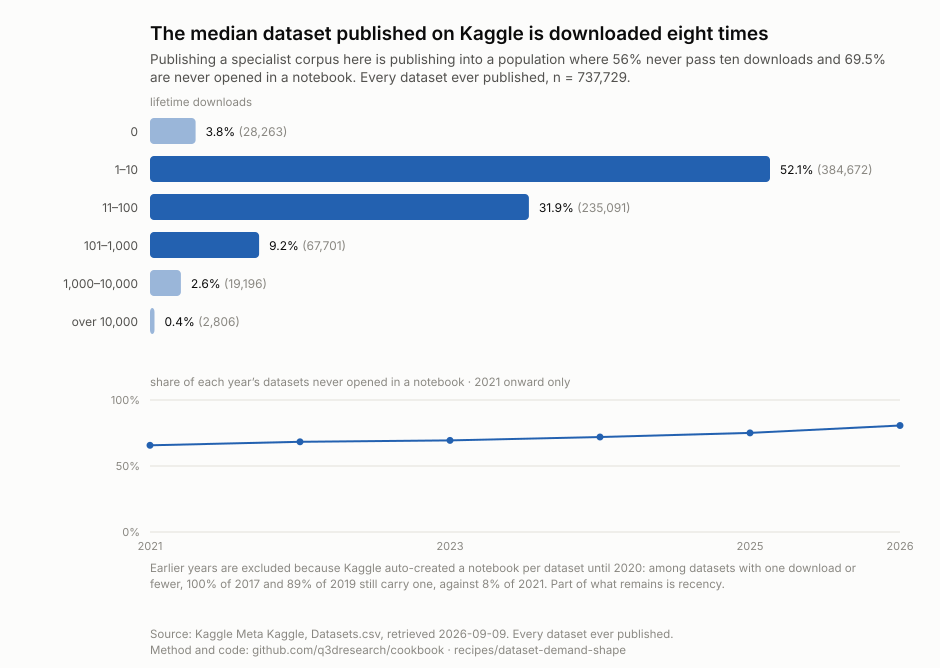
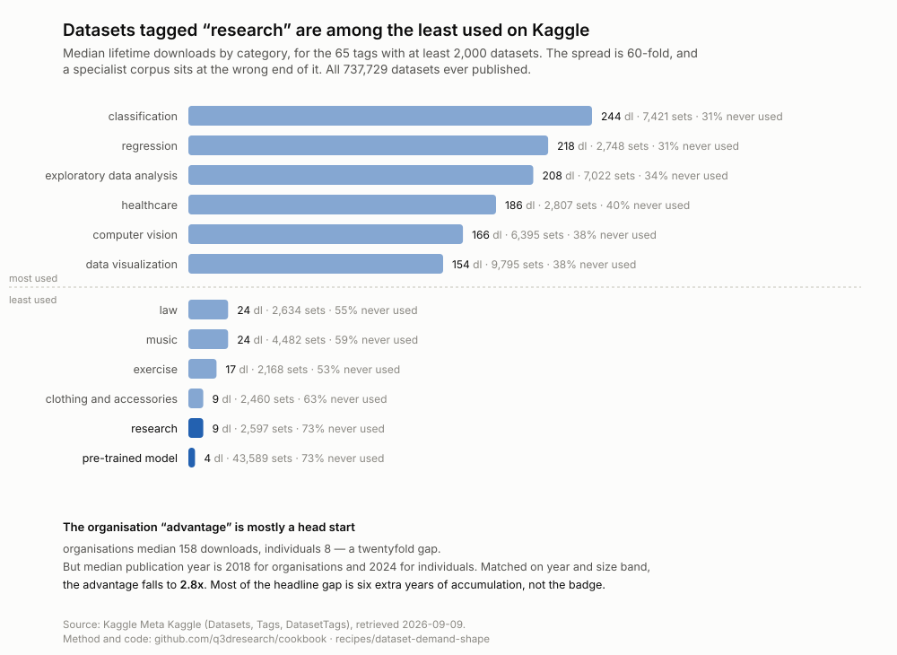
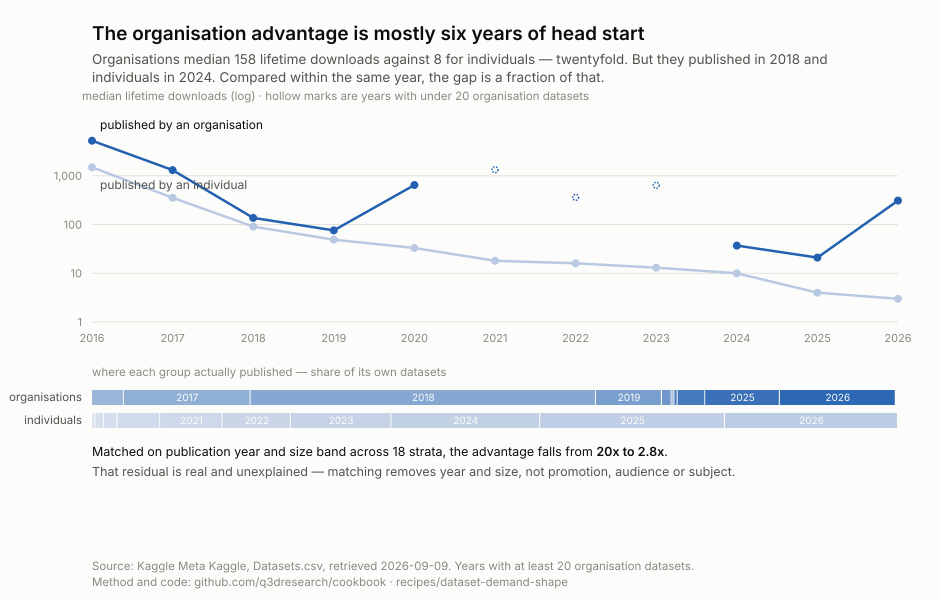
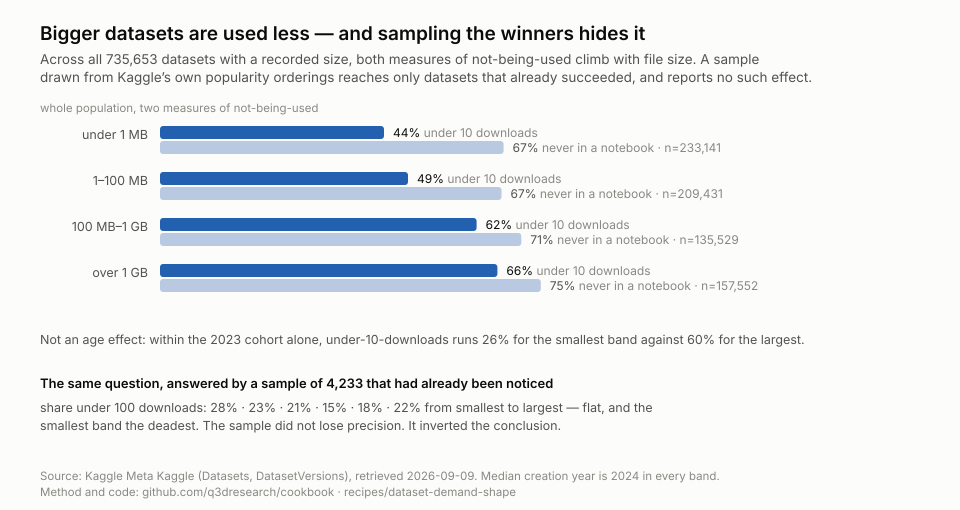
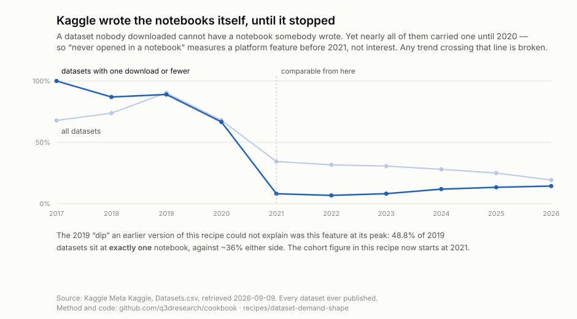
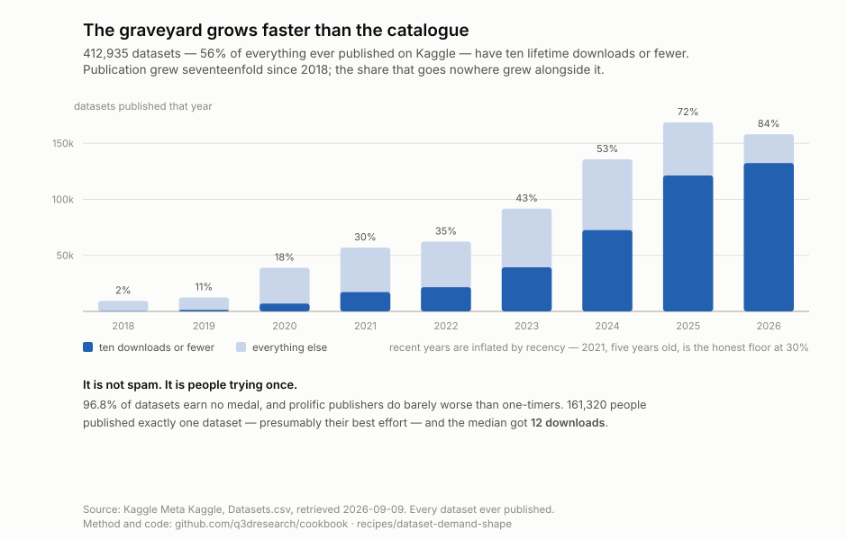

# The median dataset published on Kaggle is downloaded eight times

**Finding:** across every dataset ever published on Kaggle — 737,729 of them —
the median gets **8 downloads**, **69.5% are never opened in a single
notebook**, and only 0.4% ever pass ten thousand downloads. Who published it
matters more than what it is, and bigger is worse.

| lifetime downloads | datasets | share |
| --- | --- | --- |
| 0 | 28,263 | 3.8% |
| 1–10 | 384,672 | 52.1% |
| 11–100 | 235,091 | 31.9% |
| 101–1,000 | 67,701 | 9.2% |
| 1,000–10,000 | 19,196 | 2.6% |
| over 10,000 | 2,806 | **0.4%** |

## What the top actually looks like

The twelve most-downloaded datasets ever published, with notebook counts:

| downloads | notebooks | dataset |
| --- | --- | --- |
| 1,192,008 | 6,178 | `creditcardfraud` |
| 930,966 | 8,171 | `iris` |
| 805,530 | 2,029 | `videogamesales` |
| 803,153 | 2,725 | `netflix-shows` |
| 650,191 | 3,960 | `chest-xray-pneumonia` |
| 627,017 | 866 | `brazilian-ecommerce` |
| 602,368 | 2,866 | `telco-customer-churn` |
| **589,221** | **0** | **`fsboard`** |
| 559,947 | 3,940 | `breast-cancer-wisconsin-data` |
| 545,866 | 2,416 | `tmdb-movie-metadata` |
| 511,111 | 1,749 | `students-performance-in-exams` |
| 483,677 | 1,755 | `novel-corona-virus-2019-dataset` |

Ten of the twelve are teaching datasets, and they lead on notebooks as well as
downloads — `iris` alone carries 8,171 — so this is not bot inflation.

`fsboard` is the exception worth noticing: **589,221 downloads and zero
notebooks.** Downloads and use are different things, and that row is the
cleanest demonstration of it in the dataset.

## Who publishes it matters more than what it is

**The organisation advantage is mostly a head start.** 3,186 datasets published
by an organisation have a median of 158 downloads against 8 for the 734,543
published by individuals — a twentyfold gap.

But **median publication year is 2018 for organisations and 2024 for
individuals**; 42.8% of all organisation datasets were published in 2018 alone.
Matched on year and size band across 18 strata with at least 30 organisation
datasets each, **the advantage falls to 2.8×**.

Most of the headline gap is six extra years of accumulation, not the badge. The
remaining 2.8× is real and unexplained — it could still be promotion, audience,
or the kind of data organisations publish.

Publishing is concentrated but not dominated — 267,376 distinct owners, of whom
the top 1% account for 21% of all datasets.

**Category spread is sixtyfold**, and a specialist corpus sits at the wrong end
of it. `classification` runs a median of 244 downloads; `research` runs **9**,
with 73% never opened in a notebook. The largest dead category is
`pre-trained model` — 43,589 datasets, median 4 downloads, 73% never used.

## Bigger is worse, and sampling the winners hides it

Across the population, both measures of not-being-used climb with file size:
under-10-downloads runs 44% for sub-megabyte datasets and 66% above a gigabyte;
never-in-a-notebook runs 67% to 75%.

**This is not an age effect.** Median creation year is 2024 in every size band,
and within the 2023 cohort alone — age held constant — under-10-downloads runs
26% for the smallest band against 60% for the largest.

**A correction, because it is the more useful half.** An earlier version of this
recipe sampled 4,233 datasets through Kaggle's `votes` and `hottest` orderings
and reported that size does *not* predict use — the dead share looked flat at
28 · 23 · 21 · 15 · 18 · 22 percent, with the smallest band the deadest. That
was wrong, and wrong in a specific way: those orderings reach only datasets that
had already succeeded. **Within winners size carries almost no signal; across
the population it carries a monotonic one.** The sample did not lose precision,
it inverted the conclusion, and nothing inside the sample could have revealed
that. The published figure above is population-wide.

## Almost nothing is ever revised

**86% of datasets are never updated after their first upload** — 637,233 of
737,184 sit at version 1 forever. Publication is a single act, not a
maintained commitment, for all but a seventh of the platform.

## The trend, and why to discount part of it

The share of each year's datasets never opened in a notebook rose from 32% in
2017 to 81% in 2026, while annual publication grew from 3,228 to 158,159 — a
fiftyfold increase in supply.

**Most of that range is an artefact, and the figure now excludes it.** Kaggle
auto-created a notebook for each dataset until some point in 2020. The evidence
is decisive: among datasets with **one download or fewer** — which cannot have a
user-written notebook, because nobody obtained them — 100% of 2017, 87% of 2018
and 89% of 2019 still carry one, against 8% of 2021 and 7% of 2022. The 2019
dip to 9.7% that an earlier version of this recipe flagged as unexplained was
this feature at its peak: 48.8% of 2019 datasets sit at *exactly one* notebook.

**"Never opened in a notebook" is therefore not comparable before 2021**, and
the published figure plots 2021 onward only. Over those comparable cohorts the
rise is 66% to 81% — real, modest, and still partly recency, since a 2026
dataset has had months where a 2021 one has had five years.

**What would settle it:** downloads at matched age, which needs snapshots of
Meta Kaggle over time. It publishes only current totals, so that history does
not exist unless someone captures it. `history.csv` in this folder is the start
of one.

## The graveyard, and who is filling it

**412,935 datasets — 56% of everything ever published — have ten lifetime
downloads or fewer**, and 132,340 of those were published in 2026 alone. The
absolute graveyard grows faster than the catalogue, because volume and the dead
share are rising together.

The obvious explanation is spam, and the data rejects it. **96.8% of datasets
earn no medal**, and prolific publishers do barely worse than one-timers —
median 7 downloads against 12. **161,320 people published exactly one dataset**,
presumably their best effort, and the median got twelve downloads.

So the mechanism is not dumping. It is that **the value to the publisher is
realised at publication, not at use.** For a job-seeker, a student, or someone
mirroring model weights, the dataset existing *is* the deliverable; downloads
are irrelevant to the actual goal. Uploading is nearly free, feedback arrives
months later if at all, and nothing at upload time signals that the category is
saturated.

**Kaggle has no reason to fix it.** Storage is negligible, more datasets means
more search surface, and deleting user content buys anger and support load. The
cost falls on people searching — diffuse, unorganised, with no standing to
complain. Producer benefits, consumers pay, nobody has authority to prune.

Stated generally: **a dataset dies when it was produced for the producer's
benefit rather than a named consumer's need.** Size hurts because bigger usually
means "my working files" rather than "your answer". `research` and
`pre-trained model` die because they are supply-side artefacts. 86% are never
revised because nobody was waiting for version two.

## The decision it drives

**Do not publish a research archive to a dataset platform expecting use.** The
demand curve is people learning tools, not people answering questions — and
`research` is near the bottom of every category ranking, while size works
against you and individual authorship costs you twentyfold against an
institutional badge.

The corollary: **"what dataset should I publish" is unanswerable without first
asking "to whom".** Demand shape is a property of the audience, not the data.

And the test that follows, which applies to any archive and not only to Kaggle:
**name the asker.** Not "someone will need this" — a role, an organisation, a
decision that gets made differently. If you cannot, you are publishing for the
same reason the 161,320 did, and unreconstructable-and-unwanted is still
worthless; it is only worthless with better provenance.

## What this cannot say

Everything here is Kaggle. Whether the same shape holds on Hugging Face,
Zenodo or figshare is untested, and platform audience is the variable this
recipe says matters most — so do not generalise it.

Downloads and notebook counts measure attention on one platform, not value.
A dataset used once by the right person may matter more than one downloaded ten
thousand times by students.

The residual 2.8× organisation advantage is still not causal. Matching removes
year and size; it does not remove promotion, audience, or the kind of data
organisations choose to publish.

## Reproducing it

    python artifacts/scripts/fetch.py        # ~1.5 GB, four tables, no credentials
    python artifacts/scripts/chart.py        # population distribution and cohort trend
    python artifacts/scripts/categories.py   # category and institutional comparison
    python artifacts/scripts/size.py         # size effect and the sampling contrast
    python artifacts/scripts/matched.py      # organisation gap, matched on year
    python artifacts/scripts/artefact.py     # the auto-created notebook artefact
    python artifacts/scripts/graveyard.py    # the graveyard's growth

Open questions, and what would close them, are in
[`artifacts/research-questions/`](artifacts/research-questions/questions.md) —
that is what to read first on a return visit.

**No data is committed.** A fork should be cheap. `provenance.json` records the
row counts and SHA-256 of exactly what the published figures were computed
from, and `fetch.py` prints your corpus against it, so drift is visible rather
than silent.

## Sources

**Meta Kaggle** — Kaggle's own index of itself, updated daily, served without
credentials. `Datasets.csv` (100 MB), `DatasetVersions.csv` (1.4 GB, carries
size and version history), `Tags.csv`, `DatasetTags.csv`, `Organizations.csv`.

The public list API is *not* used for any published figure. It caps at page 400
in every ordering — `votes`, `hottest`, `published`, `updated`, `active` all
stop at 8,000 rows — and there is no total count in the response or headers.
That cap is why a sample drawn from it inverted the size result.

Joins are on `DatasetId` against `Datasets.Id`, both surrogate ids from the same
export. That is the one case where a surrogate is safe: internally consistent
within one snapshot. **Do not carry these ids across snapshots.**

## Traps, so they are not rediscovered

**Kaggle's list-API size filters are leaky.** `maxSize=100000` returned a 12.3
GB dataset; `minSize=10000000000` returned one of 0 bytes. Accepted, appears to
work, silently does not filter.

**`sortBy=published` cannot answer demand questions.** It reaches back about
three weeks before pagination dies, so age and failure are perfectly confounded.

**Notebook counts are platform-contaminated before 2021.** Kaggle auto-created
one per dataset until some point in 2020, so any cross-year comparison using
`TotalKernels` needs to start at 2021. The test that reveals it: look at
datasets with one download or fewer and ask how many have a notebook.

**Meta Kaggle's file-listing endpoint 404s**, but individual files download
fine via `datasets/download/kaggle/meta-kaggle?file_name=X.csv`, which redirects
to signed storage. Filenames have to be guessed or known.

## About the data

Retrieved 2026-09-09. Licence: code MIT, text and figures CC-BY-4.0. The
underlying metadata remains subject to Kaggle's terms. No personal data is
committed; `Users.csv` was not used.
