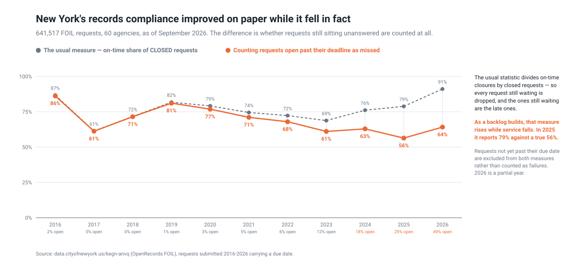
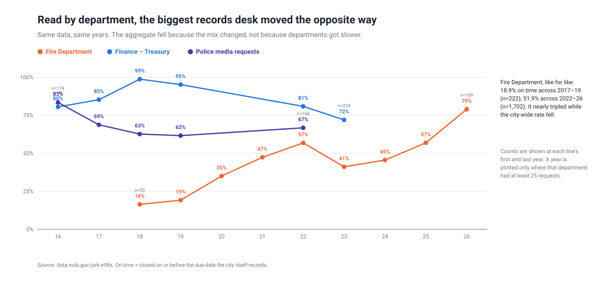
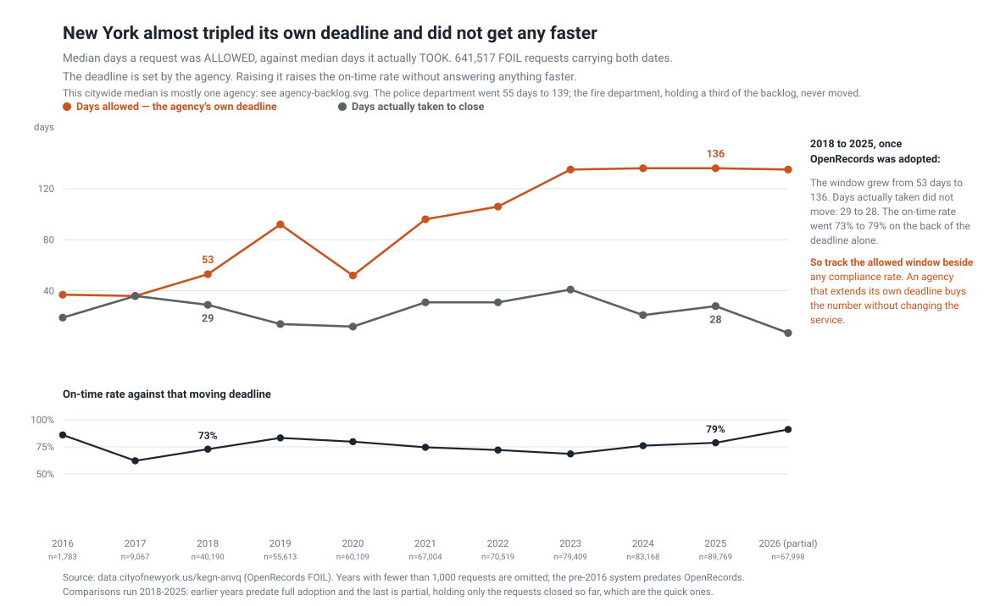
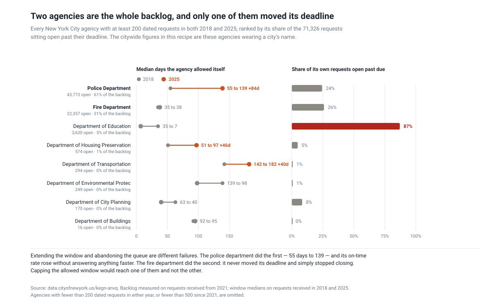

# Five ways a public-records dataset lies to you, and one thing it says outright

**Status: proven** · method 1.1.0 · re-harvested 2026-09-10 — 730,312 requests
from five published datasets across four jurisdictions, fetched by
[`artifacts/scripts/harvest.py`](artifacts/scripts/harvest.py). No data is
committed; the harvest directory is an argument and every figure below
regenerates from a clean fetch.

Four US jurisdictions publish their public-records request logs. Two — New York
City and New Orleans — record the **statutory due date**, so deadline compliance
is measurable rather than inferred. Every naive reading of them is wrong, and
each is wrong in a different, generalisable way.

## The decision it changes

**If you publish or cite a public-records compliance rate, change the
denominator.** The standard statistic — on-time closures ÷ closed requests —
reports that New York City recovered from 74% to 79% between 2021 and 2025.
Counting requests that are already past their due date as missed, compliance
fell from 82% to 56%. The two measures agree until 2022 and separate exactly as
the backlog builds, because the requests being dropped from the denominator are
the late ones.

*Who acts on this:* an agency records officer reporting to a council or
legislature; an oversight body or ombudsman assessing performance; a journalist
or transparency organisation publishing a scorecard. All of them have a number
they publish annually, and the fix is arithmetic they can apply this year.

Four more, in the order you will hit them:

| before you chart it | because |
| --- | --- |
| Track the **allowed window** beside the rate, **per agency** | The agency sets its own due date. New York's police department went from 55 days to 139 while taking no longer to answer; its fire department never moved its deadline and stopped closing instead. Same citywide number, opposite problems, different remedies. |
| Split by **agency** before acting on any total | Two agencies hold 92% of every request open past its deadline, and 32 of 60 have none. A citywide programme aims at the wrong thing. |
| Split by **channel** too | Inside one agency, in-person requests close in 5 days at 98% on time; portal requests, 91% of the volume, take 27 days at 78%. |
| Put a **departments-per-year** column beside any compliance rate | New Orleans silently drops from 81 publishing departments to 21 in one month. The rate after that compares a different population. |
| Check **composition** before reading an aggregate trend | New Orleans' city-wide rate fell while its Fire Department nearly tripled, 18.9% to 51.9% like-for-like. The aggregate moved because the mix moved. |
| Do not assume who is asking | 62% of Oregon DEQ's requests come from **environmental consultants** doing commercial property due diligence. 2% are media. |

The last one is a policy finding rather than a measurement one, and it is the
one worth arguing about: a records regime built for public accountability is, in
at least one agency, mostly a subsidised title-search service.

## 1. The usual compliance measure hides its own decline



The standard statistic is *on-time closures ÷ closed requests*. It drops every
request still sitting open — and **the ones still open are the late ones.** As a
backlog builds, the measure rises while service falls.

New York City, 641,517 FOIL requests across 60 agencies:

| | 2019 | 2021 | 2023 | 2024 | **2025** |
| --- | --- | --- | --- | --- | --- |
| closed-only (the usual measure) | 82% | 74% | 69% | 76% | **79%** |
| counting open-past-due as missed | 81% | 71% | 61% | 63% | **56%** |
| still open | 1% | 5% | 12% | 18% | **29%** |

**The usual measure reports recovery. Compliance actually fell from 82% to 56%.**
The two agree until 2022 and separate exactly as the backlog grows.

*Method:* a request open past its due date has already missed it, so it counts
as a miss. Requests not yet due are excluded from both measures rather than
counted as failures.

*And this number is two agencies.* 61% of every request sitting open past its
deadline belongs to the police department and 31% to the fire department; the top
five agencies hold 99% of the backlog and 32 of 60 agencies have none at all. The
citywide decline is real, but "New York City" is the wrong unit to act on — see
section 5. The backlog is also old: the median request open past due is **393
days** past it, 52% are more than a year past, and the oldest is 8.8 years.

## 2. Coverage changes without telling you

Requests per month fall from ~110 in 2019 to ~18 in 2025 — an 83% decline, with
a step between July 2024 (86) and August 2024 (37) that never recovers. It is
not a decline in requests. It is a decline in *publication*:

| | before 2024-08 | from 2024-08 |
| --- | --- | --- |
| distinct departments | **81** | **21** |
| Finance – Treasury | 1,143 | **0** |
| Media Request – NOPD | 957 | **0** |
| Police Department (NOPD) | 290 | **0** |
| City Attorney | 274 | **0** |

Sixty departments vanish. After the step, 520 of ~560 requests are the Fire
Department. And 2020–21 are narrow for the same reason — 63% and **86%** of
requests in a single department.

So the compliance series compares different populations year to year. Only
**2017–2019** has broad coverage (225–295 departments, largest at 14–17%).

## 3. An aggregate can move opposite to every part of it



| department | 2018 | 2019 | 2022 | 2023 | 2024 | 2025 | 2026 |
| --- | --- | --- | --- | --- | --- | --- | --- |
| **Fire Department (NOFD)** | **16%** | **19%** | 57% | 41% | 45% | 57% | **79%** |
| Finance – Treasury | 99% | 95% | 81% | 72% | · | · | · |
| Media Request – NOPD | 63% | 62% | 67% | · | · | · | · |
| Environmental Assessments | 86% | 42% | 80% | · | · | · | · |

> **Fire Department, like for like: 18.9% on time in 2017–19 (n=222), 51.9% in
> 2022–26 (n=1,702).** It nearly tripled.

The city-wide fall is a **composition effect**. Early years were dominated by
Finance-Treasury, closing 95–99% on time; later years by the Fire Department,
which started at 16%. The aggregate moved because the mix moved.

**And the Fire Department's rise has a visible mechanism**, which is what makes
it worth trusting:

| | 2017–19 | 2022–26 |
| --- | --- | --- |
| median days to close | **47** | **7** |
| median days *allowed* | 15 | **7** |
| most common outcome | *City Atty Office Closed* — 70% | *NOFD Closed* — **84%** |

Fire's requests used to route through the City Attorney's office and take 47
days against a 15-day window. Now Fire closes them itself in 7 days. They took
the process in-house — and did it while the allowed window **halved**.

The other two did not "become less compliant" so much as leave: Finance-Treasury
fell from 99% (2018) to 72% (2023) and then stops appearing. **72% is its last
observed value, not its current one.**

**The general warning, which matters more than the case:** a public-records log
can change which agencies it covers without any notice in the data, and an
aggregate compliance rate computed across that change is meaningless. Anyone
charting these series — and they are attractive to chart — needs a
departments-per-year column next to the rate.

## 4. The requesters are not who the law imagined

Oregon DEQ types its requesters natively, and the answer is not public
accountability:

| requester type | share |
| --- | --- |
| **environmental consultant** | **62%** |
| real estate | 11% |
| general public | 8% |
| law firm | 4% |
| property owner | 4% |
| non-profit / advocacy | 3% |
| media | 2% |

Nearly two thirds of DEQ's records workload is **commercial property due
diligence**, not oversight. A records regime designed for transparency is in
practice a subsidised title-search service.

## 5. The deadline itself moves

The first four traps are all about the numerator or the denominator. This one is
about the thing being compared against, and it undercuts every compliance measure
here including the corrected one.



New York City's median **allowed window** — the gap between when a request
arrives and when the agency says it is due — went from **53 days in 2018 to 136
in 2025.** Over the same period the median days actually taken went from 29 to
28. The agency did not get faster. It gave itself two and a half times longer,
and its on-time rate rose from 73% to 79% on that alone.

Which means the corrected measure in section 1 understates the problem rather
than overstating it. Compliance still fell from 81% to 56% *while the deadline
was being extended*. Both effects point the same way.

**But that citywide median is one agency.** Splitting it by agency — which is
this recipe's own third trap, applied to its own finding — the extension is
almost entirely the police department, and the two agencies that hold 92% of the
backlog behaved in opposite ways:



| | window 2018 → 2025 | share of the backlog | share of its own requests open past due |
| --- | --- | --- | --- |
| **Police Department** | **55 → 139 days** | **61%** | 24% |
| **Fire Department** | 35 → 38 days | **31%** | 26% |
| Department of Education | 35 → 7 days | 5% | **87%** |

**These are two different failures and they need different remedies.** The police
department extended its own deadline and its on-time rate rose without a single
request being answered faster — capping the allowed window would reach that. The
fire department never moved its deadline and simply stopped closing; a cap does
nothing to it. The Department of Education *shortened* its window to seven days
and leaves 87% of its own requests open past it.

**The general warning:** an on-time rate is a comparison against a date, and in
these systems the agency sets the date. Track the window and the closing time
separately, per agency. An agency whose window grows while its closing time is
flat is buying the number; an agency whose window is short and whose queue is
full has stopped answering. The citywide figure cannot tell them apart.

*A caveat on the baseline.* The comparison starts at 2018 because OpenRecords was
still rolling out before then — 2016 and 2017 carry 1,783 and 9,067 requests
against 2018's 40,190 — and the direction of the on-time rate depends on which
year you start from. From 2016 the rate *falls*, 86% to 79%. What does not depend
on the baseline, and is the point, is that the window grew several-fold while the
time actually taken did not move.

## 6. The same agency answers different doors differently

The five traps above are about measurement. This one is a finding, and it is the
only thing here a person filing a request can act on directly.

Within the New York police department alone — same agency, same staff, requests
received since 2021:

| how it was filed | requests | on-time | median days to close | still open |
| --- | --- | --- | --- | --- |
| **In person** | 3,066 | **98%** | **5** | **6%** |
| Email | 410 | 89% | 1 | 26% |
| Mail | 12,793 | 79% | 42 | 35% |
| **Online portal** | **162,682** | 78% | 27 | **30%** |

This is not the composition effect it looks like. Holding the agency fixed
removes that: 91% of the department's requests arrive through the portal, and
those are the ones that wait. The counter answers in five days.

**What this cannot rule out** is that people who turn up in person ask for
different things — a single accident report rather than a document set. The log
carries no subject field, so that confound stands and the finding is stated as
association. It is still a large gap inside one agency, and the direction is not
in doubt.

*The measurement lesson underneath it:* disaggregate by channel as well as by
agency. A citywide on-time rate averages a five-day counter with a twenty-seven
day queue and reports neither.

## What each source can and cannot answer

| source | rows | span | usable for |
| --- | --- | --- | --- |
| **New York City** | **641,517** | 2006-08 → 2026-09 | **deadline compliance at scale** — 60 agencies, every row has a due date |
| New Orleans | 10,369 | 2016-06 → 2026-09 | deadline compliance, subject to the coverage break and a 1% publication rate |
| Oregon DEQ | 19,124 | 2020-07 → 2026-03 | requester composition — the only source that types its requesters |
| Vermont | 31,651 | 2011 → 2026 | volume and agency mix only |
| Vermont pre-2020 | 27,651 | 2011 → 2019 | volume and agency mix only |

**Vermont's latency is not usable.** 58% of current-table requests close on the
same day they are received (38% pre-2020), against 10.4% for New Orleans and
9.2% for Oregon. That is a logging convention, not processing speed. Two rows
carry impossible dates (1964, 2029) but they are isolated.

## What running the build sequence caught

The recipe was finished, verified and reproducing its numbers before anyone asked
whether it keyed on anything. It did not. Four of the five sources publish the
agency's own case number — `request_id`, `foia_id` — and the harvester discarded
all four, so the one longitudinal question this recipe asks, *what becomes of the
requests that are never closed*, could not be answered. A `history.csv` sat beside
it claiming to support exactly that.

The case number is now retained, which is what makes a second harvest comparable
to this one. It is not personal data: it is the reference the agency publishes in
the same row, and the largest source names no requester at all. Adding it did
require narrowing the disclosure check rather than loosening it — a numeric case
number matches the postcode pattern, and widening that pattern to tolerate one
would also stop it catching a real postcode. The case-number column is excluded
from the scan; everything else is still scanned, row by row.

## On personal data

New York City names no requester at all — a point worth noting, since it is the
largest and most usable source here and gives up nothing by omitting them. The
other sources do name requesters; Oregon also carries the **site address** of
residential properties, and Vermont's pre-2020 table carries state employees'
email addresses. None of it is needed here.

The harvester reads names once to classify the requester as person or
organisation, and **writes no name, address, email or postcode**. The output is
checked for all three on every run and the check is printed. Deleting the name
column cannot weaken this dataset, because the column is never created.

*Caveat on that classification:* the person/organisation split from names alone
is weak — it reports 94% "person" for New Orleans against Oregon's native typing
where "general public" is 8%. It measures name format, not requester nature.
**Use Oregon's `requester_type`; treat the derived one as unreliable.**

## Running it

```bash
python artifacts/scripts/harvest.py ./work            # ~730k rows, 5 Socrata sets, ~8 min
python artifacts/scripts/nyc_compliance.py   ./work/foia/requests.csv   # hidden decline
python artifacts/scripts/charts.py           ./work/foia/requests.csv   # coverage + reversal
python artifacts/scripts/publication_rate.py                            # New Orleans, fetches its own
```

Stdlib only, and `svgkit.py` sits beside the scripts rather than being imported
from elsewhere in this repository. No data is committed: the harvest directory is
an argument, the corpus is 730k rows, and the publishers keep their own history
back to 2011. This is a recipe, not a capture — re-run it for fresher numbers.

*If you are reading this in the cookbook and the scripts fail on an import, that
is a bug and not your environment — every script here must run from a clean clone
with nothing but Python. This is checked before publication, because three of
these four scripts were broken for a fortnight by a directory rename and the
recipe still read as finished with four figures sitting beside them.*
