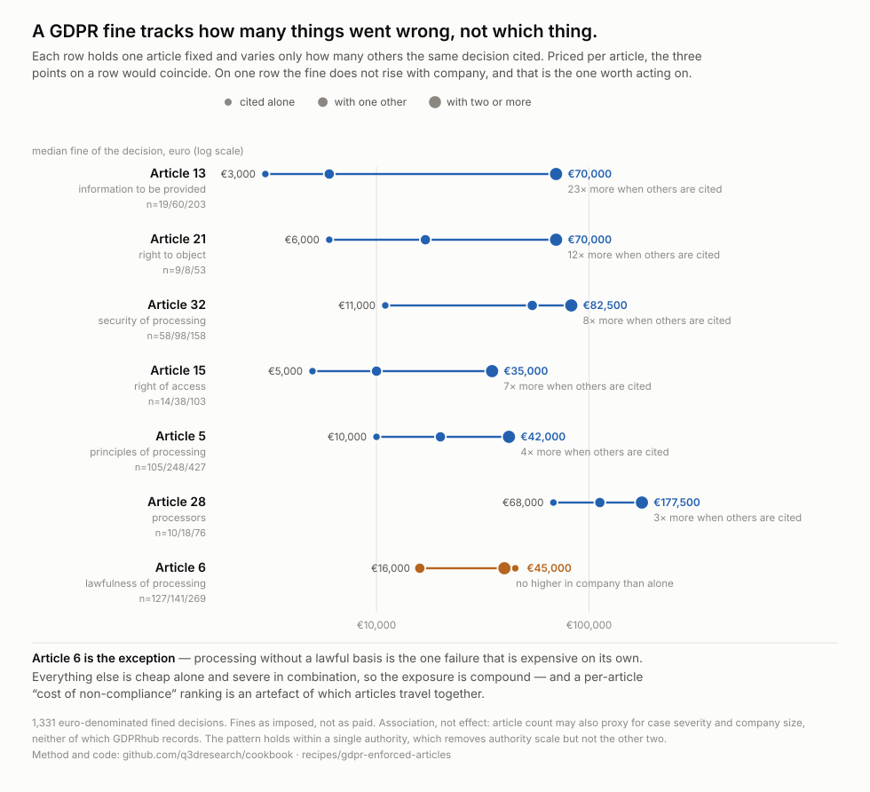
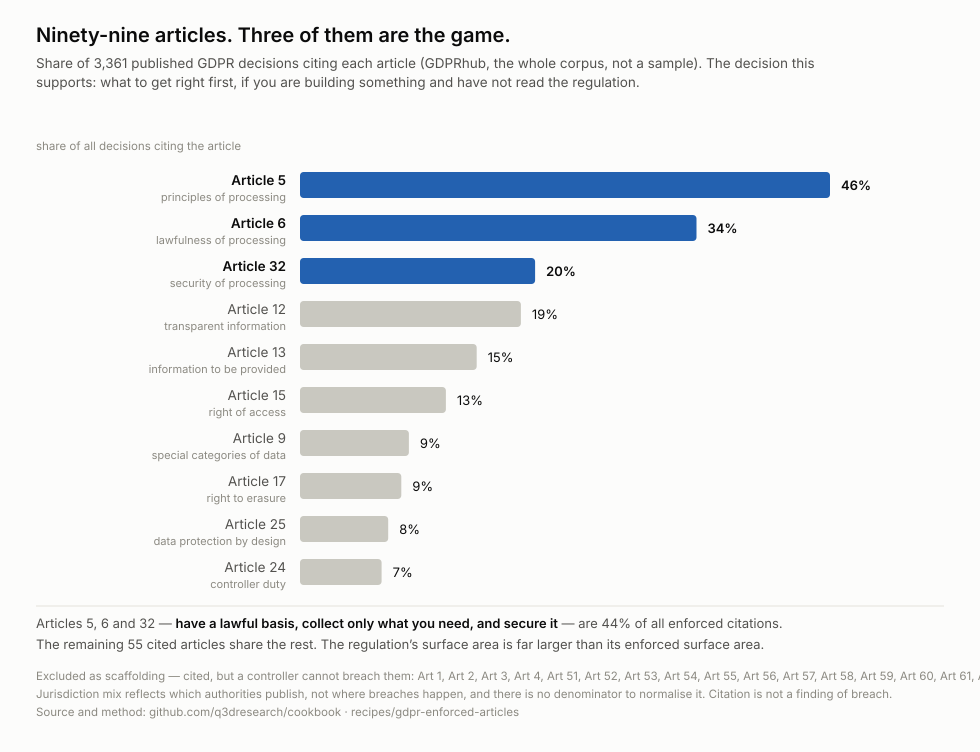
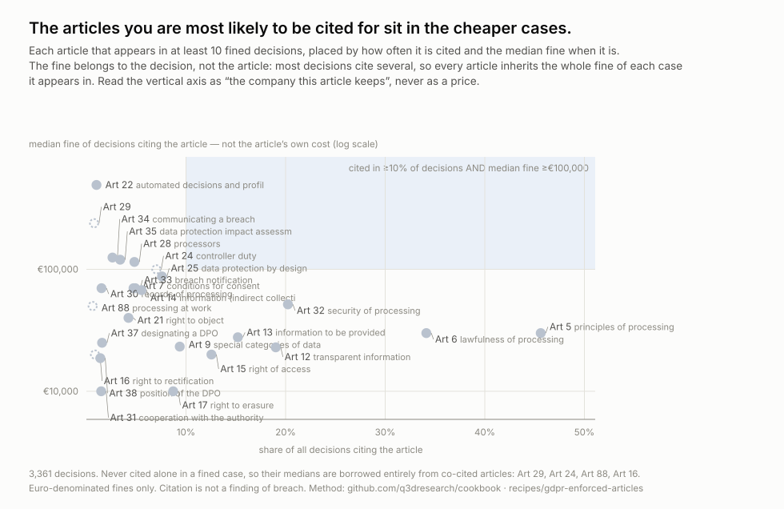
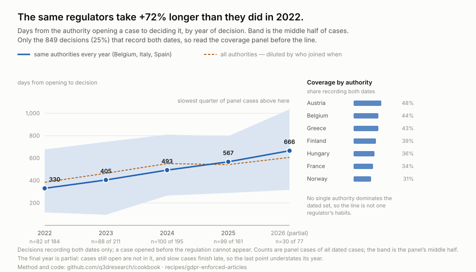

# A GDPR fine tracks how many things went wrong, not which thing

**Status: proven** · method 2.0.0 · full population fetched 2026-09-10

## The decision it changes

If you are building something and can fix one thing before a regulator arrives,
fix your **lawful basis**. Article 6 is the only obligation in the regulation
whose fine does not get worse in company: a lawful-basis failure on its own runs
a median **€45,000**, and a lawful-basis failure alongside two or more other
breaches runs **€40,000**. Everything else is cheap alone and severe in
combination — Article 13 goes from €3,000 to €70,000, Article 32 from €11,000 to
€82,500.

That inverts the advice a per-article ranking gives. Rankings of "the most
expensive GDPR articles" are published regularly and they are artefacts: they
attribute a decision's whole fine to every article it cites, and **69% of
decisions cite more than one**. Article 32 looks expensive because it shows up in
pile-on cases, not because securing data badly is itself costly.

The Article 6 premium is not an artefact of where or how those cases arise.
Holding both the authority and the case type fixed — Spanish complaints,
single-article decisions only — Article 6 runs a median €50,000 against Article
5's €5,000, a tenfold gap on n=103 and n=65.

*Who acts on this:* a founder, engineering lead or DPO deciding where the next
week of compliance work goes. The answer is not "the article with the biggest
average fine" — it is lawful basis first, and after that, reducing the **number**
of things simultaneously wrong, because that is what the fine scales with.



Each row holds an article fixed and varies only how many others the same decision
cited. Priced per article, the three points on a row would coincide.

## What actually gets enforced



Of 3,361 published decisions across 33 jurisdictions, **Article 5 (principles)
appears in 45.6%, Article 6 (lawful basis) in 34.1% and Article 32 (security) in
20.2%.** Together those three are 44% of decisions. The regulation has 99
articles; 80 have ever been cited here; the 53 outside the top five share 41% of
enforced citations.

Someone who understood only *have a lawful basis, collect only what you need, and
secure it* would be prepared for most of what regulators actually examine.

**Twenty-two of the cited articles are not obligations at all.** They are the
machinery a case runs on — the authority's powers (Art 58, cited 422 times), the
one-stop-shop mechanism routing cross-border cases (Art 60), the criteria for
setting a fine (Art 83), definitions and scope. 1,420 citations. A controller
cannot breach any of them, and leaving them in puts "cooperation between
supervisory authorities" near the top of a list a builder reads as a to-do.

### The chart this corrects

Ranking articles by the median fine of decisions citing them produces this, and it
is kept because it is the mistake worth seeing rather than a finding:



Its vertical axis is not what an article costs. A fine belongs to a decision, most
decisions cite several articles, and so every article inherits the whole fine of
every case it appears in. Article 32 looks expensive because it appears in pile-on
cases; alone it is cheap. The compound chart above is the corrected version.

## How long it takes, and it is getting worse



Median **487 days** from an authority opening a case to deciding it, and **31%
take more than two years**. The trend is the finding, and it is worse than the
raw numbers suggest. Across all authorities the median went from 384 days in 2022
to 542 in 2025, +41%. But the set of authorities publishing changed over that
window, so the defensible comparison holds the panel fixed: among the three
regulators with dated decisions in **every** year — Belgium, Italy and Spain —
the median went **330 days to 567, +72%.**

Composition was hiding the effect, not creating it. Two explanations are ruled
out: it is not new authorities dragging the average, and it is not a shift toward
cross-border cases — Article 60, which routes those, fell from 3.8% of decisions
in 2022 to 0.4% in 2025. What remains is that the same regulators are taking
substantially longer.

Cases that end in a fine take longer than cases that do not: 577 days against
408. And authorities differ by a factor of two and a half — Hungary a median 326
days, France 843.

Only a quarter of decisions record both dates, so the figure carries a coverage
panel. That coverage is spread across authorities (Austria 48%, Belgium 44%,
Greece 43%, Italy 26%, Spain 23%), which is what makes the median readable as a
European number rather than one regulator's habits.

## Who gets hit

**1,678 distinct organisations** across 1,947 decisions that name one, after
folding case, accents and legal-form suffixes. **122 organisations appear more
than once, and they account for 20% of all decisions against a named
organisation.**

| | decisions |
| --- | --- |
| Google | 31 |
| Vodafone España | 25 |
| CaixaBank | 9 |
| Orange Espagne | 8 |
| Xfera Móviles | 8 |
| Telefónica Móviles España | 8 |
| Vodafone România | 8 |
| Klarna Bank | 7 |
| Meta Platforms Ireland | 6 |
| Clearview AI | 6 |

Telecoms and big tech. Names are typed by contributors, not company identifiers,
so folding is a heuristic: it merges `VODAFONE ESPAÑA, S.A.U.` with `Vodafone
España, S.A.U.` but not `Google` with `Google LLC`. The distinct count is an
upper bound and the repeat count a lower one.

## The fines

Median **€20,000**. Three quarters are under €120,000. But the top decile starts
at €1,000,000 and the largest is **€1.225 billion**, so the mean is meaningless
and every figure here uses medians.

**Whether a fine is company-killing is not answerable from this source, and the
recipe does not try.** GDPR fines are capped at 4% of global annual turnover, so
severity only means anything against revenue — and GDPRhub records no revenue, no
employee count and no company identifier. A €2m fine is a rounding error to a
bank and fatal to an agency. The absolute distribution is reported; the question
is left open rather than answered badly.

## What this cannot tell you

* **What does *not* get prosecuted.** These are decisions authorities chose to
  publish. 90% of decisions that reached a finding found a violation, which
  measures publication practice at least as much as regulator success — a case
  that closed quietly is invisible. Non-enforcement cannot be read off a corpus
  of enforcement.
* **The appeal rate.** Only 12% of decisions record a real `Appeal_To_Status`;
  47% say "Unknown" and 41% are blank. Among the 12%, 13% were appealed, but
  that is a rate among cases somebody bothered to follow up.
* **Cause.** The compound effect is an association. Article count plausibly
  proxies for case severity and company size — a bigger investigation both finds
  more breaches and targets a bigger firm. The pattern holds *within a single
  authority*, which removes the authority-scale confound, but not the other two.
* **What was paid.** The `Fine` field is the fine as imposed. 2.7% of decisions
  mention a reduction or settlement in their prose — one Spanish bank's
  €2,000,000 was settled at €1,200,000 — and the field never reflects it. Totals
  are upper bounds.
* **Where breaches happen.** Spain is 22% of the corpus and Italy 13%. That is
  which authorities publish, and how completely. There is no denominator, so no
  cross-country claim is supportable.
* **Citation is not breach.** A decision citing Article 15 may have found no
  violation of it. The distribution measures what regulators engage with.

## Run it yourself

No data is committed — the wiki is edited continuously, so a pinned copy would
be wrong within a week and a fresh fetch is the honest artefact.

```sh
python artifacts/scripts/fetch-gdprhub.py --out gdprhub.jsonl   # ~90 min, resumable
python artifacts/scripts/gdpr-article-concentration.py gdprhub.jsonl
python artifacts/scripts/gdpr-cocitation.py            gdprhub.jsonl
python artifacts/scripts/gdpr-case-timeline.py         gdprhub.jsonl
python artifacts/scripts/chart-gdpr-meta.py            gdprhub.jsonl
python artifacts/scripts/chart-gdpr-compound.py        gdprhub.jsonl
python artifacts/scripts/chart-gdpr-leadtime.py        gdprhub.jsonl
python artifacts/scripts/chart-gdpr-exposure.py        gdprhub.jsonl
```

Stdlib only. The fetch resumes from its output file and caches the page list
beside it. Be polite: it is a small charity's wiki, not an API product.

## Where the ingredients are

**GDPRhub** (`gdprhub.eu/api.php`), noyb's wiki of European data-protection
decisions. MediaWiki, so revision history comes free, and decisions are
**templated** — `DPAdecisionBOX` carries ~46 named fields including
`GDPR_Article_1..n`, `Jurisdiction`, `Date_Started`, `Date_Decided`, `Fine`,
`Currency`, `Party_Name_1..3` and `Appeal_To_Status`. The useful content is
structured and needs no text mining.

6,871 pages enumerate in fourteen calls; 3,361 are decisions and the rest are
categories, templates and help pages. The corpus keeps every template field
verbatim, because the first version kept only the eleven the first question
needed and the second question wanted `Date_Started`.

Keeps its own history by construction, which is why this is a recipe and not a
capture.

## Why hasn't anyone

The descriptive layer is well served — CMS's Enforcement Tracker, GDPRhub itself,
DLA Piper's annual fines survey. They publish lists of decisions and league
tables of the largest fines. What none of them publish is the **conditional
structure**: which articles travel together, and therefore that a per-article
cost ranking is measuring co-citation. That is one query away from a source they
all already use.

## Wrong turns worth recording

**A sample overstated the concentration.** The first version ran on a systematic
1-in-3 sample and reported the top two articles as 41% of enforced citations. On
the population it is 35%, the tail is 53 articles rather than 22, and Article 32
doubles from 10% of decisions to 20%. The sample was drawn correctly; it was
simply small, and the population cost an afternoon.

**The recipe asserted the data was missing.** Version 1 said GDPRhub carries no
fine amount and that `Party_Name` is empty. Both fields exist and are populated
in 71% and 63% of decisions respectively. The whole fine and party analysis above
existed the entire time behind a sentence saying it did not.

**The fine parser read `2,5 million` as 25.** It stripped non-numeric characters
and lost the scale word — a hundred-thousand-fold error headed for a headline. It
now accepts only what is unambiguous: strip a currency token, and reject anything
with a surviving letter. `2.5m`, `1.5 bn`, `300k` and `100.000 (reduced to
50.000)` are all dropped rather than guessed.

**The scaffolding list was a set of hunches until it was a rule.** Articles were
excluded one at a time as they looked wrong in the ranking. It is now the
regulation's own structure — Chapter I is scope and definitions, Chapters VI–VII
are the authorities and their cooperation, and the procedural half of Chapter
VIII is remedies — which caught Article 60 before publication. Article 60 routes
the largest cross-border cases and carries a median fine of €95,500,000; ranked
as an enforced article it would have put "cooperation between supervisory
authorities" near the top of a builder's to-do list.

**A chart argued against its own headline, twice.** The exposure scatter plotted
a median fine per article and called Article 32 the one that is common *and*
expensive. It is neither: the axis was measuring co-citation, and Article 32 has
almost no fined decisions where it stands alone. That figure is kept — it is
useful as the thing the compound figure corrects — but relabelled so its vertical
axis reads "median fine of decisions citing this article", never "what this
article costs".
