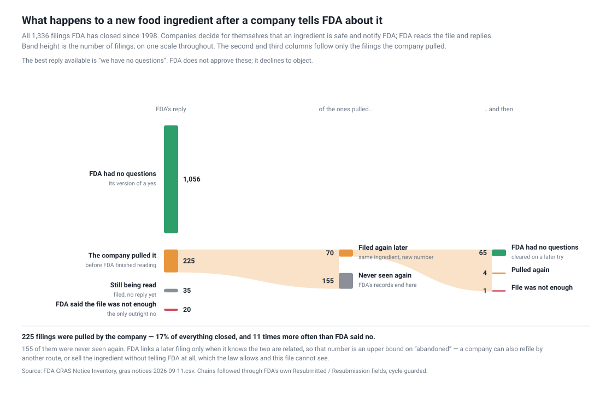
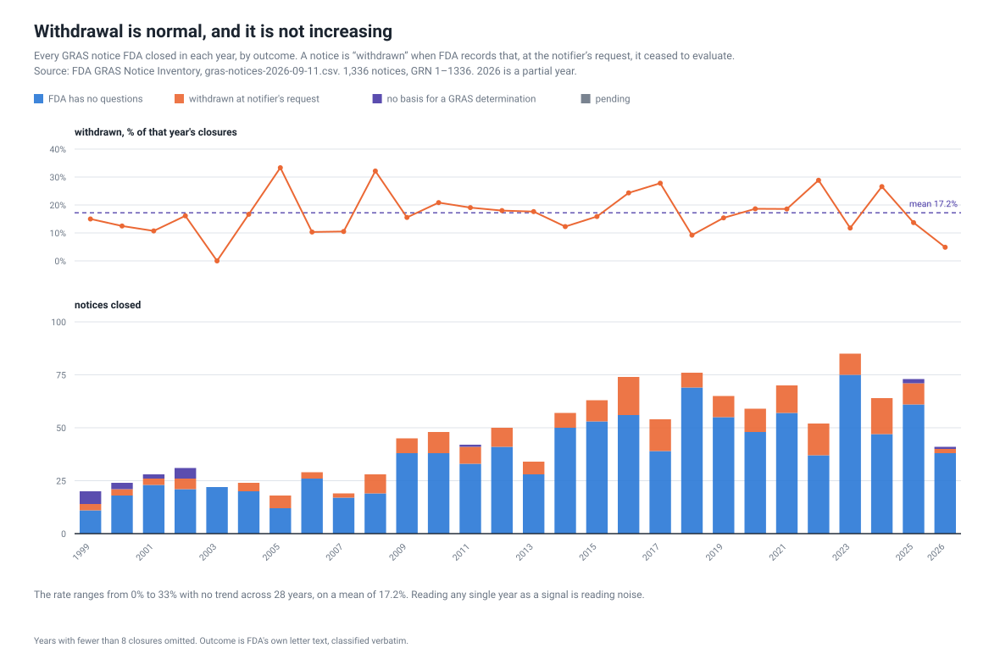
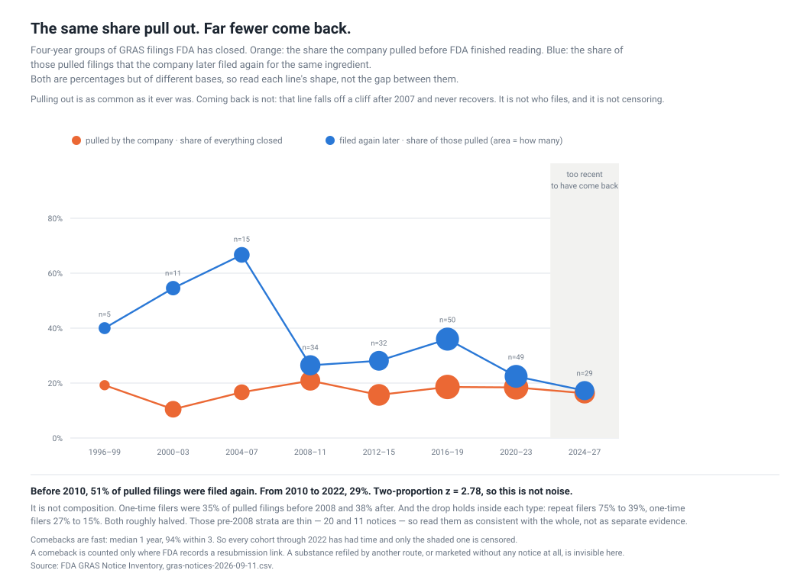
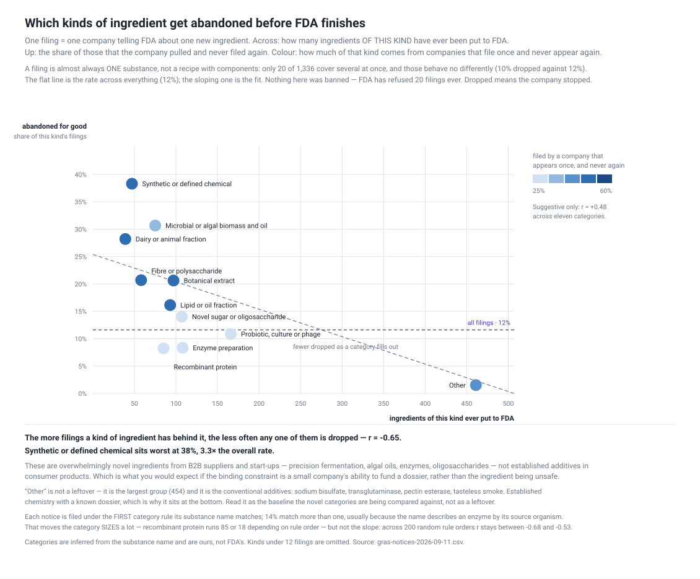

# The same share of food ingredients get pulled. Far fewer come back.

**Published 2026-09-11** · four figures, eight scripts · source: FDA's own
inventories, no key and no account · everything here re-derives from two CSV
downloads with no network access afterwards.

## What this is

Most new food ingredients in the United States do not enter through an approval.
They enter through a **GRAS notice**: a company decides for itself that its
ingredient is *generally recognized as safe*, tells FDA, and FDA replies. The best
reply available is not "approved" — it is **"we have no questions"**. FDA declines
to object; it does not endorse.

Crucially, **telling FDA is optional.** A company may make that determination
privately and sell the ingredient without notifying anyone. So this inventory is
the visible half of a system whose other half leaves no record.

FDA publishes every notice it has received since 1998 with its own response
attached. That file describes the process more honestly than anything written
about it.

*Who has a stake:* a retailer or brand vetting an ingredient supplier · an
investor pricing an ingredient company · a journalist or regulator auditing the
pipeline · food-safety researchers measuring what enters the supply without
review.

## The short version

- **One filing in six is pulled by the company**, not refused by FDA. Outright
  refusal is eleven times rarer.
- **Withdrawal is not getting more common** — 10–21% a year for 28 years, no trend.
- **But what it means changed.** Before 2010, 51% of pulled filings came back.
  From 2010, 29%. The fall survives every control we could run.
- **The kinds that get abandoned are the novel ones.** Synthetic chemicals fail
  at 38% against an 11.6% base.
- **Who filed it matters too.** Eight firms file at volume and clear 92%. A firm
  that just pulled a filing is 3.2× more likely to pull the next.
- **At least 16 of the 155 "never seen again" are still permitted in food today** —
  three of them through the food-additive petition route instead.

## What happens to a filing



| FDA's response | notices | share |
| --- | --- | --- |
| FDA has no questions | 1,056 | 79.0% |
| **Pulled at the notifier's request** | **225** | **16.8%** |
| Pending | 35 | 2.6% |
| No basis for a GRAS determination | 20 | 1.5% |

**The friction in this system is not FDA saying no.** It is companies not waiting
for the answer.

Year by year, with the volume behind it — the programme has roughly tripled in
throughput since the 2000s, and the outcome mix has barely moved:



The top panel here is the same series as the orange line in the next chart, drawn
annually rather than in four-year groups. It is kept for the panel underneath it:
how many notices FDA actually closes each year, split by how they ended.

## The rate is flat. The meaning is not.



The withdrawal rate holds at 10–21% across 28 years. The share of pulled filings
that come back does not: **40–67% through 2007, then 22–36%.** A break, not a
trend — it lands between the 2004–07 and 2008–11 cohorts.

Two-proportion z on the censoring-free split (51% before 2010, 29% for 2010–2022)
is **2.78**. Four explanations were tested and all failed:

| tested | result |
| --- | --- |
| censoring | **No.** Comebacks take a median 1 year, 94% within 3 |
| who files | **No.** One-time filers were 35% of withdrawals before 2008, 38% after |
| a mix of filer types | **No.** Repeat filers 75%→39%, one-time 27%→15%. Both halved |
| FDA got slower | **No.** Median days to close: 177, 181, 178 across the break |

And it is not one category: **5 of 6 kinds with enough data fell**. Broad,
simultaneous, and at a moment FDA's own throughput did not move — which is the
signature of something exogenous. *What* is not in this file. See
[question 9](artifacts/research-questions/questions.md).

## Which ingredients get abandoned



Novel ones. **Synthetic or defined chemicals are dropped for good 38% of the
time against an 11.6% base.** More usefully, the whole picture is a slope: the
more filings a kind of ingredient has behind it, the less often any one is
dropped, **r = −0.65** — and that holds across 200 random orderings of the
classifier's rules (−0.68 to −0.53).

These are overwhelmingly novel ingredients from B2B suppliers and start-ups —
precision fermentation, algal oils, enzymes, oligosaccharides — not established
additives in consumer products. Which is what you would expect if the binding
constraint is a small company's ability to fund a dossier rather than the
ingredient being unsafe.

## Who files matters, but less than what

Eight firms have filed ten or more times. **They clear 92%.** One-and-done firms
clear 78%. Overall, experienced filers clear 86% against 76%, z = +3.94.

**The control cuts it down.** Experienced firms file in the easier categories, so
part of that gap is the ingredient, not the filer. Within a single category the
gap falls to 5–9 points — and for microbial biomass it reverses (54% experienced
against 59% first-timers).

What does survive cleanly is **stickiness**: after a firm pulls a filing, 29% of
its next filings are also pulled; after a clearance, 9%. **3.2×.** Consistent with
the constraint being the firm's ability to fund and defend a dossier.

## Where the vanished ones went

155 pulled filings have no recorded resubmission. Three fates, only one benign:
abandoned, refiled by another route, or **marketed anyway** — which the law allows
with no notice to anyone. NRDC's 2014 report [*Generally Recognized as
Secret*](https://www.nrdc.org/resources/generally-recognized-secret-chemicals-added-food-united-states)
identified 275 chemicals from 56 companies apparently sold on undisclosed
self-determinations.

Testing the second branch against FDA's *Substances Added to Food* inventory
(3,971 permitted substances, each tagged with the CFR section that allows it):

| route | n | examples |
| --- | --- | --- |
| listed, no CFR section | 8 | theobromine, L-carnitine, trehalose, L-arabinose |
| GRAS by regulation | 5 | caffeine, menhaden oil, gum arabic |
| **food-additive petition (172.x)** | 3 | **polydextrose, allyl isothiocyanate, 1,3-butanediol** |

**At least 16 of the 155 did not vanish.** Those last three are the other door
working exactly as FDA has described it: pulled from the GRAS route, admitted
through the petition route instead.

The third branch stays invisible by construction, and **it is growing** — the
share of withdrawals that leave no trace went from 49% to 71%.

## What to do with it

**Stop reading "withdrawn" as a resolved status. Date it.**

- A withdrawal from **before 2010** probably came back and cleared. It is usually
  a stale record of something since settled.
- A withdrawal from **2010 onward** is an open question. Seven in ten never
  reappear, and one of the possible answers is *"on sale under a
  self-determination nobody filed"*.

Then check the filer's history, not just the ingredient — a firm with a prior pull
is three times more likely to pull again. But the category control says that is
the second question to ask, not the first.

## What not to trust

**Counting notices double-counts substances.** A company that withdraws and
refiles appears two or three times. Collapsing each retry chain to the substance
it concerns:

| | notices | substances |
| --- | --- | --- |
| total | 1,336 | **1,261** |
| ended "no questions" | 79.0% | **83.8%** |
| abandoned, never returned | 16.8% | **12.3%** |

**Roughly one substance in eight is abandoned, not one in six.** Which number you
quote depends on whether you are counting paperwork or ingredients, and the two
support different stories.

- **A comeback is counted only where FDA records a resubmission link**, so every
  comeback rate here is a floor.
- **The pre-2008 cohorts are thin** — 5, 11 and 15 withdrawals. The pooled
  pre-2010 figure (n=47) is the evidence; the early chart points are shape.
- **The other-door join is 59% precise before hand-checking.** Both sides are
  free-text chemical names; *White mulberry leaf extract* matched *MUSTARD,
  YELLOW, EXTRACT*. Every candidate was read and the rejections are recorded in
  `other_door.py`. 16 is a floor.
- **Substance categories are ours**, inferred from the notice's own name. `Other`
  is the largest group at 454 and is not a residue — it is the conventional
  additives, which is why it sits at the bottom of the risk chart.
- **The animal-food programme is a different animal**: 55.8% of animal notices
  clear against 81.2% of human ones, and the industry files for a different
  reason. Written up separately in `animal-feed-ingredients`.

*Every question this recipe asks — with its status, what would settle it, and
which answers describe, predict or prescribe — is the working document at
[`artifacts/research-questions/questions.md`](artifacts/research-questions/questions.md).*

## Why hasn't anyone

They largely have. **NRDC** and **CSPI** have worked this ground since at least
2014, and the withdraw-then-market pattern is their finding, not one waiting to be
made. Anyone writing about GRAS withdrawal should start there.

What I could not find published is the narrower mechanical cut: following FDA's
own `Resubmitted` / `Resubmission` fields to compute a retry-and-clear rate,
collapsing notices into substance chains to fix the denominator, and splitting the
comeback rate by era. That is a small contribution sitting inside a well-worked
story, and it is worth being honest that it is small.

## Run it

Two downloads, no key, no account. The derive is instant.

```sh
export GRAS_WORK=./work
python artifacts/scripts/capture.py            # GRAS inventory + animal companion
python artifacts/scripts/chart_flow.py
python artifacts/scripts/chart_years.py
python artifacts/scripts/chart_meaning.py
python artifacts/scripts/chart_kinds.py
python artifacts/scripts/other_door.py         # the food-additive petition join
```

**Three parse traps**, all silent:

- The CSV is **cp1252**, not UTF-8, and throws `UnicodeDecodeError` on a plain open.
- The real header is on **row 3** — rows 1–2 are a provenance banner and a blank.
- The GRN column is wrapped in an Excel formula: `=T("1")`, not `1`.
