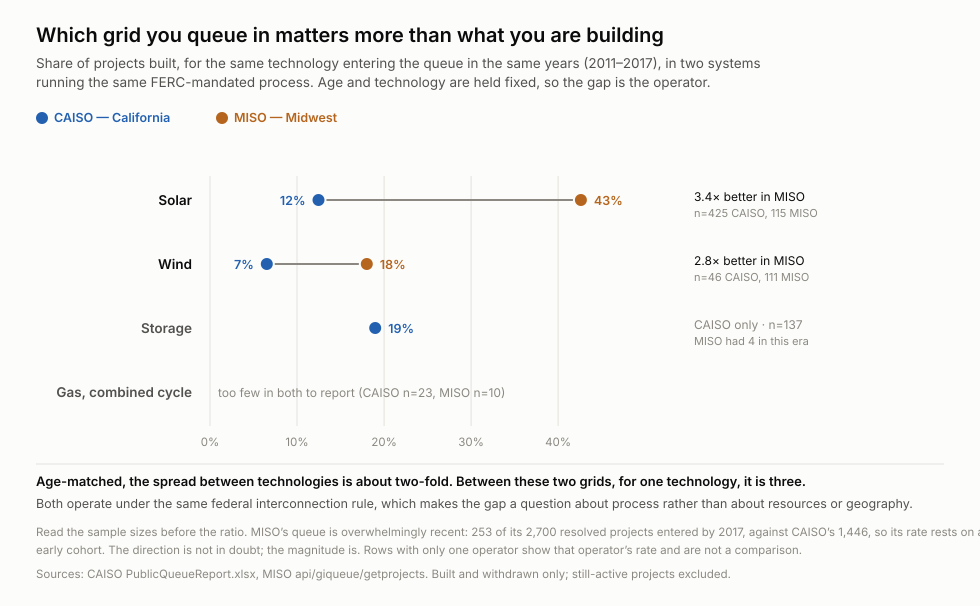

# Which grid you queue in matters more than what you are building

**Status: proven** — rebuilt 2026-09-11 from scratch. The previous version was
marked proven and its central claim did not survive a question about binning; it
was withdrawn, corrected and stress-tested. Every number below re-derives from two
public files, and the conclusions are not the ones it started with.

## What it says

Every US transmission provider runs an interconnection queue under the same FERC
rule. Two of them publish enough to check the outcome, and they do not get the
same one. Holding both the technology and the year of entry fixed:

| | CAISO | MISO | |
| --- | --- | --- | --- |
| **Solar** | 12.5% built | **42.6%** | 3.4× · n=425 / 115 |
| **Wind** | 6.5% built | **18.0%** | 2.8× · n=46 / 111 |



**Age-matched, the spread between technologies is about two-fold. Between these
two grids, for a single technology, it is three.** Which is the finding: the
operator dominates the technology.

*The magnitude depends on the cut, so both are stated.* Pooled across all
technologies in the clean era, MISO is **1.9×** CAISO. Per technology, holding the
entry years fixed, it is **2.8× to 3.4×** — the pooled figure is lower because the
two grids queue different mixes. Either way it exceeds the roughly two-fold spread
between technologies.

*And it is not a thin early cohort.* That was the open worry, and it is closed:
MISO's next cohort, 2018–2021, resolves at **31.9% on 1,187 projects** against its
early 31.2% on 253. The advantage held as the sample grew twenty-fold. CAISO over
the same period fell from 16.6% to 5.2% — though a quarter of that cohort is still
unresolved and deaths resolve before builds, so read 5.2% as a floor.

## The chain: which chart cannot be read alone

**0. [`entry-era`](artifacts/charts/entry-era.svg) — read this one first.** It is
the evidence for the premise everything else rests on: that these families
occupied the queue at different times. California's gas sits in 2006–2012 and its
storage in 2018–2021, and the bars do not touch. Without it, a reader has no
reason to accept that comparing them directly is meaningless.

It also shows something no other chart here does: **gas runs opposite ways in the
two grids.** It is California's oldest family, median entry 2008, and the
Midwest's newest, median 2024. One queue stopped taking gas as the other started.

These four are not independent findings. Three of them exist because the first one
makes the naive reading wrong.

**1. [`survival-curves`](artifacts/charts/survival-curves.svg) — the root caveat.**
Projects die at a median of **1.0 year** and get built at a median of **6.1**.
Nothing else here is safe to read without that. It is the reason a raw survival
rate is not a property of a technology.

**2. [`cohort-survival`](artifacts/charts/cohort-survival.svg) — requires (1).**
Because deaths land five years before builds, a young technology accumulates its
failures before its successes. Storage looks like the worst performer at 8.1%
all-time and is **19.6%** age-matched, level with combined-cycle gas and above
solar. Comparing technologies is only legitimate within a fixed entry cohort at a
fixed horizon.

**3. [`jurisdiction`](artifacts/charts/jurisdiction.svg) — requires (2).**
Once age and technology are controlled, what is left is the operator, and it is
the largest effect in the data.

**4. [`death-stage`](artifacts/charts/death-stage.svg) — CAISO only, and stands
apart.** Where projects stop, not whether. MISO publishes no study milestones, so
this cannot be compared across grids and must not be read as a general fact about
queues.

**5. [`stage-leadtime`](artifacts/charts/stage-leadtime.svg) — requires (4), and
corrects it.** How many stop somewhere says nothing about whether stopping there
was quick or slow, and those imply opposite remedies. Everything up to and
including the system impact study resolves in **about a year**. The facilities
stage takes **3.8**, a 3.7× jump, and a signed agreement **5.8**. Reading
`death-stage` without this one produces the wrong policy, which is what happened
in the first draft of this rewrite.

**6. [`queue-exposure`](artifacts/charts/queue-exposure.svg) — the only chart
here about the present.** Everything above concerns projects that already
resolved. This is what is still waiting: how long each family has sat, how much
capacity is behind it, and how long the slowest tenth have waited.

*It replaced a chart that could not be fixed.* `survival-volume` plotted build
rate against capacity, which needed two different populations for its two axes.
Worse, it structurally could not show any young technology — a recent family has
volume but no age-matched rate, so MISO's Hybrid, its fastest-growing category at
372 projects, was invisible on it. Active projects need no age-matching, so this
one uses only those.

**The finding it adds:** every Midwest family has waited less than every
California family — **4.0 years at worst against 5.4 at best**, no overlap — and
the tails are proportionally similar, so this is not a few stragglers. California
solar has a median wait of **8.4 years** and a ninetieth percentile of **15.9**.

## The policy each one supports, and does not

**There are two bottlenecks and they need opposite instruments.** 52% of withdrawn
CAISO projects never reached any study, and the share barely moves by technology —
43% to 55% across solar, storage, wind, steam and gas. But those projects leave in
a median of **0.8 years** having consumed no study time. That is a volume problem:
the lever is what it costs to enter, and study capacity does not touch it.

The time is somewhere else. Everything through the system impact study resolves in
about a year; the facilities stage takes **3.8 years** and a signed agreement
**5.8**. That is a capacity problem, and entry deposits do not touch *it*.

*An earlier draft of this rewrite said "intake, not study capacity" and stopped
there.* It was reading the count chart without the duration chart, which is
exactly the mistake this recipe is otherwise about.

**Size screening will not work.** Capacity dies in the same proportions as project
count — 49% of the 382 GW abandoned is at intake against 52% of projects — and
average project size is flat across every stage. There is no fat tail of large
speculative projects to filter out.

**The 6% who die holding a signed agreement are the expensive tail.** They waited
**5.8 years** against **6.2** for a project that actually got built — nearly the
same investment of time, calendar and study effort, and no asset at the end. They
cleared every study and still could not proceed, which is a cost-allocation or
financing failure rather than a queue-management one, and needs a different
instrument again.

**The jurisdiction gap is a FERC-level question.** Same federal rule, three-fold
difference in outcome for the same technology in the same years. That is not
explained by resource quality or land, and it is the one finding here that points
at a regulator rather than a developer.

**For a developer**, the order of leverage is: the grid you interconnect to,
then whether you can survive two years, then the technology. That is the reverse
of how the previous version of this recipe read.

## Category errors the chart audit caught

Two merges were wrong, both found by asking of the finished set: *did I merge
things that are not one thing?*

**"Gas" was mostly not gas.** CAISO publishes turbine type and fuel in separate
columns and they do not follow from each other. Its "Steam Turbine" category is
**99 solar-thermal, 35 geothermal, 15 biofuel and only 13 natural gas** — so
folding steam turbines into a gas family by type put 149 non-gas plants in it,
moving that family from 111 GW and 373 projects to 75 GW and 236. Families are now
keyed on fuel.

**The merge was hiding a result.** Split out, **geothermal is 3.2% — one project
built out of 31**, the worst rate anywhere in this data, previously averaged into
gas and invisible.

**372 projects were being dropped in silence.** MISO's "Hybrid" — solar paired
with storage on one interconnection — matched no family and vanished. Charts now
print what they cannot map rather than discarding it; 173 active projects still
fall outside, mostly MISO rows with a blank technology.

## What was wrong before

**The headline was an artefact of age.** The previous version reported that "the
technologies the grid most needs are the ones least likely to survive", with
batteries at 8% against gas at 20%. Age-matched, storage is 19.6% and simple-cycle
gas is **10.0%** — the worst on the board. The comparison was measuring which
decade a technology entered the queue.

**Gas and storage were never in the same queue.** CAISO's gas turbines have a
median entry year of 2007 and its storage 2020. Ranking them against each other
compares 2007 rules to 2020 rules.

**The recipe contradicted itself.** Its own cohort chart carried the warning —
*"recent bars are NOT worse outcomes: withdrawals resolve in ~1 year, completions
take many"* — and the technology chart beside it ignored exactly that.

**Sliding cohort bins double-counted.** The first corrected version used
2008–2012, 2010–2015, 2013–2017, which put the same project in two bins and made
part of "the trend" a redrawing of the same projects. Bins are now disjoint.

**Five charts had no scripts at all.** The numbers could not be re-derived, which
is how the error survived. Two of those five are deleted as superseded, one as
redundant (county survival: 2.5× spread over 13 counties, confounded by the same
age bias), and the rest rebuilt.

## Where the ingredients are

* **CAISO** — `https://www.caiso.com/PublishedDocuments/PublicQueueReport.xlsx`,
  385 KB, no auth, `robots.txt` permits it. Three sheets: active, completed,
  withdrawn. Carries study milestones and an actual on-line date.
* **MISO** — `https://www.misoenergy.org/api/giqueue/getprojects`, 2.25 MB JSON,
  3,833 projects. `applicationStatus` is CAISO's three sheets by another name. No
  withdrawal date and no study milestones.

Both keep their own history, which is why this is a recipe and not a capture.

Two traps in the raw data. CAISO's dates are **Excel serial numbers** — `37943.33`
is 2003-11-06, not a year — and its header row is the **fourth** row, under a
report date and a merged title. Reading row 0 as the header yields zero projects
and no error.

## Run it

```sh
python artifacts/scripts/harvest.py            ./work    # both grids -> queue.csv
python artifacts/scripts/chart-survival-curves.py ./work/queue.csv
python artifacts/scripts/chart-cohort-survival.py ./work/queue.csv
python artifacts/scripts/chart-jurisdiction.py    ./work/queue.csv
python artifacts/scripts/chart-death-stage.py     ./work/queue.csv
python artifacts/scripts/chart-stage-leadtime.py  ./work/queue.csv
python artifacts/scripts/chart-queue-exposure.py ./work/queue.csv
```

Stdlib only; the .xlsx is read with `zipfile` and `xml.etree`. `curl` is required
because both hosts stall indefinitely against Python's urllib with no error.

## What would change the answer

* **A third grid.** Two operators is one comparison. NYISO publishes a queue in
  the same shape and would say whether CAISO is unusual or MISO is.
* ~~MISO's early cohort is thin.~~ **Closed.** Its 2018–2021 cohort resolves at
  31.9% on 1,187 projects, against 31.2% on 253 earlier. The gap is not an
  artefact of a small sample.
* **CAISO's recent cohort is a quarter unresolved.** Its 5.2% for 2018–2021 counts
  only finished projects, and withdrawals finish years before builds do, so that
  number will rise. How far is the open question.
* **Nothing here separates queue process from what is being connected to.** MISO
  has more transmission headroom and less congestion than California. The gap is
  real; attributing it to process rather than to the grid itself is not supported
  by this data alone.
* **Geothermal rests on 31 projects.** The lowest rate in the data sits on its
  thinnest sample; it should not be quoted without the n.
* **173 active projects have no usable technology**, almost all MISO rows with the
  field blank. If they are disproportionately one family, `queue-exposure`
  understates it.
