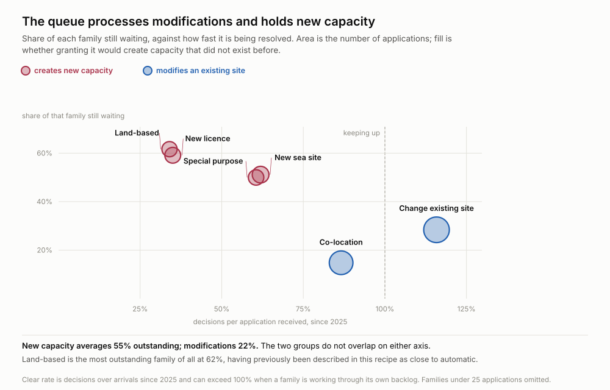
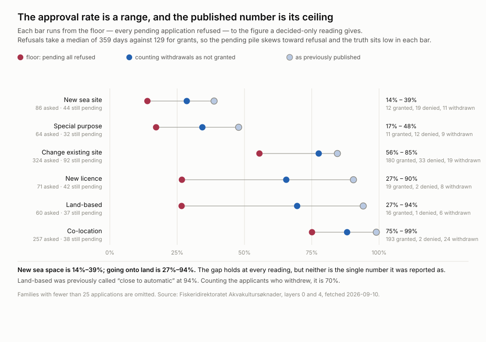
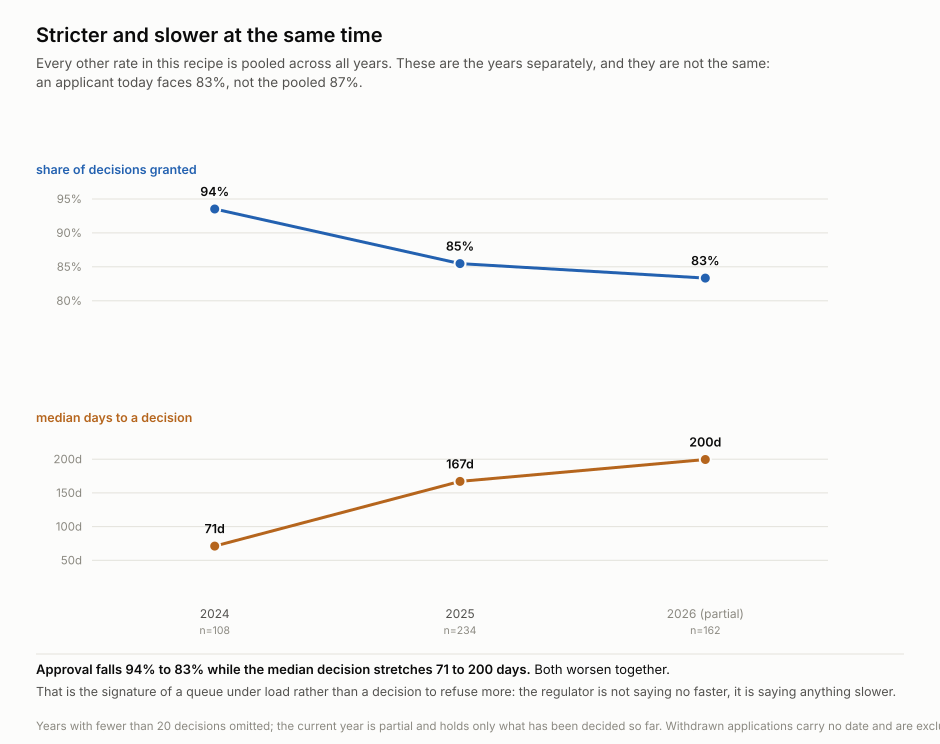
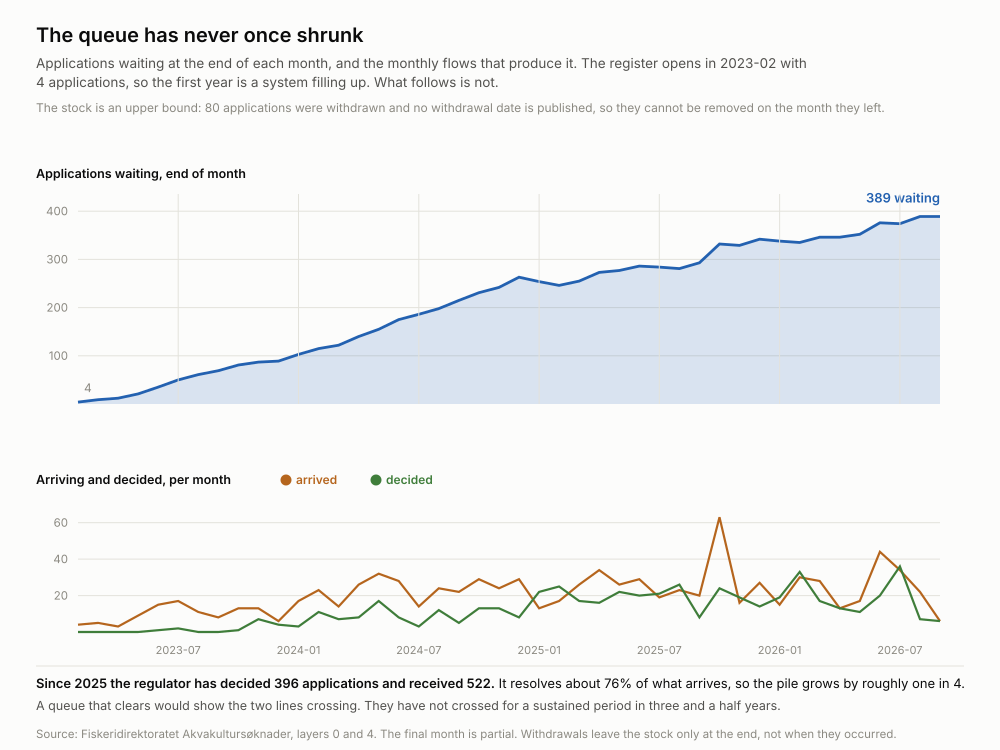
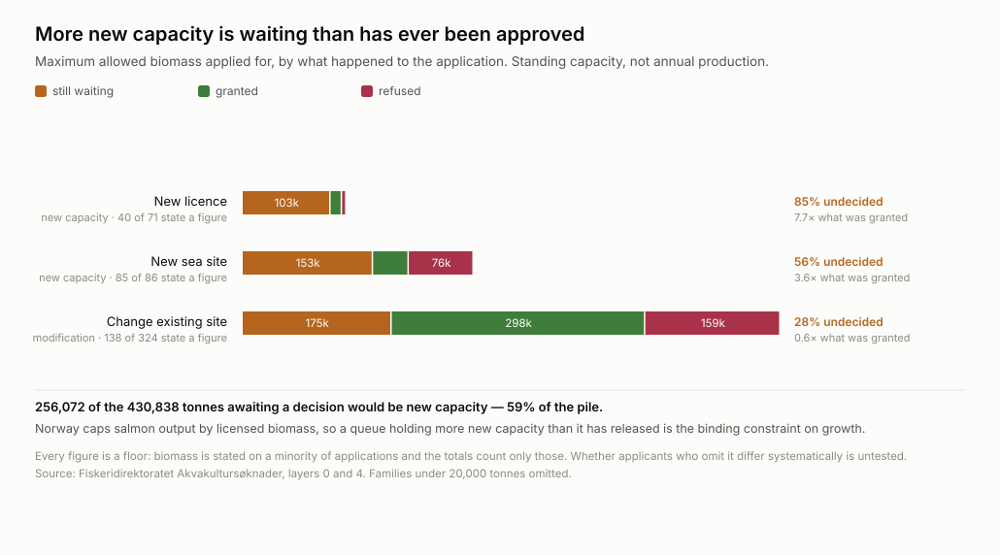

# Norway's aquaculture regulator processes modifications and holds new capacity

**Status: proven** · rebuilt 2026-09-11 · five figures, five scripts, all
re-derivable from two public ArcGIS layers

## What it says

Fiskeridirektoratet publishes the whole licence pipeline — applied for, decided,
and when. Sorting applications by whether granting one would create capacity that
did not exist before splits the register cleanly in two:

| | still waiting | decisions per arrival |
| --- | --- | --- |
| **Creates new capacity** (new sea site, land-based, new licence, special purpose) | **55%** | 34–62% |
| **Modifies an existing site** (change of site, co-location) | **22%** | 87–116% |



The two groups do not overlap on either axis. Changes to existing sites are
decided *faster than they arrive*; co-location resolves in a median 80 days.
Anything that adds capacity sits at half to two thirds outstanding.

## The decision it changes

**If you are applying for new capacity in Norway, budget for a wait rather than
an answer, and do not price the published approval rate.** Land-based aquaculture
is the most outstanding category in the register at 62%, and it has been described
— including by the previous version of this recipe — as close to automatic.

*Who acts on this:* a salmon producer choosing between expanding an existing site
and applying for a new one; an investor pricing a licence application; a regulator
or journalist auditing whether the pipeline clears.

The lever the split implies is specific. A modification queue that decides more
than it receives does not need more staff. A new-capacity queue at 55%
outstanding, growing, and slowing does — and the two are not competing for the
same fix.

## The chain: which figure cannot be read alone

**1. `approval-range` — read before any rate.** The approval rate is not a number,
it is a range, and the published figure is its ceiling.



Three readings per family. *Reported* is granted ÷ (granted + denied), which is
what was previously published. *Counting withdrawals* treats an application the
applicant pulled before a decision as not granted — **80 of 599 concluded
applications were withdrawn and were being dropped entirely**. *Floor* is every
pending application refused.

The truth is not the midpoint. **Refusals take a median 359 days against 129 for
grants**, so the pending pile is disproportionately cases heading for refusal and
the real figure sits low in each bar.

**2. `drift` — requires (1), and moves it again.** Every rate above is pooled
across three and a half years, and the regulator is not standing still.



Approval falls **94% → 83%** while the median decision stretches **71 → 200
days**. An applicant today faces 83%, not the pooled 87%. Both worsening together
is the signature of a queue under load rather than a decision to refuse more: the
regulator is not saying no faster, it is saying anything slower.

**3. `queue-clock` — the stock behind the rates.**



Four applications in February 2023, **389 now, and the line never turns down**.
Since 2025 the regulator decided 396 and received 522 — it resolves about **76% of
what arrives**, so the pile grows by roughly one in four. The register opens in
2023, so the first year is a system filling up; the years after it are not.

**4. `biomass-at-risk` — what the queue length is worth.**



Applications state a desired maximum allowed biomass. **256,072 of the 430,838
tonnes awaiting a decision would be new capacity — 59% of the pile.** New sea
sites have 152,957 tonnes waiting against 41,939 ever granted, 3.6× more held than
released; new licences 7.7×. Norway caps salmon output by licensed biomass, which
makes this queue the binding constraint on the industry's growth.

## What was wrong before

**80 withdrawals were dropped.** 599 concluded applications are 448 granted, 71
denied and **80 withdrawn by the applicant before any decision**. Computing
granted ÷ (granted + denied) made them vanish — the same error as reporting
public-records compliance on closed requests only.

**"Close to automatic" was 17 decisions.** Land-based was reported at 94% approval
on 16 grants and 1 refusal. Counting its 6 withdrawals it is 70%, and **37 of its
60 applications have never been decided at all**. It is the most outstanding
family in the register, not the easiest.

**Every rate was a point when it is a range and a trend.** The pooled 86% is a
ceiling over a declining series whose current value is 83%.

**Three figures had no script.** The numbers could not be re-derived, which is how
all of the above survived. Those three are deleted and replaced.

## Where the ingredients are

Two layers of one public ArcGIS MapServer — no key, no account:

```
gis.fiskeridir.no/server/rest/services/Yggdrasil/Akvakultursøknader/MapServer
  layer 0   309 pending applications
  layer 4   599 concluded applications
```

Both sit under the service's 2,000-feature cap, so there is no pagination to get
wrong. Applicants are limited companies with organisation numbers, so there is no
personal data.

**Dates arrive as epoch milliseconds.** `1676547547000` is not a year, an id or a
quantity, and every duration computed from it raw is nonsense.

## Run it

```sh
python artifacts/scripts/harvest.py             ./work
python artifacts/scripts/chart-approval-range.py   ./work/applications.csv
python artifacts/scripts/chart-drift.py            ./work/applications.csv
python artifacts/scripts/chart-queue-clock.py      ./work/applications.csv
python artifacts/scripts/chart-stuck-by-kind.py    ./work/applications.csv
python artifacts/scripts/chart-biomass-at-risk.py  ./work/applications.csv
```

Stdlib only; `curl` is used for the fetch. No data is committed.

## What would change the answer

* **Withdrawals carry no date.** Fiskeridirektoratet records that an application
  was withdrawn but not when, so withdrawals cannot be placed in time. The queue
  stock is an upper bound by up to 80, and no withdrawal appears in the flows.
* **Whether a withdrawal is a soft refusal is untested.** They are counted as
  "not granted", which is right arithmetically. Whether applicants pull
  applications because refusal is coming, or for unrelated commercial reasons,
  changes what the number means and this data cannot say.
* **Biomass is stated on a minority of applications** — 85 of 86 new sea sites but
  only 138 of 324 site changes. Every tonnage is a floor, and whether the
  applicants who omit it differ systematically is untested.
* **Three and a half years is a short series**, and the register's first year is a
  system starting up rather than a queue forming.
