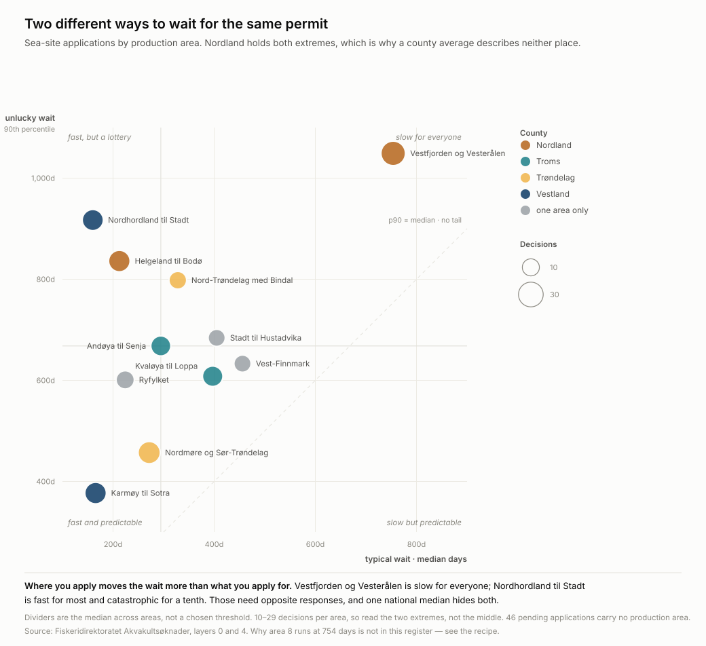
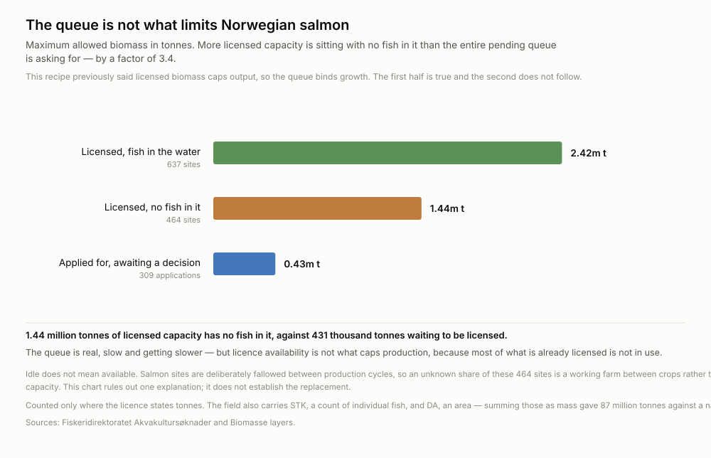
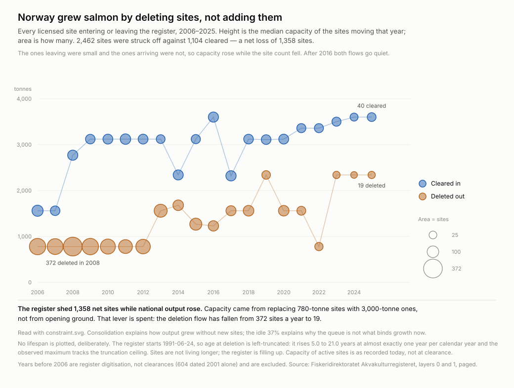

# Norway's aquaculture regulator processes modifications and holds new capacity

**Status: proven** · rebuilt 2026-09-11 · eight figures, eight scripts, all
re-derivable from five public ArcGIS layers

## What it says

Fiskeridirektoratet publishes the whole licence pipeline — applied for, decided,
and when. Sorting applications by whether granting one would create capacity that
did not exist before splits the register cleanly in two:

| | still waiting | decisions per arrival |
| --- | --- | --- |
| **Creates new capacity** (new sea site, land-based, new licence, special purpose) | **55%** | 34–62% |
| **Modifies an existing site** (change of site, co-location) | **22%** | 87–116% |


The two groups do not overlap on either axis. Changes to existing sites are
decided *faster than they arrive*; co-location resolves in a median 80 days.
Anything that adds capacity sits at half to two thirds outstanding.

## The decision it changes

**If you are applying for new capacity in Norway, budget for a wait rather than
an answer, and do not price the published approval rate.** Land-based aquaculture
is the most outstanding category in the register at 62%, and it has been described
— including by the previous version of this recipe — as close to automatic.

*Who acts on this:* a salmon producer choosing between expanding an existing site
and applying for a new one; an investor pricing a licence application; a regulator
or journalist auditing whether the pipeline clears.

The lever the split implies is specific. A modification queue that decides more
than it receives does not need more staff. A new-capacity queue at 55%
outstanding, growing, and slowing does — and the two are not competing for the
same fix.

**Then budget by production area, not by county, and not by the national median.**
The wait varies more across places than across application types: 754 days in
Vestfjorden og Vesterålen against 160 in Nordhordland til Stadt, for the same
paperwork. Two areas inside Nordland sit 3.6× apart, so a county-level figure
describes neither. And check which *kind* of slow you are buying — some areas are
slow for everyone, others are fast for most and catastrophic for a tenth.

## The chain: which figure cannot be read alone

**1. `approval-range` — read before any rate.** The approval rate is not a number,
it is a range, and the published figure is its ceiling.


Three readings per family. *Reported* is granted ÷ (granted + denied), which is
what was previously published. *Counting withdrawals* treats an application the
applicant pulled before a decision as not granted — **80 of 599 concluded
applications were withdrawn and were being dropped entirely**. *Floor* is every
pending application refused.

The truth is not the midpoint. **Refusals take a median 359 days against 129 for
grants**, so the pending pile is disproportionately cases heading for refusal and
the real figure sits low in each bar.

**2. `drift` — requires (1), and moves it again.** Every rate above is pooled
across three and a half years, and the regulator is not standing still.


A median alone would have reported this as *"decisions slowed from 161 to 265
days"*. The boxplot says something different and worse: **the middle half barely
moved, while the top tenth went from 202 days to 1,000.** The median wanders in a
110–265 day band with no trend; every quarter of the drift lives in the tail.

Approval falls with it, **92% → 84%**, touching 80%. An applicant today faces the
low 80s, not the pooled 87%. Both worsening together is the signature of a queue
under load rather than a decision to refuse more — and because **refusals take a
median 359 days against 129 for grants**, the growing tail is where the refusals
are. The pending pile inherits it.

The rate rides the right-hand axis. That is allowed here because it is a *rate*
against a *duration*, not a second quantity of the same kind, so no scale choice
can fake a relationship between them; the vertical gap between the line and the
boxes means nothing and the caption says so.

**3. `where-it-stalls` — requires (2), and says where that tail lives.**



If the delay is all in the tail, *whose* tail? Holding the application type fixed
— change of, or new, sea site — and plotting the typical wait against the unlucky
one by production area separates two failures a national median blends together:

* **Uniformly slow.** Vestfjorden og Vesterålen: median **754 days**, 90th
  percentile **1,049**. Almost nobody gets through quickly.
* **A lottery.** Nordhordland til Stadt: median **160 days**, 90th percentile
  **917**. Most applicants are fine; one in ten waits two and a half years.

These need opposite responses. The first is a place to avoid; the second is a
risk to price.

**The obvious version of this finding is wrong, and it survives most controls
before it fails.** "Nordland is slow" holds up against every check this recipe
could run: within one application type Nordland's median is 368 days against
Vestland's 161, and it survives splitting by outcome (granted 316 vs 229 days,
denied 789 vs 353), by applicant (24 slow decisions spread across 14 companies)
and by submission year. It is still a merge. Nordland contains **both extremes**
— Vestfjorden og Vesterålen at 754 days and Helgeland til Bodø at 212, a **3.6×
spread inside one county and one application type.** The county average describes
neither place.

Delay is not refusal. Trøndelag denies 27% of these applications and decides in
290 days; Vestland denies 11% and takes 161. The regulator is not slow because it
is saying no.

*What the register cannot say is why.* Vestfjorden og Vesterålen is production
area 8, which the traffic-light system has repeatedly coloured red — but that is
an outside fact, and this recipe has not tested it.

**4. `queue-clock` — the stock behind the rates.**


Four applications in February 2023, **389 now, and the line never turns down**.
Since 2025 the regulator decided 396 and received 522 — it resolves about **76% of
what arrives**, so the pile grows by roughly one in four. The register opens in
2023, so the first year is a system filling up; the years after it are not.

**5. `biomass-at-risk` — what the queue length is worth.**


Applications state a desired maximum allowed biomass. **256,072 of the 430,838
tonnes awaiting a decision would be new capacity — 59% of the pile.** New sea
sites have 152,957 tonnes waiting against 41,939 ever granted, 3.6× more held than
released; new licences 7.7×.

**6. `constraint` — and it stops the obvious conclusion.**



The tempting reading of everything above is that licence availability caps
Norwegian salmon growth. It does not. The same publisher's biomass layer shows
**3.86 million tonnes of licensed capacity, of which 1.44 million — 37%, across
464 sites — has no fish in it.** Idle licensed capacity is **3.4× the entire
pending queue.**

*Idle is not available.* Salmon sites are deliberately fallowed between production
cycles, so an unknown share of those 464 is a working farm between crops. This
rules out one explanation without establishing its replacement. What survives is
narrower and firmer: the queue is real, slow and getting slower, **and it is not
what binds production**, because most of what is already licensed is not in use.

**7. `consolidation` — where the capacity actually came from.**



If the queue is not the constraint, what did produce three decades of growth?
Not new ground. Between 2006 and 2025 Norway cleared **1,104** sites and deleted
**2,462** — the register **shed 1,358 net sites** while national output rose. The
sites leaving had a median capacity of **780 tonnes**; the ones arriving went from
1,560 to **3,600**. Growth came from swapping small sites for large ones on the
same coast.

**That lever is spent.** The deletion flow has fallen from 372 sites in 2008 to 19
in 2025, and since 2016 the two flows roughly balance. The consolidation that paid
for the last twenty years of growth has already happened, which is why the
question of where the next tonne comes from lands on the idle 37% in (5) rather
than on the queue in (3).

*No lifespan is plotted here, and that is deliberate.* The register's earliest
clearance is 1991-06-24, so median age at deletion climbs from 5.0 to 21.0 years —
almost exactly one year per calendar year — and the observed maximum tracks the
truncation ceiling to within a year (2014: max 23.1, ceiling 23.0). Sites are not
living longer; the register is filling up. It is the same left-truncation trap as
an unadjusted survival rate, and the chart refuses it rather than reporting it.

## What was wrong before

**80 withdrawals were dropped.** 599 concluded applications are 448 granted, 71
denied and **80 withdrawn by the applicant before any decision**. Computing
granted ÷ (granted + denied) made them vanish — the same error as reporting
public-records compliance on closed requests only.

**"Close to automatic" was 17 decisions.** Land-based was reported at 94% approval
on 16 grants and 1 refusal. Counting its 6 withdrawals it is 70%, and **37 of its
60 applications have never been decided at all**. It is the most outstanding
family in the register, not the easiest.

**Every rate was a point when it is a range and a trend.** The pooled 86% is a
ceiling over a declining series whose current value is 84%.

**Three figures had no script.** The numbers could not be re-derived, which is how
all of the above survived. Those three are deleted and replaced.

## Where the ingredients are

Three public ArcGIS MapServers on one host — no key, no account:

```
gis.fiskeridir.no/server/rest/services/Yggdrasil/…/MapServer
  Akvakultursøknader     layer 0     309  pending applications
  Akvakultursøknader     layer 4     599  concluded applications
  Biomasse               layer 0   1,127  sites, with/without fish
  Akvakulturregisteret   layer 0   1,780  active licences
  Akvakulturregisteret   layer 1   2,487  deleted licences   ← paged
```

**The register layer exceeds the service's 2,000-feature cap and says nothing
about it.** `returnCountOnly` reports 2,487; a plain query returns exactly 2,000
features, HTTP 200, no error, no warning. The only tell is `exceededTransferLimit`
in the response body, which is easy not to look at. Read unpaged, the deletion
flow would have lost 487 sites — silently, and from the recent end. The harvester
pages it with `resultOffset` and checks that flag.

Applicants and licence holders are limited companies with organisation numbers,
so there is no personal data.

**Dates arrive as epoch milliseconds.** `1676547547000` is not a year, an id or a
quantity, and every duration computed from it raw is nonsense.

## Run it

```sh
python artifacts/scripts/harvest.py             ./work
python artifacts/scripts/chart-approval-range.py   ./work/applications.csv
python artifacts/scripts/chart-drift.py            ./work/applications.csv
python artifacts/scripts/chart-queue-clock.py      ./work/applications.csv
python artifacts/scripts/chart-stuck-by-kind.py    ./work/applications.csv
python artifacts/scripts/chart-biomass-at-risk.py  ./work/applications.csv
python artifacts/scripts/chart-constraint.py       ./work/applications.csv ./work/sites.csv
python artifacts/scripts/chart-consolidation.py    ./work/licences.csv
python artifacts/scripts/chart-where-it-stalls.py  ./work/applications.csv
```

Stdlib only; `curl` is used for the fetch. No data is committed.

## What would change the answer

* **Withdrawals carry no date.** Fiskeridirektoratet records that an application
  was withdrawn but not when, so withdrawals cannot be placed in time. The queue
  stock is an upper bound by up to 80, and no withdrawal appears in the flows.
* **Whether a withdrawal is a soft refusal is untested.** They are counted as
  "not granted", which is right arithmetically. Whether applicants pull
  applications because refusal is coming, or for unrelated commercial reasons,
  changes what the number means and this data cannot say.
* **Biomass is stated on a minority of applications** — 85 of 86 new sea sites but
  only 138 of 324 site changes. Every tonnage is a floor, and whether the
  applicants who omit it differ systematically is untested.
* **Three and a half years is a short series**, and the register's first year is a
  system starting up rather than a queue forming.
* **Why one production area runs at 754 days is not in this register.**
  Vestfjorden og Vesterålen is production area 8, repeatedly red under the
  traffic-light system, and a red area restricts growth — but the register records
  no lice status, no traffic-light colour and no objection history. Testing that
  needs a second source, and until it exists the geography is a fact without a
  mechanism.
* **46 pending sea-site applications carry no production area at all** — the
  largest single pending group, median age 320 days. They cannot be placed on the
  map, and whether missing geography is itself a marker of a stalled file is
  untested.
* **The per-area samples are small.** Eleven areas clear ten decisions; most sit
  between 10 and 22. The two extremes are separated by far more than the noise,
  but the middle of that chart should not be read as a ranking.
* **Site capacity is as recorded today, not at clearance.** Sites gain capacity
  over their life, so the older clearance cohorts in `consolidation` are
  flattered. This biases against the trend the chart shows, not toward it — the
  real gap between 2006 grants and 2025 grants is wider than plotted.
* **Why consolidation stopped after 2016 is not in this data.** Regulation,
  exhaustion of merge candidates and the traffic-light system all fit, and the
  register cannot separate them. It records that sites left, never why.
* **How much of the idle 37% is fallowing is unknown.** The biomass layer says
  whether a site has fish, never how much or for how long, so a farm between crops
  and a dormant licence look identical. Separating them needs a repeated capture
  of the layer over time — a `wss` job, not a recipe.
* **Licensed capacity is counted only where the licence states tonnes.** The field
  also carries STK, a count of individual fish, and DA, an area in dekar. Summing
  those as mass gives 87 million tonnes against a national output near 1.5
  million; 26 sites are excluded for that reason.
