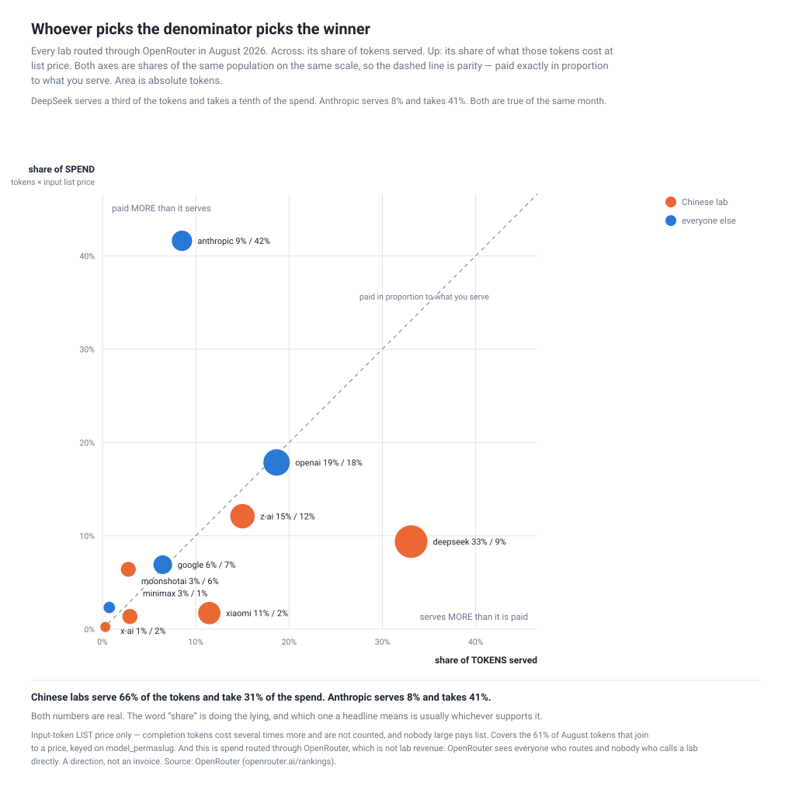
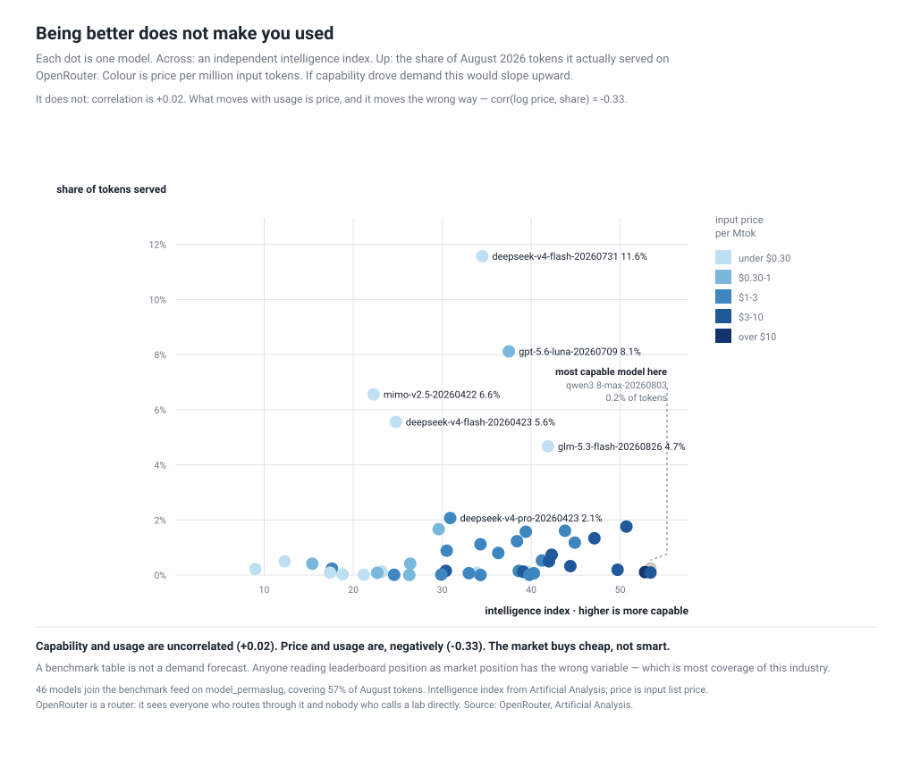
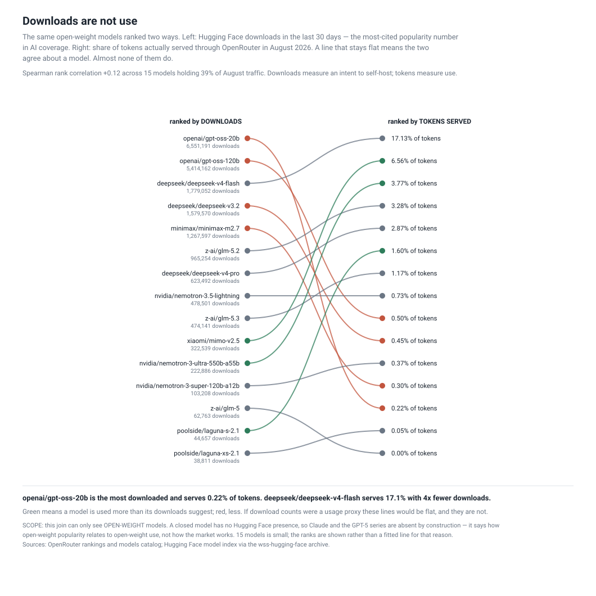
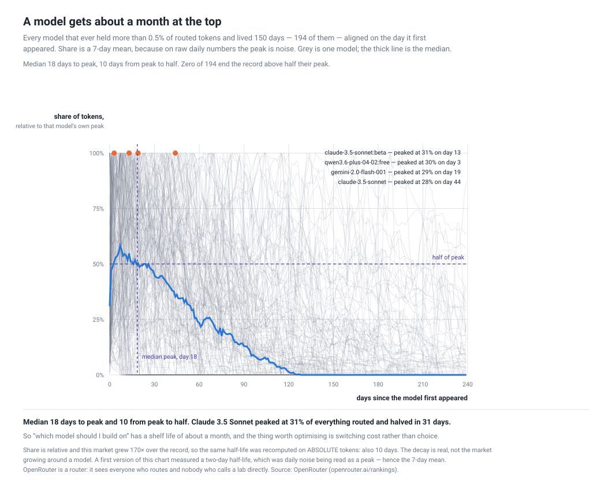
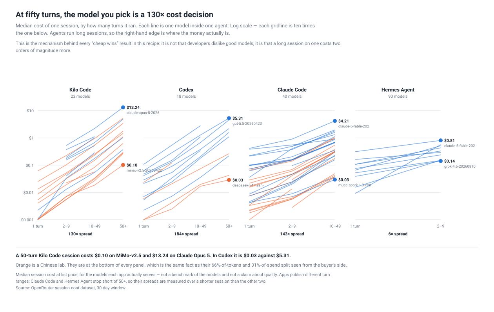

# Three ways to measure an AI lab, and they disagree

**Published 2026-09-11** · five figures, seven scripts · source: eight public
OpenRouter endpoints, one API key, no scraping · everything re-derives from one
capture with no further network access.

## What this is

**OpenRouter is a router.** A developer calls one API and it forwards the request
to whichever lab's model they asked for, handling billing and failover. It sees
the traffic of everyone who routes through it — and nobody who calls Anthropic,
OpenAI or Google directly.

It publishes daily model rankings back to **2025-01-01**, app rankings, session
costs, benchmark scores and a provider directory. Because the publisher keeps its
own history, one request gets twenty months of daily data; there is nothing to
capture on a schedule.

**The caveat that governs everything below:** any sentence of the form *"lab X is
winning"* is wrong. The most this data supports is *"among developers who route,
X is winning"* — and even that depends on which number you mean by "winning",
which turns out to be the finding.

*Who has a stake:* a developer choosing what to build on · an investor pricing a
lab · anyone writing about AI market share who currently cites downloads or
leaderboard position.

## The short version

- **The market grew 170× in twenty months.** Almost nobody shrank; they grew at
  different speeds.
- **Capability does not predict usage** (r = +0.02). **Downloads do not either**
  (Spearman +0.12). **Price does** — negatively (−0.33).
- **Tokens are not money.** DeepSeek is 33% of tokens and 9% of spend; Anthropic
  is 8% of tokens and 41%.
- **A model gets about a month at the top**: 18 days to peak, 10 days to half.
- **At fifty turns, the model you pick is a 130× cost decision.** That is the
  mechanism under all of it.

## Nobody is losing. The pie grew 170×.

The recipe's own earlier sketch had Anthropic flat at 15% of traffic. Over the
full history it goes **49.3% → 5.6%** — which sounds like collapse and is not.

| lab | share Jan 2025 | share Aug 2026 | absolute growth | vs market |
| --- | --- | --- | --- | --- |
| deepseek | 4.3% | **22.4%** | 894× | 5.3× |
| openai | 4.7% | 10.7% | 385× | 2.3× |
| google | 16.8% | 7.5% | 76× | 0.4× |
| **anthropic** | **49.3%** | **5.6%** | **19×** | **0.11×** |

**Anthropic's absolute volume grew nineteen-fold while its share fell forty-four
points.** "Losing share" here means "growing slower than 170×". The only labs
whose volume actually fell are a cohort of 2024-era open-weight and roleplay
finetunes, which genuinely died.

And the denominator moved for a reason that is visible: in February 2025 the top
apps were Cline (45%) and Roo Code (29%); in August 2026 they are Hermes Agent
(37%) and Claude Code. **Tokens per request went 13.8k → 73.9k.** Coding
assistants became autonomous agents.

## Whoever picks the denominator picks the winner



| lab | share of TOKENS | share of SPEND | ratio |
| --- | --- | --- | --- |
| **anthropic** | 8.4% | **41.3%** | **4.9×** |
| openai | 18.7% | 18.0% | 1.0× |
| **deepseek** | **33.1%** | 9.4% | **0.3×** |
| xiaomi | 11.5% | 1.7% | 0.2× |

Chinese labs are **65.7% of tokens and 31.4% of spend**. Both numbers are real.
The word *share* is doing the lying, and which one a headline means is usually
whichever supports it.

*Input-token list price only — completion tokens cost several times more and are
not counted, nobody large pays list, and it covers the 57% of tokens that join to
a price. A direction, not an invoice.*

## Being better does not make you used



**corr(intelligence index, share of tokens) = +0.02.** The most-used model in
August scores 34.5; the most capable scores 50.7 and serves 0.2%.

What does move with usage is price, and it moves the wrong way:
**corr(log price, share) = −0.33**. Models under $0.30/Mtok hold 29% of tokens;
models over $5 hold 2.6%.

## Downloads are not use



**Spearman +0.12.** `openai/gpt-oss-20b` has **6.55 million downloads and 0.22%
of tokens**. DeepSeek-v4-flash has four times fewer downloads and seventy-eight
times more traffic.

Downloads measure an intent to self-host. Tokens measure what people ran
repeatedly and paid for. Using one as a proxy for the other is measuring the
wrong verb.

*This join only sees open-weight models: a closed model has no Hugging Face
presence, so Claude and the GPT-5 series are absent by construction.*

## A model gets about a month



Across 194 models that ever held more than 0.5%: **18 days to peak, 10 days from
peak to half, and zero of them end the record above half their peak.**

Claude 3.5 Sonnet peaked at 31% of everything routed and halved in 31 days.

**So "what should I build on" has a shelf life of about a month, and the thing
worth optimising is switching cost rather than choice.**

*A first version measured a two-day half-life, which was daily noise being read
as a peak — hence the 7-day mean. And because share is relative in a market that
grew 170×, the half-life was recomputed on absolute tokens: also 10 days. The
decay is real.*

## Why cheap wins: 130× at fifty turns



A 50-turn Kilo Code session costs **$0.10** on MiMo-v2.5 and **$13.24** on Claude
Opus 5. In Codex it is $0.03 against $5.31.

Agents run long sessions, so at the margin the model choice is a two
orders-of-magnitude cost decision. That is the mechanism under every "cheap wins"
result above — not that developers dislike good models.

## What else the eight endpoints said

- **Labs specialise.** Code: OpenAI 29%, Z-AI 24%. Agents: Tencent 32%. General
  work: DeepSeek 42%. OpenAI tilts 2.1× toward code; DeepSeek tilts the other way
  and dominates the cheapest work there is.
- **Tokens and requests rank tasks in opposite order.** Classification is 21.7% of
  requests and 5.4% of tokens; workflow execution is 9.2% and 24.6%. Code and
  agent work is 28% of requests and **72% of tokens**.
- **A lab's fortunes are one or two models.** Every lab runs 6–13 models and
  23–82% of its tokens sit in the single biggest.
- **The roleplay story is not what it looks like.** The specialist roleplay labs
  hit zero by mid-2025, but the roleplay apps held 7%+ of traffic into 2026. The
  use case outlived its specialist models — general models got good enough.

## What not to trust

- **This is a router's traffic, not the market's.** Enterprise contracts called
  directly against a lab's own API are invisible here, and they are most of the
  money in the industry.
- **Spend is input-token list price** on the 57% of tokens that join to a price.
- **The downloads join sees open-weight models only**, and is 15 models — thin in
  count, 39% in tokens.
- **`providers` names a datacenter for 26 of 106.** Where inference physically
  runs is mostly not stated, so data-residency questions cannot be answered here.
- **The models catalog is a current snapshot** against 21 months of history, so
  retired models are unpriceable. Price questions route through the benchmarks
  feed, which keys on `model_permaslug` like the rankings do.

*Every question this recipe asked — twenty of them, all closed, with which
answers describe, predict or prescribe — is the working document at
[`artifacts/research-questions/questions.md`](artifacts/research-questions/questions.md).*

## Run it

```sh
export OPENROUTER_API_KEY=...      # any valid key; the rankings need auth
export OR_WORK=./work
python artifacts/scripts/capture.py $OR_WORK
python artifacts/scripts/chart_tokens_vs_spend.py
python artifacts/scripts/chart_capability.py
python artifacts/scripts/chart_shelflife.py
python artifacts/scripts/chart_session_cost.py
HF_RAW='…/wss-hugging-face/raw/hf.models.text-generation/**/*' \
  python artifacts/scripts/chart_downloads.py
```

`rankings-daily` caps at 366-day windows, so the capture walks it in two. The
capture refuses any response carrying an `error` key — the first run stored a
113-byte API error as if it were data, because `cline` is not a valid app_slug
and a small file looks like a small answer.

CC BY 4.0. Citation required wherever a figure from this is published:
**Source: OpenRouter (openrouter.ai/rankings).**
