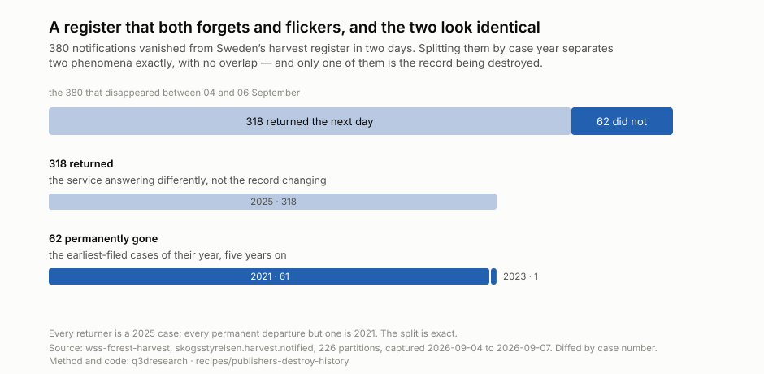

# A register that both forgets and flickers, and the two look identical

**Status: proven** · sweep run 2026-09-08, corrected 2026-09-09

## What it says

Sweden's Skogsstyrelsen harvest-notification register holds ~128,000 records and
the total barely moves between captures — 128,054 to 127,686 to 128,020 across
three days. Underneath that flat total, **380 notifications vanished in two
days**, and splitting them by case year separates two phenomena exactly:

| what happened | how many | case years | what it is |
| --- | --- | --- | --- |
| returned the next day | 318 | 2025 × 318 | the service answering differently |
| never returned | 62 | 2021 × 61, 2023 × 1 | the record being destroyed |

**The split is exact — no overlap.** Every returner is a 2025 case. Every
permanent departure but one is 2021, and each sits at the front of its partition,
which is ordered by case number: they are the **earliest-filed cases of their
year, five years on.** That is the retention window this archive exists to catch,
observed rather than inferred.

## The decision it drives

**A single query to this register is not reliable, and nothing tells you so.**
A researcher, journalist or NGO checking what has been notified for felling gets
an answer that is short by a few hundred records with no indication of it. That
is invisible to one observer and obvious to a repeated one — which is the whole
argument for capturing on a schedule rather than downloading when curious.

And the destruction is real but small and orderly: roughly sixty records a
fortnight aging out of a five-year window, not a purge.

## A wrong turn worth recording

The permanent departures cluster at the front of their partitions — a **3×
excess in the first decile**, 93 against ~32 expected — and this was read as a
boundary bug in our own query, a `>=` versus `>` error in the range clauses.

It is not. The partitions are county × case-year × `Inkomdatum` range with
correct half-open intervals, they are ordered by case number, and the front of a
partition is simply the oldest case of that year. **The anomaly was the finding.**
Two further explanations were tested and also wrong: single-record partitions
producing a division artefact (there are none — the smallest partition holds 24
records), and quarantined captures contaminating the diff (they are excluded).

## Reproducing it

    python artifacts/scripts/chart-register-churn.py    # clones the archive, redraws the figure
    python artifacts/scripts/what-publishers-destroy.py # scans it for shrink events

The first script **clones the archive it reads** — `wss-forest-harvest` is
public and small, so a shallow clone is the whole dependency. Nothing else to
install; Python standard library only. `provenance.json` records the commit the
published figure was computed from.

That clone is also the point: a finding here resolves to specific captured bytes
in a specific archive, not to a claim about them.

## Where the ingredients are

`wss-forest-harvest`, source `skogsstyrelsen.harvest.notified` — 226 partitions,
captured 2026-09-04, 09-06 and 09-07. Diffed by `Beteckn`, the case number, never
by row order.

Only gate-passed captures in `raw/` are compared. One 67,603-byte drop was
quarantined by the size gate and is a fetch anomaly rather than publisher
behaviour; including it would have overstated the churn.

`what-publishers-destroy.py` is the fleet-wide sibling: it scans every archive's
manifests for captures returning fewer bytes than the time before. Growth is
ambiguous — a source may be appending — and shrinkage is not.

## What it cannot say

Three capture days is a very short window. The 62 permanent departures are
consistent with a five-year retention window and with the archive's own stated
expectation, but three observations cannot establish a rate.

Why the 2025 records flicker is unknown. This measures the symptom — that the
service returns different result sets on different days — not the cause, which
could be replication lag, indexing, or load shedding.
