# One short report in five is reproducible from public data. The rest needed someone to talk.

**Published 2026-09-11** · twelve figures, twenty scripts · source: six activist
short-selling firms, 273 first-look reports, 2.8M words, joined to daily prices for
85 of them · no key, no account · **the sources are private companies and can delete
any of this tomorrow**, so a capture manifest with a sha256 per resource — 728 rows
covering 816 MB — ships alongside.

## What this is

An activist short seller publishes a report saying a listed company is worth less
than it trades for, having bet that it is. The obvious question for anyone building
screening tools is: **how much of that work is derivable from public structured
data?** If most of it is filings and court records, a tool can get close. If most of
it is a former employee agreeing to talk, no tool ever will.

Hindenburg Research answers it in unusual detail — it published 105 posts between
2017 and 2025 and then wound down, so the archive is closed, complete, and has no
survivorship in it. That is the deep source. Five more firms are here as controls,
because a single firm's habits will otherwise be mistaken for the practice, which is
exactly what happened on the first pass.

*Who has a stake:* a forensic analyst deciding what to examine first · a journalist
or regulator weighing a short report's evidence base · anyone building screening
tools who needs to know which half is automatable.

## The short version

- **Only 20% of reports rest on public sources alone.** 67% need something no
  database holds. The first version of this recipe said 50/43 — it never asked
  whether they talked to anyone.
- **The thing that cannot be automated is usually a phone call**, not a leak. 60% of
  reports cite someone interviewed; 31% have an interview as their *only*
  non-public evidence.
- **That floor holds across firms.** "Needs a person" never drops below 44% and the
  median firm sits at 70% — across six firms, sixteen years and two continents.
- **The field splits into two businesses and nothing sits between them.** Fire-once
  firms publish 5–14% follow-ups; campaigners publish 55–61%.
- **Follow-ups are rhetoric.** Field legwork and registry work fall to zero;
  interviews roughly halve. Pool them in and firm rankings reverse.
- **Hindenburg learned this.** Its interview rate went 21% → 75% across three eras
  while Muddy Waters' highest era was its first, in 2010.
- **A short report is worth about 3% on the day.** 78% of targets underperform
  within a day. The drift continues to −7% by day 30.
- **Size decides whether it lands at all.** A target over $10B does not move — 53%
  fall, a coin toss. The hit peaks between $300M and $10B.
- **Pick your horizon, pick your number.** The median abnormal return runs −2.7% to
  −8.3% depending only on the window. The hit rate decays cleanly and is the honest
  statistic.

## How hard is it to do alone

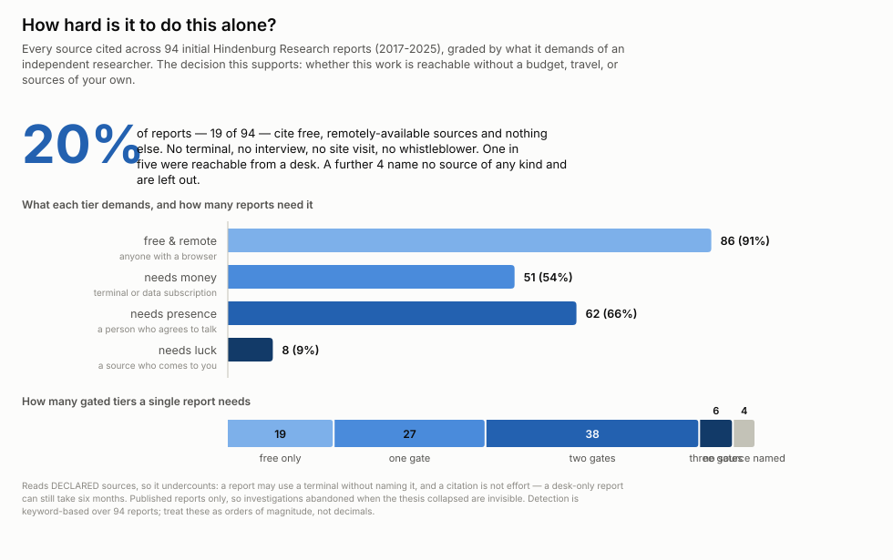

Every source cited across 94 initial Hindenburg reports, graded by what it demands
of someone with no budget, no travel and no sources.

| | reports | share |
| --- | --- | --- |
| use at least one PUBLIC evidence type | 86 / 94 | **91%** |
| use ONLY public evidence | 19 / 94 | **20%** |
| need something no database holds | 63 / 94 | **67%** |

And the non-public half is not exotic:

| | reports | share |
| --- | --- | --- |
| someone they interviewed | 56 / 94 | **60%** |
| their own people on the ground | 29 / 94 | 31% |
| a whistleblower | 8 / 94 | 9% |

**For 31% of reports the only thing you cannot reproduce is a conversation.** That
is a cheaper barrier than travel and a less lucky one than a source walking in, and
it is the one a tool cannot cross.

## Does that hold anywhere else

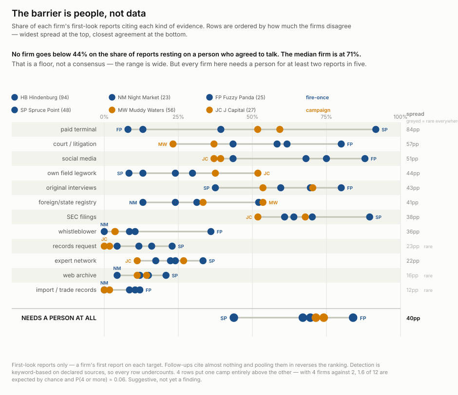

Twelve kinds of evidence, six firms, ordered by how much they disagree. Every
measure spreads 12–84 points. The share resting on a person is the one with a floor:
**44% at the lowest, 70% at the median.**

Read the greyed rows carefully — import records and whistleblowers have narrow
spreads because *nobody does them*, which is a floor, not a consensus.

**Spruce Point is the low end at 44% and does not explain away.** Its reports are as
prose-dense as everyone's (22 words a sentence, 96% prose); its own boilerplate says
it "frequently speaks with industry experts and former employees"; widening the
probe for its vocabulary moves it 4 points. Either it leans less on people or it
does the work without writing the sentence, and this corpus cannot tell which.

## Two businesses, not one practice

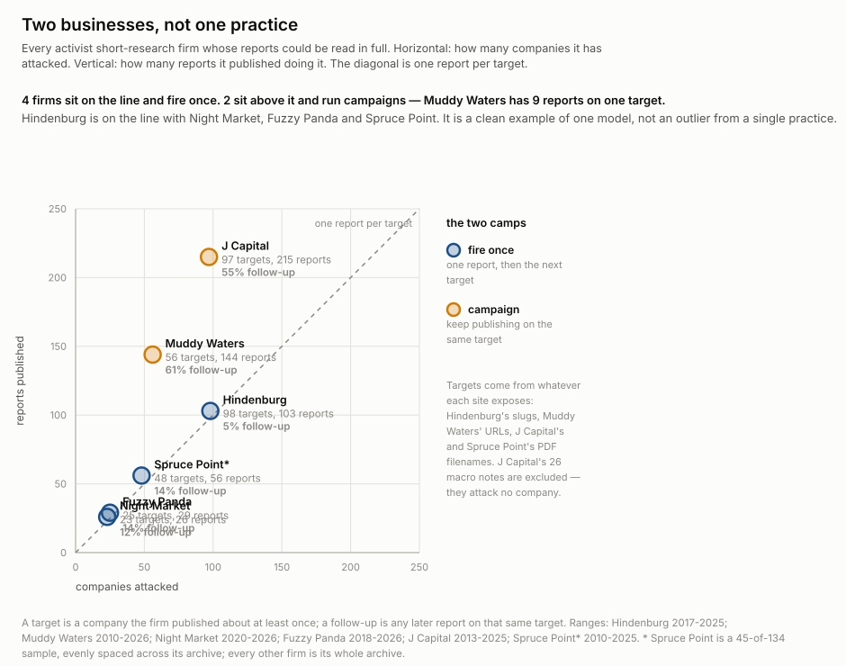

| | targets | reports | follow-up |
| --- | --- | --- | --- |
| Hindenburg | 98 | 103 | **5%** |
| Night Market | 23 | 26 | 12% |
| Fuzzy Panda | 25 | 29 | 14% |
| Spruce Point | 48 | 56 | 14% |
| J Capital | 97 | 215 | **55%** |
| Muddy Waters | 56 | 144 | **61%** |

**Nothing lands between 14% and 55%.** Hindenburg is a clean example of one model,
not an outlier from a single practice — which is what one control firm had
suggested, wrongly.

The camps do *not* predict method. Four of twelve evidence measures separate them
cleanly, 1.6 are expected by chance, P = 0.065. Suggestive, uncrossed.

## Why the pooled numbers lie

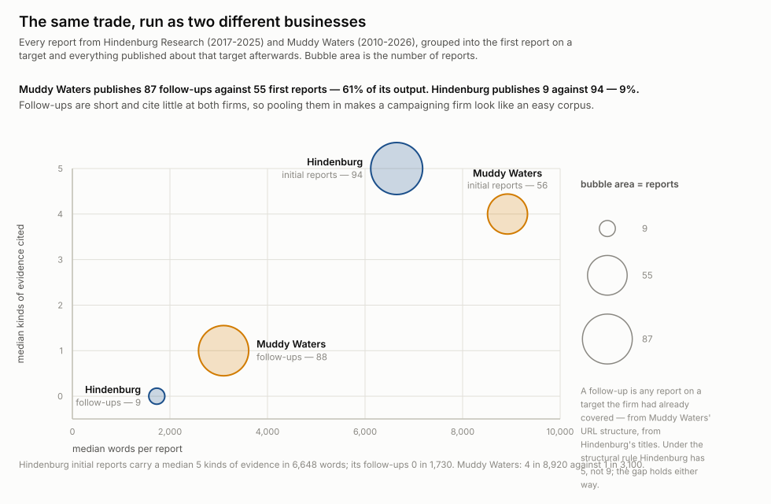

Counting all 144 Muddy Waters reports, 47% are desk-reachable against Hindenburg's
37% — it looks like the easier corpus. It is not. **61% of its output is follow-ups**,
which cite almost nothing and therefore score as "reachable from a desk". On
first-look reports the order flips to 4% against 20%.

Always split first-look from follow-up before comparing anything.

## One firm learned to interview people

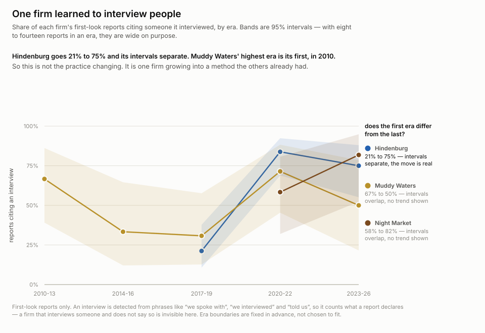

Hindenburg goes 21% → 75% across three eras and the confidence intervals separate.
Muddy Waters' highest era is its first — 73% in 2010–13 — and every one of its
intervals overlaps every other. Night Market the same.

So this is not the practice changing. It is one firm growing into a method the
others already had, and "the method got richer over time" was a Hindenburg
biography read as industry history.

## Longer means wider, not padded

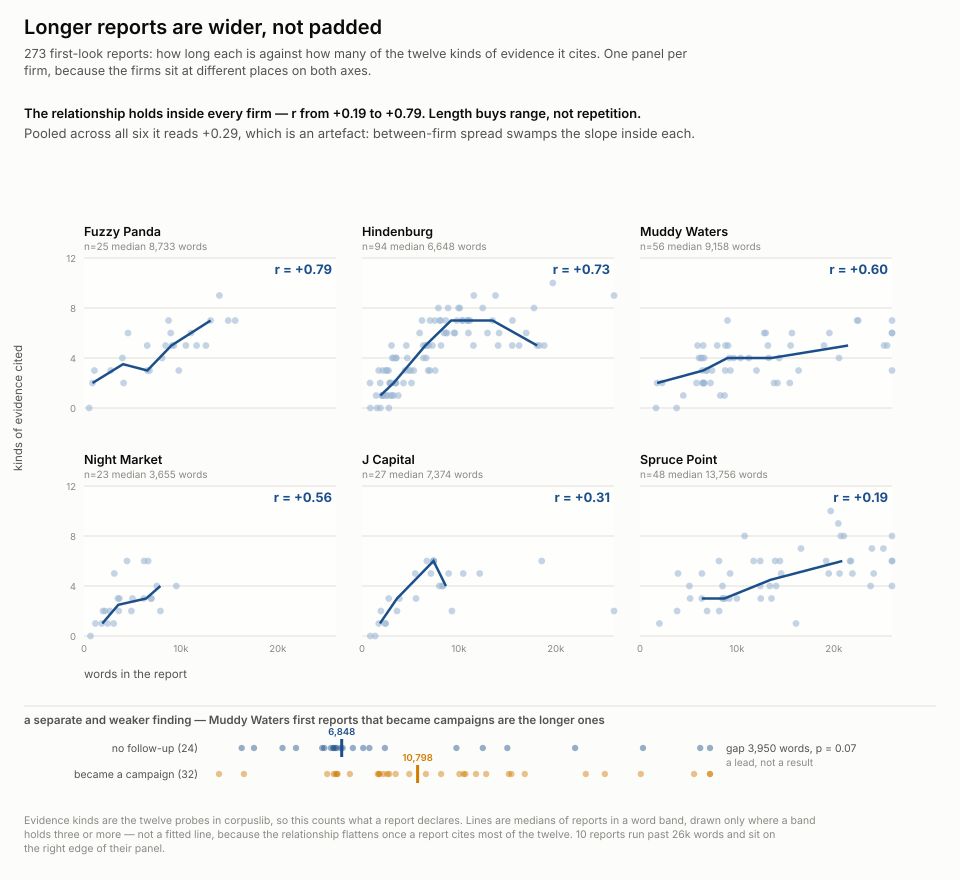

r = +0.73 at Hindenburg, +0.59 at Muddy Waters. The shorter half of Hindenburg's
reports carries a median 2 kinds of evidence; the longer half, 7.

And Muddy Waters' first reports that went on to become campaigns are the **longer**
ones — 10,813 words against 6,864 — which is the opposite of a follow-up repairing a
thin opening. Permutation p = 0.073 on length, 0.178 on interviews. Two signals, same
direction, neither conclusive.

## Who can be studied at all

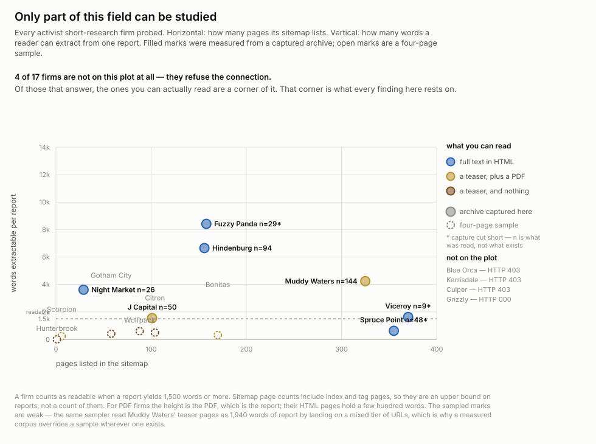

**4 of 17 firms refuse the connection outright.** Several more publish a teaser and
nothing else. Every finding above is a finding about the firms that publish
readably, and that is a smaller set than the field.

## What the stock does

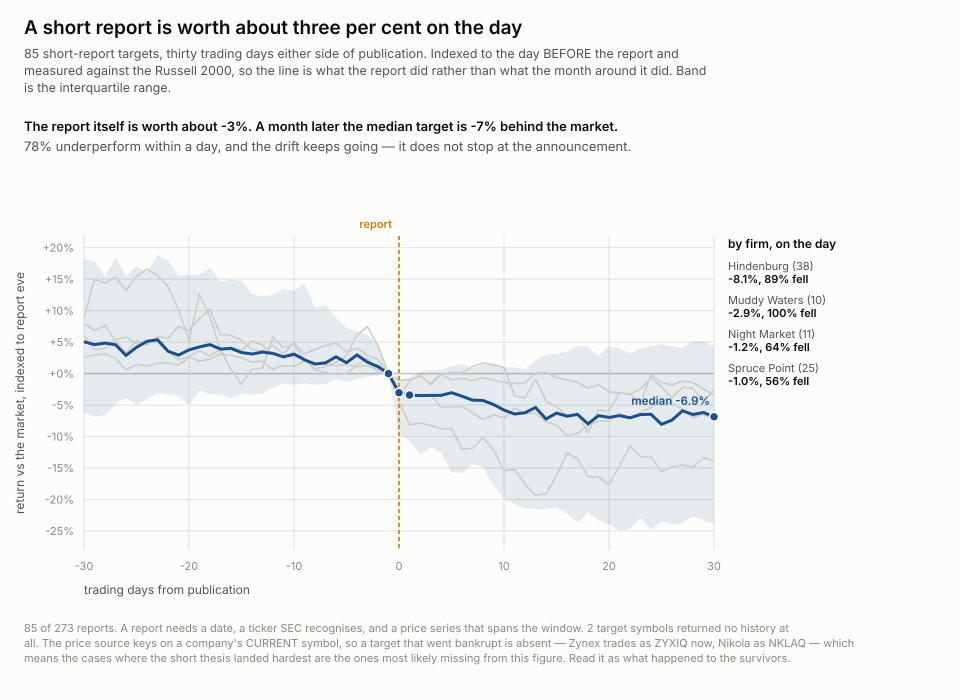

Indexed to the day **before** the report and measured against the Russell 2000, so
the line is what the report did rather than what the month around it did.

| | median |
| --- | --- |
| the report itself, day −1 to +1 | **−3.4%** |
| day +30 | −6.9% |
| underperformed within a day | **78%** |

A −30 baseline reads −10.2% at day +30 and most of that is drift already under way.
The step down is the announcement; the drift continues after it.

**It is firm-dependent by an order of magnitude.** Hindenburg's targets fall a median
8.1% on the day with 89% falling; Spruce Point's fall 1.0% with 56%.

## And the horizon you choose is most of your headline

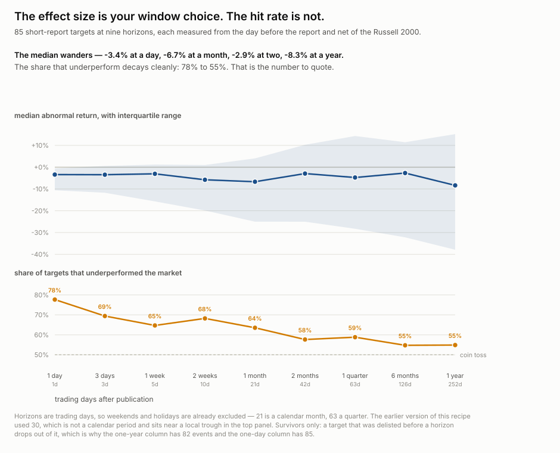

The median abnormal return wanders non-monotonically — −3.4% at a day, −6.7% at a
month, −2.9% at two, −8.3% at a year. Whichever window an author picks becomes their
number. **The share that underperform decays cleanly, 78% to 55%, and that is the
statistic to quote.**

Thirty trading days, which this recipe used at first, is not a calendar period and
sits near a local trough.

## Size decides whether a report lands

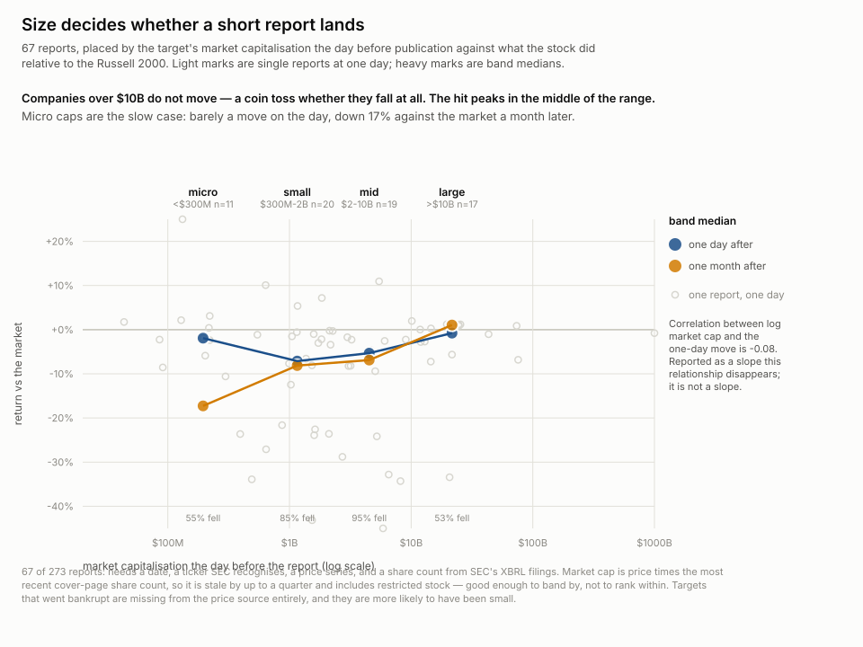

| target | day +1 | % fell | day +21 |
| --- | --- | --- | --- |
| micro, under $300M | −1.9% | 55% | **−17.3%** |
| small, $300M–2B | **−7.1%** | 85% | −8.1% |
| mid, $2–10B | −5.3% | **95%** | −6.9% |
| large, over $10B | −0.8% | 53% | **+1.0%** |

**A company over $10B does not move.** The hit peaks in the middle of the range, and
micro caps are the slow case — barely a move on the day, down 17% a month later,
too illiquid to reprice at once.

The correlation between log market cap and the one-day move is **−0.08**. Reported as
a slope, size looks irrelevant. It is not a slope.

This also explains most of the firm gap: Spruce Point's targets are 8× larger than
Hindenburg's, with 52% above $10B against 7%.

## Does better evidence predict a bigger fall

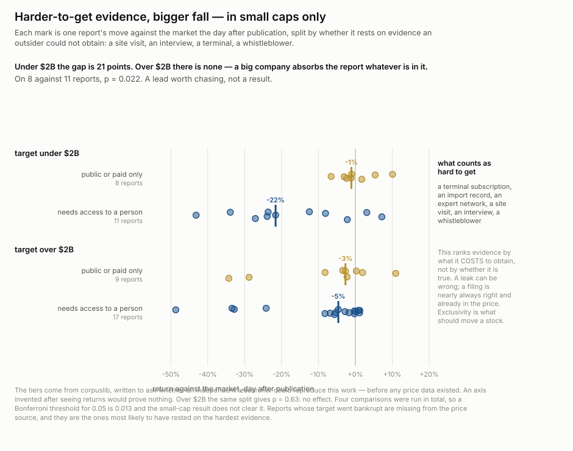

The axis is exclusivity, not accuracy — what evidence **costs an outsider to obtain**.
An SEC filing is nearly always true and already in the price; a former employee's
account is neither. It comes from `corpuslib.BARRIER`, written to ask whether an
independent researcher could reproduce this work, **before any price data existed**.

| target | public or paid only | needs access to a person |
| --- | --- | --- |
| under $2B | −1.1% (n=8) | **−21.6%** (n=11) |
| over $2B | −2.7% (n=9) | −4.6% (n=17) |

Twenty-one points in small caps, and it is **not** size doing the work — median market
cap is flat across evidence levels. But p = 0.022 against a Bonferroni threshold of
0.013 for the four comparisons run. **A lead, not a result.**

## Something trades before the report

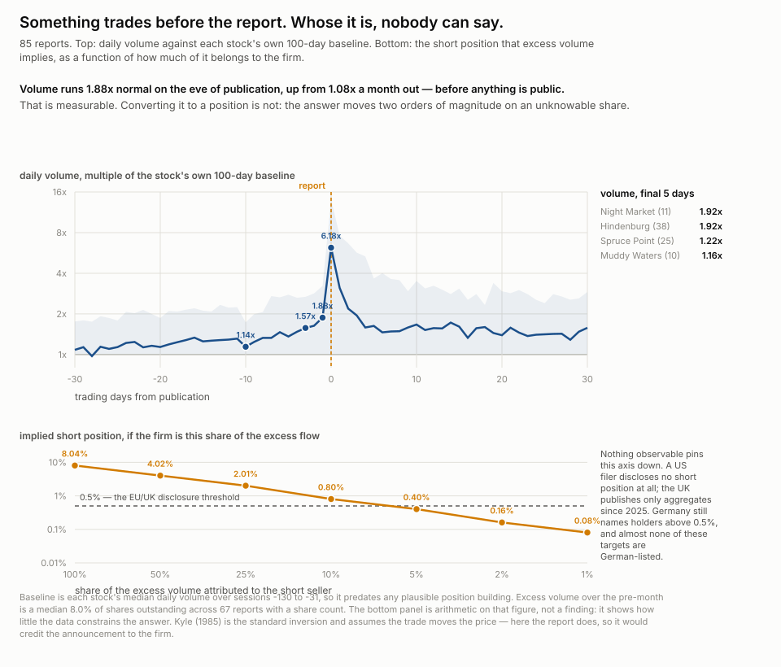

Volume against each stock's own 100-day baseline: 1.08× a month out, 1.57× three days
before, **1.88× on the eve**, 6.18× on the day. Something happens before the report
exists.

Converting that to a position size is not possible. Excess volume over the pre-month
is a median **8.0% of shares outstanding**, so the implied short runs from 8% of the
company at full attribution to 0.08% at 1% — two orders of magnitude on a parameter
no public source reports. Kyle (1985) is the standard inversion and assumes the
*trade* moves the price; here the *report* does.

13F is long-only. FINRA and Nasdaq publish aggregates. The UK moved to aggregate-only
in 2025. Germany still names holders above 0.5% and almost no target here is
German-listed.

## What became of the targets

Of 32 targets whose ticker two independent routes agree on, years after their
report: **59% still trade under the same symbol, 25% are gone from it, 12% changed
symbol, 3% are bankrupt.**

Do not quote that. Reading the thirteen non-survivors dissolves the categories —
KDNY resolves to NVS because Chinook Therapeutics was **acquired by Novartis**, a
premium exit filed next to a fraud. SQ to XYZ is Block renaming itself. Among the
disappearances RINO and CIFS are delisted Chinese frauds, but FMCN went private and
relisted in China and WSP trades on the TSX.

**Symbol persistence is not corporate survival.** Separating a kill from a takeover
needs merger, bankruptcy and deregistration filings — a bounded next step, and the
one that would give the accuracy axis this recipe does not have.

## The one thing that predicts being targeted

| exchange | all 10,407 US filers | 104 targets | lift |
| --- | --- | --- | --- |
| Nasdaq | 41.9% | 55.8% | 1.3× |
| NYSE | 31.7% | 42.3% | 1.3× |
| **OTC** | **24.0%** | **1.9%** | **0.1×** |

**Short sellers ignore OTC.** A quarter of US filers are there and one target in
fifty. The mechanism is not in this corpus — plausibly that the stock cannot be
borrowed, or that too little is held for a report to pay for itself.

Nothing else here can answer what attracts a short seller, and that is a
control-group problem rather than a missing-data one: it needs the same measurements
on companies the firms passed over, and the free registries carry exchange and
nothing else.

## What to do with it

**Build the tool for the fifth that is reachable, and staff the rest.**

- A screening tool over filings, court records, registries and archives reconstructs
  the evidence base of **one report in five**. That is real and worth building.
- Two in three need a person. Half of *those* need only a phone call, not travel and
  not luck — which is a hiring decision, not an engineering one.
- **Date the claim before trusting a method inventory.** Hindenburg's pre-2020 work
  is a different operation from its post-2020 work.
- **Check the firm's cadence before reading any rate.** A campaigner's pooled
  numbers are dominated by rebuttals that cite nothing.
- **Check the target's size before expecting a move.** Above $10B a short report is
  a coin toss. The tool is worth most between $300M and $10B.
- **Quote the hit rate, not the median return.** The median is your window choice;
  the hit rate decays monotonically and means something.

## What not to trust

- **This counts what a report DECLARES.** A firm that uses a terminal without naming
  it, or interviews someone without writing the sentence, is invisible. Every share
  here is a floor.
- **Published reports only.** Investigations abandoned when the thesis collapsed
  leave no trace anywhere, at any firm.
- **The probe list was written by reading Hindenburg** and therefore measured
  Hindenburg. Night Market scored zero on original sourcing while filing FOIA
  requests and interviewing at trade conferences. Three widenings followed, each
  forced by a firm that scored strangely — and the next firm would probably force a
  fourth.
- **Field legwork is hand-ruled, not detected.** The regex was wrong in both
  directions: loose, it counted the firm calling itself "professional fraud
  researchers" and a state regulator's investigators; tight, it missed "an
  investigator sent to the exact site". All 12 disputed reports were read and the
  verdicts recorded in `corpuslib.py`.
- **Spruce Point and Viceroy are samples**, 45 of 134 and 9 of 331. Every other firm
  is its whole archive.
- **A verified ticker exists for 23% of reports.** The first exchange-prefixed symbol
  is wrong roughly 30% of the time, because reports open with peer comparison tables
   — Kratos returns Parrot SA, Inpixon returns Kodak. SEC's registry catches these.
- **The price join reaches 85 of 273 reports.** It needs a date, a ticker SEC
  recognises, and a series spanning the window. J Capital contributes none — its
  targets are Chinese and HK-listed.
- **The price source is survivors-only, and the bias points the wrong way.** It keys
  on a company's CURRENT symbol, so a target that went bankrupt moved to OTC under a
  new one — Zynex is ZYXIQ now, Nikola is NKLAQ. Sino-Forest and China MediaExpress
  are absent entirely. **The cases where the thesis landed hardest are the ones you
  cannot price.**
- **No cross-firm correlation means anything untested.** Length-versus-breadth is
  +0.19 to +0.79 within firms and +0.29 pooled — the firms differ enough on both axes
  to invert the within-firm picture. Compute per firm first, always.

*Every question this recipe asks — with its status, what would settle it, and which
answers describe, predict or prescribe — is the working document at
[`artifacts/research-questions/questions.md`](artifacts/research-questions/questions.md),
including a section on what to expect if you run this on a firm not covered here.*

## Why hasn't anyone

Plenty have studied short sellers — the academic literature on activist short
campaigns and price impact is large, and it works from campaign databases like
Activist Insight, which record *that* a campaign happened and what the stock did.

What I could not find is the corpus read as text: counting what the reports say they
looked at, then asking which of it a machine could have found. That is a small,
mechanical cut and worth being honest that it is small. Its one durable contribution
is probably the negative: **the single biggest evidence type is a conversation, and
it was invisible to the first probe list because nobody thinks to grep for "told
us".**

## Run it

No key, no account. Capture is slow and polite; everything after it is instant.

```sh
# capture — slow and polite, an hour or so in total
python artifacts/scripts/capture_hindenburg.py         # the closed archive, 105 posts
python artifacts/scripts/capture_control.py            # five more firms, sitemap-first
python artifacts/scripts/capture_access.py             # the 17-firm access census
python artifacts/scripts/tickers.py                    # extract, then validate_tickers.py
python artifacts/scripts/capture_prices.py             # daily OHLCV for the targets
python artifacts/scripts/capture_marketcap.py          # SEC share counts
python artifacts/scripts/build_manifest.py             # url + sha256 per resource

# figures — instant
for f in artifacts/scripts/chart-*.py; do python "$f"; done
```

`artifacts/raw/` is not in this repository: 816 MB of third-party HTML and PDFs,
captured from firms that can delete any of it. `artifacts/manifest/` is — 728 rows,
one per resource, with its URL, fetch time, byte count and sha256. Re-fetch and
compare hashes to know whether you are holding what these figures were computed
from; get a 404 and you know exactly what is gone.

**Four traps, all silent:**

- **`/wp-json/wp/v2/posts` is the wrong question.** Muddy Waters keeps 146 reports in
  a custom post type that endpoint cannot return. Ask the sitemap first, always.
- **The page is often not the report.** Three of six firms publish a ~350-word teaser
  over a linked PDF. Counting the page gives 319 words where the report is 4,406.
- **Boilerplate needs removing twice, two different ways.** HTML: the shared
  prefix/suffix across pages (Spruce Point appends 9,525 words). PDF: that returns
  zero, because `pdftotext` scatters the legal block through the body — match
  repeated *sentences* instead, after collapsing whitespace.
- **A probe matching ~100% is matching the template.** Night Market read as 100%
  social-media citation because its navigation bar contains a link saying "Twitter".
