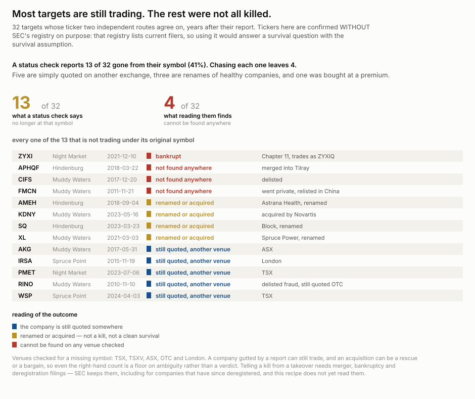
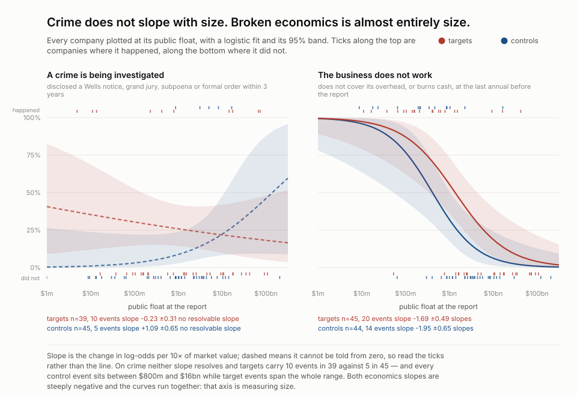
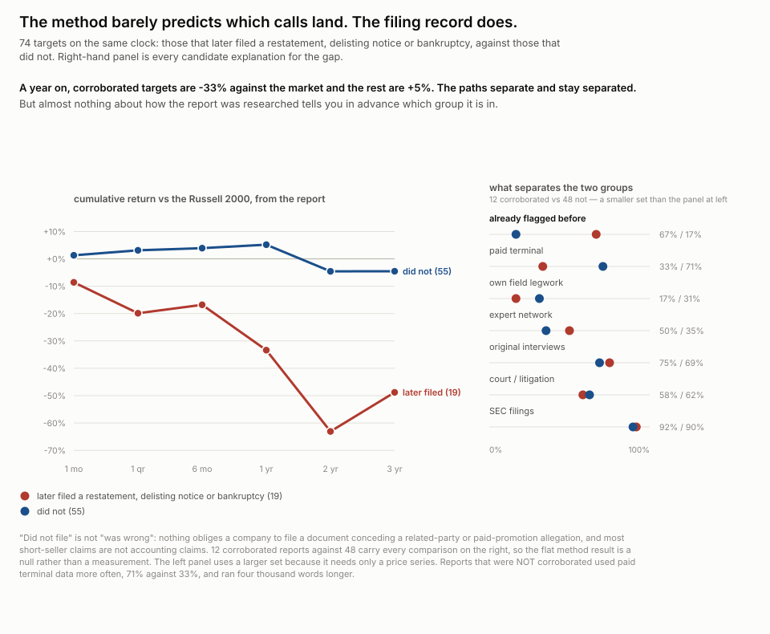
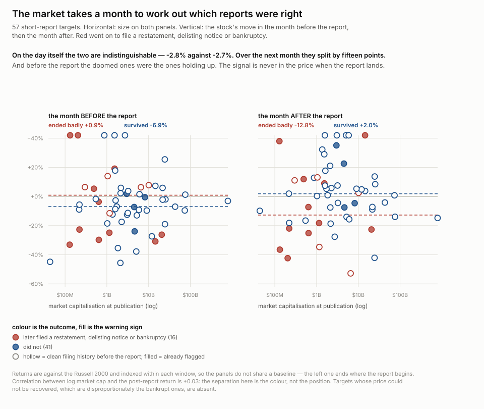
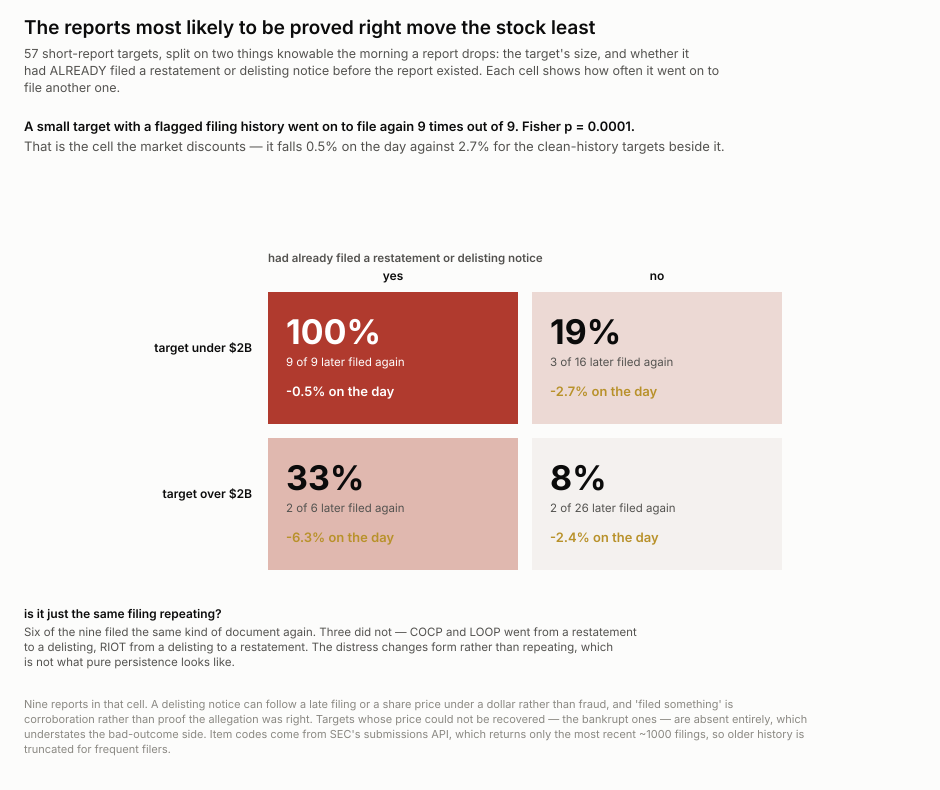

# One short report in five is reproducible from public data. The rest needed someone to talk.

**Published 2026-09-11** · seventeen figures, thirty-nine scripts · source: six activist
short-selling firms, 273 first-look reports, 2.8M words, joined to daily prices for
85 of them · no key, no account · **the sources are private companies and can delete
any of this tomorrow**, so a capture manifest with a sha256 per resource — 728 rows
covering 816 MB — ships alongside.

## What this is

An activist short seller publishes a report saying a listed company is worth less
than it trades for, having bet that it is. The obvious question for anyone building
screening tools is: **how much of that work is derivable from public structured
data?** If most of it is filings and court records, a tool can get close. If most of
it is a former employee agreeing to talk, no tool ever will.

Hindenburg Research answers it in unusual detail — it published 105 posts between
2017 and 2025 and then wound down, so the archive is closed, complete, and has no
survivorship in it. That is the deep source. Five more firms are here as controls,
because a single firm's habits will otherwise be mistaken for the practice, which is
exactly what happened on the first pass.

*Who has a stake:* a forensic analyst deciding what to examine first · a journalist
or regulator weighing a short report's evidence base · anyone building screening
tools who needs to know which half is automatable.

## The short version

- **Only 20% of reports rest on public sources alone.** 67% need something no
  database holds. The first version of this recipe said 50/43 — it never asked
  whether they talked to anyone.
- **The thing that cannot be automated is usually a phone call**, not a leak. 60% of
  reports cite someone interviewed; 31% have an interview as their *only*
  non-public evidence.
- **That floor holds across firms.** "Needs a person" never drops below 44% and the
  median firm sits at 70% — across six firms, sixteen years and two continents.
- **The field splits into two businesses and nothing sits between them.** Fire-once
  firms publish 5–14% follow-ups; campaigners publish 55–61%.
- **Follow-ups are rhetoric.** Field legwork and registry work fall to zero;
  interviews roughly halve. Pool them in and firm rankings reverse.
- **Hindenburg learned this.** Its interview rate went 21% → 75% across three eras
  while Muddy Waters' highest era was its first, in 2010.
- **A short report is worth about 3% on the day.** 78% of targets underperform
  within a day. The drift continues to −7% by day 30.
- **Size decides whether it lands at all.** A target over $10B does not move — 53%
  fall, a coin toss. The hit peaks between $300M and $10B.
- **Pick your horizon, pick your number.** The median abnormal return runs −2.7% to
  −8.3% depending only on the window. The hit rate decays cleanly and is the honest
  statistic.
- **Short sellers do not pick companies that already look bad on EDGAR.** Against a
  random control sample, every prior-distress ratio is 1.0×.
- **But among targets, prior distress predicts vindication almost perfectly** — and
  the market moves least on exactly those reports.
- **What they avoid is sharper than what they pick.** Against the same controls, an
  emerging growth company is attacked at 0.2× and a non-accelerated filer at 0.4×,
  both surviving Bonferroni. Short sellers skip small and young companies; they do
  not hunt them.
- **They find crimes; broken businesses, not quite.** A target discloses an
  investigation within three years at 22% against 6% for matched controls — 4.0×,
  p = 0.002. On unit economics the lift is 1.5× at p = 0.09, and it nearly vanishes
  once you split by size: small companies fail to cover overhead four times in five
  whether or not anybody shorts them.
- **This is not an industry that hunts bad business models.** 78% of reports allege a
  crime or accounting manipulation. 5% rest on broken unit economics alone. And
  targets have *better* gross margins than random filers, +41% against +28%.
- **Spruce Point is an accounting shop; Hindenburg is a fraud shop.** 69% against 17%
  on accounting manipulation, from firms whose output looks superficially alike.
- **The two things worth proving are found in different companies.** Targets that went
  on to disclose an investigation had a median pre-report operating margin of +17%;
  those that did not, −1%. Not significant on 41 companies, but the sign is stable at
  every window. You cannot find the crime by screening for bad numbers.

## How hard is it to do alone


Every source cited across 94 initial Hindenburg reports, graded by what it demands
of someone with no budget, no travel and no sources.

| | reports | share |
| --- | --- | --- |
| use at least one PUBLIC evidence type | 86 / 94 | **91%** |
| use ONLY public evidence | 19 / 94 | **20%** |
| need something no database holds | 63 / 94 | **67%** |

And the non-public half is not exotic:

| | reports | share |
| --- | --- | --- |
| someone they interviewed | 56 / 94 | **60%** |
| their own people on the ground | 29 / 94 | 31% |
| a whistleblower | 8 / 94 | 9% |

**For 31% of reports the only thing you cannot reproduce is a conversation.** That
is a cheaper barrier than travel and a less lucky one than a source walking in, and
it is the one a tool cannot cross.

## Does that hold anywhere else


Twelve kinds of evidence, six firms, ordered by how much they disagree. Every
measure spreads 12–84 points. The share resting on a person is the one with a floor:
**44% at the lowest, 70% at the median.**

Read the greyed rows carefully — import records and whistleblowers have narrow
spreads because *nobody does them*, which is a floor, not a consensus.

**Spruce Point is the low end at 44% and does not explain away.** Its reports are as
prose-dense as everyone's (22 words a sentence, 96% prose); its own boilerplate says
it "frequently speaks with industry experts and former employees"; widening the
probe for its vocabulary moves it 4 points. Either it leans less on people or it
does the work without writing the sentence, and this corpus cannot tell which.

## Two businesses, not one practice


| | targets | reports | follow-up |
| --- | --- | --- | --- |
| Hindenburg | 98 | 103 | **5%** |
| Night Market | 23 | 26 | 12% |
| Fuzzy Panda | 25 | 29 | 14% |
| Spruce Point | 48 | 56 | 14% |
| J Capital | 97 | 215 | **55%** |
| Muddy Waters | 56 | 144 | **61%** |

**Nothing lands between 14% and 55%.** Hindenburg is a clean example of one model,
not an outlier from a single practice — which is what one control firm had
suggested, wrongly.

The camps do *not* predict method. Four of twelve evidence measures separate them
cleanly, 1.6 are expected by chance, P = 0.065. Suggestive, uncrossed.

## Why the pooled numbers lie


Counting all 144 Muddy Waters reports, 47% are desk-reachable against Hindenburg's
37% — it looks like the easier corpus. It is not. **61% of its output is follow-ups**,
which cite almost nothing and therefore score as "reachable from a desk". On
first-look reports the order flips to 4% against 20%.

Always split first-look from follow-up before comparing anything.

## One firm learned to interview people


Hindenburg goes 21% → 75% across three eras and the confidence intervals separate.
Muddy Waters' highest era is its first — 73% in 2010–13 — and every one of its
intervals overlaps every other. Night Market the same.

So this is not the practice changing. It is one firm growing into a method the
others already had, and "the method got richer over time" was a Hindenburg
biography read as industry history.

## Longer means wider, not padded


r = +0.73 at Hindenburg, +0.59 at Muddy Waters. The shorter half of Hindenburg's
reports carries a median 2 kinds of evidence; the longer half, 7.

And Muddy Waters' first reports that went on to become campaigns are the **longer**
ones — 10,813 words against 6,864 — which is the opposite of a follow-up repairing a
thin opening. Permutation p = 0.073 on length, 0.178 on interviews. Two signals, same
direction, neither conclusive.

## Who can be studied at all


**4 of 17 firms refuse the connection outright.** Several more publish a teaser and
nothing else. Every finding above is a finding about the firms that publish
readably, and that is a smaller set than the field.

There is a second selection, on the target side. **Short sellers essentially never
touch OTC** — 24.0% of the 10,407 US filers trade there against 1.9% of 104 targets,
a lift of 0.1×. Nasdaq and NYSE both run 1.3×. This is a constraint, not a thesis:
the mechanism is not in this corpus, but the plausible ones are that the stock cannot
be borrowed to short, or that too little of it is held for a report to pay for the
work. Either way it bounds what any reproduction of this can see. It is filed here
rather than under target selection because where a stock trades is a fact about
borrowability, not about the company — an earlier draft led with it as "the one thing
that predicts being targeted", which measured the easiest available attribute and
promoted a clean null to an answer.

## What the stock does


Indexed to the day **before** the report and measured against the Russell 2000, so
the line is what the report did rather than what the month around it did.

| | median |
| --- | --- |
| the report itself, day −1 to +1 | **−3.4%** |
| day +30 | −6.9% |
| underperformed within a day | **78%** |

A −30 baseline reads −10.2% at day +30 and most of that is drift already under way.
The step down is the announcement; the drift continues after it.

**It is firm-dependent by an order of magnitude.** Hindenburg's targets fall a median
8.1% on the day with 89% falling; Spruce Point's fall 1.0% with 56%.

## And the horizon you choose is most of your headline


The median abnormal return wanders non-monotonically — −3.4% at a day, −6.7% at a
month, −2.9% at two, −8.3% at a year. Whichever window an author picks becomes their
number. **The share that underperform decays cleanly, 78% to 55%, and that is the
statistic to quote.**

Thirty trading days, which this recipe used at first, is not a calendar period and
sits near a local trough.

## Size decides whether a report lands


| target | day +1 | % fell | day +21 |
| --- | --- | --- | --- |
| micro, under $300M | −1.9% | 55% | **−17.3%** |
| small, $300M–2B | **−7.1%** | 85% | −8.1% |
| mid, $2–10B | −5.3% | **95%** | −6.9% |
| large, over $10B | −0.8% | 53% | **+1.0%** |

**A company over $10B does not move.** The hit peaks in the middle of the range, and
micro caps are the slow case — barely a move on the day, down 17% a month later,
too illiquid to reprice at once.

The correlation between log market cap and the one-day move is **−0.08**. Reported as
a slope, size looks irrelevant. It is not a slope.

This also explains most of the firm gap: Spruce Point's targets are 8× larger than
Hindenburg's, with 52% above $10B against 7%.

## Does better evidence predict a bigger fall


The axis is exclusivity, not accuracy — what evidence **costs an outsider to obtain**.
An SEC filing is nearly always true and already in the price; a former employee's
account is neither. It comes from `corpuslib.BARRIER`, written to ask whether an
independent researcher could reproduce this work, **before any price data existed**.

| target | public or paid only | needs access to a person |
| --- | --- | --- |
| under $2B | −1.1% (n=8) | **−21.6%** (n=11) |
| over $2B | −2.7% (n=9) | −4.6% (n=17) |

Twenty-one points in small caps, and it is **not** size doing the work — median market
cap is flat across evidence levels. But p = 0.022 against a Bonferroni threshold of
0.013 for the four comparisons run. **A lead, not a result.**

## Something trades before the report


Volume against each stock's own 100-day baseline: 1.08× a month out, 1.57× three days
before, **1.88× on the eve**, 6.18× on the day. Something happens before the report
exists.

Converting that to a position size is not possible. Excess volume over the pre-month
is a median **8.0% of shares outstanding**, so the implied short runs from 8% of the
company at full attribution to 0.08% at 1% — two orders of magnitude on a parameter
no public source reports. Kyle (1985) is the standard inversion and assumes the
*trade* moves the price; here the *report* does.

13F is long-only. FINRA and Nasdaq publish aggregates. The UK moved to aggregate-only
in 2025. Germany still names holders above 0.5% and almost no target here is
German-listed.

## What became of the targets



Of 32 targets whose ticker two independent routes agree on, years after their
report: **59% still trade under the same symbol, 25% are gone from it, 12% changed
symbol, 3% are bankrupt.**

Do not quote that. Reading the thirteen non-survivors dissolves the categories —
KDNY resolves to NVS because Chinook Therapeutics was **acquired by Novartis**, a
premium exit filed next to a fraud. SQ to XYZ is Block renaming itself. Among the
disappearances RINO and CIFS are delisted Chinese frauds, but FMCN went private and
relisted in China and WSP trades on the TSX.

**Symbol persistence is not corporate survival.** Separating a kill from a takeover
needs merger, bankruptcy and deregistration filings — a bounded next step, and the
one that would give the accuracy axis this recipe does not have.

## What makes a company worth attacking

Earlier this section led with the exchange a target trades on. That finding is real —
short sellers essentially never touch OTC, 1.9% of targets against 24% of filers —
but it was the wrong headline for an instructive reason. **Exchange was the easiest
attribute to measure, so it got measured first, and a clean null got promoted to an
answer.** Where a stock trades is a fact about borrowability, not about the company.
It belongs under constraints, and that is where it now sits.

The question worth asking is what the company *does* and how it *earns*. Run against
the same 140 untargeted filers, with Fisher exact on every cell and a Bonferroni
threshold of p < 0.0026 for 19 comparisons:

| attribute, before the report | targets | controls | lift | p |
| --- | --- | --- | --- | --- |
| **emerging growth company** | 6/74 = 8% | 43/123 = 35% | **0.2×** | **0.0000** |
| **non-accelerated filer** | 12/74 = 16% | 52/123 = 42% | **0.4×** | **0.0001** |
| large accelerated filer | 45/74 = 61% | 48/123 = 39% | 1.6× | 0.0033 |
| smaller reporting company | 12/74 = 16% | 43/123 = 35% | 0.5× | 0.0052 |
| SEC industry office 08, Industrial Applications | 13/76 = 17% | 6/128 = 5% | 3.6× | 0.0051 |
| Nevada incorporation | 7/68 = 10% | 5/119 = 4% | 2.4× | 0.1250 |

**The two findings that survive Bonferroni are both avoidances, and both are size.**
A company that is small (non-accelerated filer) or young (emerging growth company,
the JOBS Act class for recent IPOs under $1.235bn of revenue) is roughly a fifth to
two-fifths as likely to be attacked. Short sellers are not hunting tiny sketchy
companies; they are systematically skipping them. The OTC finding was this same size
effect seen through a worse lens.

Everything below the line is nominal only, expected to appear at this many tests, and
should be read as a direction to check rather than a result. Nevada incorporation is
the one worth naming as a hypothesis — 2.4× on 7 companies is exactly the shape a
real effect and a coincidence both have at this sample size.

Note what is *not* here. Filer class is a multi-label field — `Non-accelerated
filer<br>Smaller reporting company<br>Emerging growth company` is three flags, not one
class. Read as a single string it splits the same companies across buckets and
produces a striking "0 of 76 targets are smaller reporting companies". The true figure
is 12 of 76. Each flag is its own comparison here for that reason.

## Why they say they are short

`thesis.py` pulls the sentences where a firm states its own case — first person,
declarative, "we believe", "our investigation found", "today we reveal" — and
classifies the report on three overlapping axes. The extractor finds a thesis sentence
in 96% of reports, against `claims.py`'s 74%, because a firm stating its own position
writes in a far more predictable register than a firm describing an allegation.

| what the report alleges | share of 273 first-look reports |
| --- | --- |
| a crime — fraud, forgery, bribery, self-dealing | 68% |
| broken unit economics | 36% |
| accounting manipulation not called a crime | 32% |
| **crime or accounting manipulation** | **78%** |
| **broken economics and nothing else** | **5%** |
| none of the three | 17% |

**This is not an industry that hunts bad business models.** Four reports in five
allege wrongdoing; one in twenty rests on unit economics alone. If the goal is to
prove a business cannot work, the corpus offers 13 worked examples, not 273.

The firms split sharply on which they lead with:

| firm | alleges a crime | alleges accounting manipulation |
| --- | --- | --- |
| Fuzzy Panda | 88% | 20% |
| Hindenburg | 74% | 17% |
| Spruce Point | 73% | **69%** |
| J Capital | 63% | 30% |
| Muddy Waters | 61% | 43% |
| Night Market | 39% | 9% |

**Spruce Point is an accounting shop and Hindenburg is a fraud shop.** 69% against 17%
on the same axis, from firms whose output looks superficially alike. That is a
sharper separation than anything in the evidence-type measurements, and it is visible
only because the firms say it themselves.

One caution on reading any of this. A declared reason is what a firm chose to lead
with, which is a marketing decision as much as an analytical one. It is evidence of
what the firm thought would land, not necessarily of what it actually found.

## They find crimes. Broken businesses, not quite.



Both things worth proving are checkable from SEC filings alone, which is what makes
them reachable without sources: whether a crime is being investigated, from a Wells
notice, grand jury, subpoena or formal order of investigation the company discloses in
its own filings; and whether the unit economics work, from XBRL at the last annual
**filed before** the report. Each is run against 139 control filers.

| | targets | controls | lift | p |
| --- | --- | --- | --- | --- |
| **a crime is being investigated** (within 3 years) | **13/59 = 22%** | **6/108 = 6%** | **4.0×** | **0.002** |
| the business does not work (overhead or cash burn) | 30/61 = 49% | 19/58 = 33% | 1.5× | 0.093 |

**They are good at one of these and barely distinguishable at the other.** On the
crime axis the 95% intervals do not come close to touching. On the economics axis
they overlap across most of their range, and a reader who saw only the two point
estimates would take a 1.5× lift for a result.

**And the economics lean is mostly composition.** Split by filer size class it nearly
disappears:

| | targets | controls | lift | p |
| --- | --- | --- | --- | --- |
| large accelerated filers | 12/39 = 31% | 8/41 = 20% | 1.6× | 0.31 |
| everything smaller | 17/20 = 85% | 11/14 = 79% | 1.1× | 0.67 |

Small companies fail to cover their overhead about four times in five whether or not
anybody shorts them. Targets skew large and controls skew small — that is the
Bonferroni-surviving finding two sections up — so most of the pooled 49%-vs-33% gap is
that size mix rather than any difference in how broken the companies are.

The component measures say the same thing in more detail, and one of them says it
loudly: **targets have better gross margins than random filers.** Median +41% against
+28%, with negative gross margins *rarer* among targets, 1/49 = 2% against 2/31 = 6%.
Whatever these firms are selecting for, it is not a product that loses money on every
sale. Negative operating margin runs 49% vs 34% (p = 0.20) and negative operating cash
flow 37% vs 24% (p = 0.16) — the weakness is overhead and financing, not the unit.

So if the goal is proving unit economics do not work, **this corpus is the wrong model
to copy.** The firms in it are not finding those companies. If the goal is finding a
company that is about to be investigated, they are demonstrably good at it, and this
is the measurement that says so.

**Exposure has to be matched on the crime axis or the clock decides the answer.** A
target attacked in 2014 has twelve years in which to disclose an investigation; one
attacked in 2025 has months. Every control is given a report date drawn from the
target distribution, every company is scored on a fixed three-year window, and any
company whose window has not closed is dropped rather than counted as a no.

Read the 4.0× with one caution held firmly. **A short report can cause the
investigation it appears to predict** — regulators read these, and a public allegation
is itself a reason to open a file. Nothing in this data separates "found a company
already under investigation" from "caused the investigation", and the two have
completely different implications for anyone trying to do the same thing. That
separation needs the date a file was *opened*, which is not public.

## The two jackpots are different companies

So the firms find the crime. The obvious next question is whether *you* could find it
the same way — by reading the numbers. The obvious assumption is that the two jackpots
arrive together, that the company cooking its books is the company whose margins look
wrong. They do not. Of 41 targets whose
pre-report margins can be read and whose three-year window has closed, the ones that
went on to disclose an investigation had a **median operating margin of +17%**; the
ones that did not, **−1%**. Visibly broken economics → investigated 2/21 = 10%;
economics that looked fine → 5/20 = 25%.

**Match the exposure or the comparison is fake.** A target attacked in 2014 has twelve
years in which to disclose an investigation; one attacked in 2025 has months — and it
is not random which is which. The targets whose economics were visibly broken have a
median report year of 2022 against 2020 for the rest, so they carry two years less
exposure, which on its own produces a lower rate. Counting "ever disclosed after"
gave 11% against 33% at p = 0.09. A fixed three-year window gives 10% against 25% at
p = 0.24. The first number was flattered by the clock.

**A margin screen finds companies that are losing money, which is not the same set as
companies that are committing crimes.** A company losing money in public is not hiding
anything — its problem is on the face of the income statement and there is nothing to
charge. The company worth investigating is the one reporting margins it should not be
able to earn. Fraud has to look healthy; that is what makes it fraud.

**None of this is significant and it should not be read as if it were.** Seven
investigated companies is far too few. What the direction has going for it is
stability rather than strength — it holds at every window tested:

| window | broken economics | looked fine | p |
| --- | --- | --- | --- |
| 2 years | 4% | 24% | 0.09 |
| 3 years | 10% | 25% | 0.24 |
| 4 years | 19% | 31% | 0.69 |
| 5 years | 17% | 31% | 0.66 |

So the claim this supports is the negative one: **nothing here suggests bad numbers
lead you to the crime, and the sign runs the other way in every window.** That is
still worth knowing if you were about to build a margin screen. And disclosing an
investigation is not being guilty of anything — the causation caution above applies
here too.

**There is deliberately no figure for this.** A fifteen-point gap with a stable sign
and p = 0.24 on seven companies is exactly the shape that draws well and means little
— it is the `before-and-after` mistake, kept elsewhere in this recipe as a worked
example of it. The numbers are here; the chart would oversell them.

The allegation itself predicts nothing here. Reports alleging a crime were followed by
a disclosed investigation 28% of the time; reports not alleging one, 27%. **What a
report claims tells you nothing about whether the company later concedes it.**

## What the targets have in common — and it is not distress

140 randomly drawn non-targeted filers, measured against the 76 targets **as they
stood before their report**:

| filed before the report | targets | controls | lift |
| --- | --- | --- | --- |
| a restatement | 13% | 13% | **1.0×** |
| a delisting notice | 22% | 24% | 0.9× |
| an auditor change | 30% | 32% | 0.9× |
| ever filed late | 28% | 29% | **1.0×** |

**Every ratio is 1.0×.** Targets are *less* likely to have filed for bankruptcy — 1%
against 4%. The only real difference is that they file 1.7× more, which makes them
bigger and more active, the opposite of a distress screen.

So a filing-based screen will not find the next target. What the firms are seeing is
in the text of their own reports: **undisclosed related party 29%, paid promotion
26%**, accounting fraud 21%, auditor concerns 17%, executive history 15%. The two
largest categories are about *who is behind the company*, not what the numbers say —
and neither is in filing metadata, which is the same wall as the 67% that need a
person.

## Which calls landed, and what separated them



Both groups on the same clock — targets that later filed a restatement, delisting
notice or bankruptcy, against those that did not.

| from the report | corroborated | not |
| --- | --- | --- |
| 1 month | −8.6% | +1.3% |
| 1 quarter | −19.9% | +3.1% |
| **1 year** | **−33.4%** | **+5.2%** |
| 2 years | −63.1% | −4.6% |

The paths separate and stay separated. **But almost nothing about how the report was
researched tells you in advance which group it is in.** SEC filings 92% vs 90%,
interviews 75% vs 69%, court records 58% vs 62%, kinds of evidence 5 vs 6 at p = 0.75.

Where the method does move, it moves the **wrong way**: reports that were *not*
corroborated used paid terminal data 71% against 33%, ran four thousand words longer,
and did more field legwork. More expensive research, no better hit rate.

**What separates them is the company.** 67% of corroborated targets had already filed
a restatement or delisting notice before anyone wrote a word, against 17%.

*"Not corroborated" is not "wrong" — nothing obliges a company to file a document
conceding a related-party allegation, and 12 against 48 makes the method comparison a
null rather than a measurement.*

### A convincing chart that is wrong, kept on purpose



Fifteen points between its medians, a plausible mechanism, a caption that reads like
a finding — and it is measuring a **thirty-day window for an event that arrives at a
median 454 days**. The point cloud is random because it is random; the medians part
because a handful of fast outcomes drag them.

A chart that is obviously wrong teaches nobody anything. This is the kind that ships.

One thing in it does survive, because it does not depend on catching an outcome
inside a month: **before the report, the doomed companies were holding up at +0.9%
while the eventual survivors were already sliding at −6.9%.**

## The one rule worth acting on



Two axes, both free, both knowable the morning a report drops.

| | already filed a restatement or delisting notice | clean history |
| --- | --- | --- |
| **target under $2B** | **9 of 9 later filed again · −0.5% on the day** | 3 of 16 · −2.7% |
| target over $2B | 2 of 6 · −6.3% | 2 of 26 · −2.4% |

Fisher exact on the small-cap row: **p = 0.0001**.

**And the market discounts exactly that cell.** The nine reports that were nine for
nine moved the stock 0.5%; the clean-history small caps beside them moved 2.7%. The
market reads an already-troubled company as old news, which is precisely where the
filing record later concedes the point.

Six of the nine filed the same kind of document again, which is mechanical. Three
escalated into a different one — COCP and LOOP from a restatement to a delisting,
RIOT from a delisting to a restatement — and that part is not.

Nine reports. A delisting notice can follow a late filing rather than fraud. Treat it
as a screen worth testing forward, not a backtest to trade.

## What to do with it

**Build the tool for the fifth that is reachable, and staff the rest.**

- A screening tool over filings, court records, registries and archives reconstructs
  the evidence base of **one report in five**. That is real and worth building.
- Two in three need a person. Half of *those* need only a phone call, not travel and
  not luck — which is a hiring decision, not an engineering one.
- **Date the claim before trusting a method inventory.** Hindenburg's pre-2020 work
  is a different operation from its post-2020 work.
- **Check the firm's cadence before reading any rate.** A campaigner's pooled
  numbers are dominated by rebuttals that cite nothing.
- **Check the target's size before expecting a move.** Above $10B a short report is
  a coin toss. The tool is worth most between $300M and $10B.
- **Quote the hit rate, not the median return.** The median is your window choice;
  the hit rate decays monotonically and means something.

## What not to trust

- **This counts what a report DECLARES.** A firm that uses a terminal without naming
  it, or interviews someone without writing the sentence, is invisible. Every share
  here is a floor.
- **Published reports only.** Investigations abandoned when the thesis collapsed
  leave no trace anywhere, at any firm.
- **The probe list was written by reading Hindenburg** and therefore measured
  Hindenburg. Night Market scored zero on original sourcing while filing FOIA
  requests and interviewing at trade conferences. Three widenings followed, each
  forced by a firm that scored strangely — and the next firm would probably force a
  fourth.
- **Field legwork is hand-ruled, not detected.** The regex was wrong in both
  directions: loose, it counted the firm calling itself "professional fraud
  researchers" and a state regulator's investigators; tight, it missed "an
  investigator sent to the exact site". All 12 disputed reports were read and the
  verdicts recorded in `corpuslib.py`.
- **Spruce Point and Viceroy are samples**, 45 of 134 and 9 of 331. Every other firm
  is its whole archive.
- **A verified ticker exists for 23% of reports.** The first exchange-prefixed symbol
  is wrong roughly 30% of the time, because reports open with peer comparison tables
   — Kratos returns Parrot SA, Inpixon returns Kodak. SEC's registry catches these.
- **The price join reaches 85 of 273 reports.** It needs a date, a ticker SEC
  recognises, and a series spanning the window. J Capital contributes none — its
  targets are Chinese and HK-listed.
- **The price source is survivors-only, and the bias points the wrong way.** It keys
  on a company's CURRENT symbol, so a target that went bankrupt moved to OTC under a
  new one — Zynex is ZYXIQ now, Nikola is NKLAQ. Sino-Forest and China MediaExpress
  are absent entirely. **The cases where the thesis landed hardest are the ones you
  cannot price.**
- **No cross-firm correlation means anything untested.** Length-versus-breadth is
  +0.19 to +0.79 within firms and +0.29 pooled — the firms differ enough on both axes
  to invert the within-firm picture. Compute per firm first, always.

*Every question this recipe asks — with its status, what would settle it, and which
answers describe, predict or prescribe — is the working document at
[`artifacts/research-questions/questions.md`](artifacts/research-questions/questions.md),
including a section on what to expect if you run this on a firm not covered here.*

## Why hasn't anyone

Plenty have studied short sellers — the academic literature on activist short
campaigns and price impact is large, and it works from campaign databases like
Activist Insight, which record *that* a campaign happened and what the stock did.

What I could not find is the corpus read as text: counting what the reports say they
looked at, then asking which of it a machine could have found. That is a small,
mechanical cut and worth being honest that it is small. Its one durable contribution
is probably the negative: **the single biggest evidence type is a conversation, and
it was invisible to the first probe list because nobody thinks to grep for "told
us".**

## Run it

Figures are SVG in `artifacts/charts/`, with PNG renders alongside in
`artifacts/charts/png/` for viewers that will not preview SVG. The SVGs are the
source of truth; the PNGs are generated.


No key, no account. Capture is slow and polite; everything after it is instant.

```sh
# capture — slow and polite, an hour or so in total
python artifacts/scripts/capture_hindenburg.py         # the closed archive, 105 posts
python artifacts/scripts/capture_control.py            # five more firms, sitemap-first
python artifacts/scripts/capture_access.py             # the 17-firm access census
python artifacts/scripts/tickers.py                    # extract, then validate_tickers.py
python artifacts/scripts/capture_prices.py             # daily OHLCV for the targets
python artifacts/scripts/capture_marketcap.py          # SEC share counts
python artifacts/scripts/capture_control_firms.py       # 140 random non-targeted filers
python artifacts/scripts/capture_outcomes.py           # 8-K item codes either side of the report
python artifacts/scripts/capture_profiles.py           # SIC, owner office, filer class, state
python artifacts/scripts/capture_jackpot.py            # XBRL unit economics + enforcement language
python artifacts/scripts/build_manifest.py             # url + sha256 per resource

# analysis — instant
python artifacts/scripts/thesis.py                     # why each report says it is short
python artifacts/scripts/selection.py                  # targets vs 140 controls, Bonferroni
python artifacts/scripts/jackpot.py                    # broken economics and conceded investigations

# figures — instant
for f in artifacts/scripts/chart-*.py; do python "$f"; done
```

`artifacts/raw/` is not in this repository: 816 MB of third-party HTML and PDFs,
captured from firms that can delete any of it. `artifacts/manifest/` is — 728 rows,
one per resource, with its URL, fetch time, byte count and sha256. Re-fetch and
compare hashes to know whether you are holding what these figures were computed
from; get a 404 and you know exactly what is gone.

**Four traps, all silent:**

- **`/wp-json/wp/v2/posts` is the wrong question.** Muddy Waters keeps 146 reports in
  a custom post type that endpoint cannot return. Ask the sitemap first, always.
- **The page is often not the report.** Three of six firms publish a ~350-word teaser
  over a linked PDF. Counting the page gives 319 words where the report is 4,406.
- **Boilerplate needs removing twice, two different ways.** HTML: the shared
  prefix/suffix across pages (Spruce Point appends 9,525 words). PDF: that returns
  zero, because `pdftotext` scatters the legal block through the body — match
  repeated *sentences* instead, after collapsing whitespace.
- **A probe matching ~100% is matching the template.** Night Market read as 100%
  social-media citation because its navigation bar contains a link saying "Twitter".

**Four more, specific to the SEC side:**

- **XBRL tags drift within one company.** Riot files `GrossProfit` until 2016 and
  `CostOfRevenue` until 2021; Nikola never files `Revenues` at all, only
  `RevenueFromContractWithCustomerExcludingAssessedTax`. Every measure needs an alias
  list, and `companyfacts` returns all 450 tags in one request where `companyconcept`
  needs sixteen.
- **A third of this corpus files IFRS, not US-GAAP, and in its own currency.** Aurora
  Cannabis has no `us-gaap` namespace and reports in CAD; a USD-only, GAAP-only reader
  drops it silently. Foreign targets are not a random subset — they are the ones short
  sellers like most.
- **Filter XBRL on the FILED date, not the period end.** A figure for 2013 filed in
  2016 is the *restated* figure, which in a fraud study is the one number you must not
  quietly substitute for what was public at the time.
- **A margin needs a denominator worth dividing by.** Riot's last annual before
  Hindenburg's report showed revenue of $9,416 — it was Bioptix, a biotech that had
  just renamed itself — giving an operating margin of −669×. Arithmetically correct,
  analytically meaningless, and it dominates any average it enters.

**And two on EDGAR full-text search**, which is the only free route to enforcement
language: scope it with `ciks=0001234567`, zero-padded — unpadded returns zero hits
with no error. And choose phrases the company can only be saying about *itself*.
`"Department of Justice"` returns 27 hits for AMETEK, every one inside an EX-10
employment contract; restricting to 8-K/10-K/10-Q does not help, because EDGAR
attributes an exhibit to its parent form. `"class action"` is worse than imprecise —
a securities class action *follows* a stock drop, so counting it after a short report
measures the report's own wake. `"Wells notice"`, `"grand jury"`, `"received a
subpoena"` and `"formal order of investigation"` correctly score AMETEK at zero.
